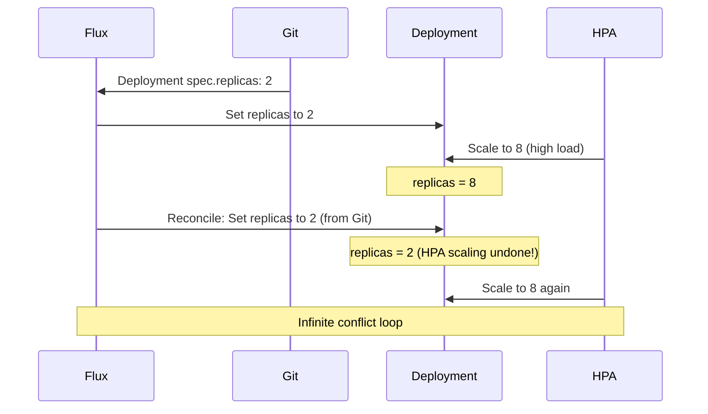

# Resolving HPA and Flux Replicas Conflict

Author: [nawazdhandala](https://github.com/nawazdhandala)

Tags: Flux CD, HPA, Horizontal Pod Autoscaler, Replicas, Conflict, GitOps, Kubernetes

Description: Understand and resolve the conflict between Flux CD's GitOps reconciliation and Kubernetes HPA when both try to manage Deployment replica counts.

---

## Introduction

A common problem when using Flux CD with Horizontal Pod Autoscaler is a conflict between the desired state in Git and the current replica count managed by HPA. Flux reconciles the Deployment with the replica count in Git, while HPA dynamically adjusts replicas based on metrics. This creates a tug-of-war: Flux resets replicas to the Git value, breaking HPA's scaling.

Understanding this conflict and the correct solutions is essential for any team running HPA with GitOps. Kubernetes and Flux have specific mechanisms to resolve this gracefully.

## Prerequisites

- Kubernetes cluster with Flux CD installed
- HPA and a Deployment that HPA manages
- Understanding of Flux Kustomize patch syntax

## Understanding the Conflict

When both Flux and HPA manage the same Deployment:



## Step 1: Solution 1 - Remove replicas from the Deployment in Git

The cleanest solution is to remove the `replicas` field from the Deployment manifest in Git. When `replicas` is absent, Kubernetes defaults to 1 on first creation, and HPA immediately takes over.

```yaml
# deployment-no-replicas.yaml - Deployment without replicas field (HPA manages it)
apiVersion: apps/v1
kind: Deployment
metadata:
  name: web-api
  namespace: production
spec:
  # Do NOT set replicas here when HPA is managing this Deployment
  selector:
    matchLabels:
      app: web-api
  template:
    metadata:
      labels:
        app: web-api
    spec:
      containers:
        - name: web-api
          image: my-org/web-api:1.0.0
          resources:
            requests:
              cpu: "200m"
              memory: "256Mi"
```

## Step 2: Solution 2 - Use Kustomize to Remove the replicas Field

If you need to keep `replicas` in the base manifest (for environments without HPA), use a Kustomize patch to remove it in the HPA-enabled overlay:

```yaml
# kustomization.yaml - Remove replicas field for HPA-managed environments
apiVersion: kustomize.config.k8s.io/v1beta1
kind: Kustomization
resources:
  - ../../base/web-api
patches:
  # Strategic merge patch to remove the replicas field
  - patch: |-
      apiVersion: apps/v1
      kind: Deployment
      metadata:
        name: web-api
      spec:
        replicas: null
    target:
      kind: Deployment
      name: web-api
```

## Step 3: Solution 3 - Use Flux's ignoreDifferences

Flux supports ignoring specific fields during reconciliation. This tells Flux to never overwrite the `replicas` field:

```yaml
# flux-kustomization-ignore-replicas.yaml - Ignore replicas field during reconciliation
apiVersion: kustomize.toolkit.fluxcd.io/v1
kind: Kustomization
metadata:
  name: web-api
  namespace: flux-system
spec:
  interval: 5m
  path: ./apps/production/web-api
  prune: true
  sourceRef:
    kind: GitRepository
    name: fleet-infra
  # Tell Flux to ignore the replicas field so HPA can manage it
  patches:
    - patch: |
        - op: remove
          path: /spec/replicas
      target:
        kind: Deployment
        name: web-api
```

Alternatively, use `spec.force: false` and strategic merge patches, or configure `ignoreDifferences` with server-side apply:

```yaml
# Using force field with kustomize patch to never overwrite replicas
spec:
  # Enable server-side apply which respects HPA ownership of replicas
  force: false
```

## Step 4: Verify the Solution Works

```bash
# Check the current replica count managed by HPA
kubectl get hpa web-api -n production

# Watch for Flux reconciliations to ensure replicas are not being reset
kubectl get events -n production --field-selector reason=ScalingReplicaSet --watch

# Describe the Deployment to verify replicas are stable
kubectl describe deployment web-api -n production | grep -A3 "Replicas:"

# Check Flux reconciliation status
flux get kustomizations
```

## Best Practices

- Always choose Solution 1 (remove `replicas` from Git) as the primary approach — it is the cleanest
- Use Solution 3 (`ignoreDifferences`) when you cannot modify the base manifests
- Document in the Deployment YAML that replicas are HPA-managed to prevent future confusion
- Set HPA `minReplicas` to your desired baseline replica count rather than putting it in the Deployment
- Test the solution by watching both Flux reconciliation logs and HPA events simultaneously

## Conclusion

The HPA-Flux replicas conflict is a common pitfall for teams new to GitOps with autoscaling. The correct solution is to remove or patch out the `replicas` field from Git-managed manifests in environments where HPA is active. Using Flux's `ignoreDifferences` is a viable alternative when modifying base manifests is not feasible. Once resolved, Flux and HPA coexist cleanly — Flux manages all deployment configuration except replica count, which HPA owns.
