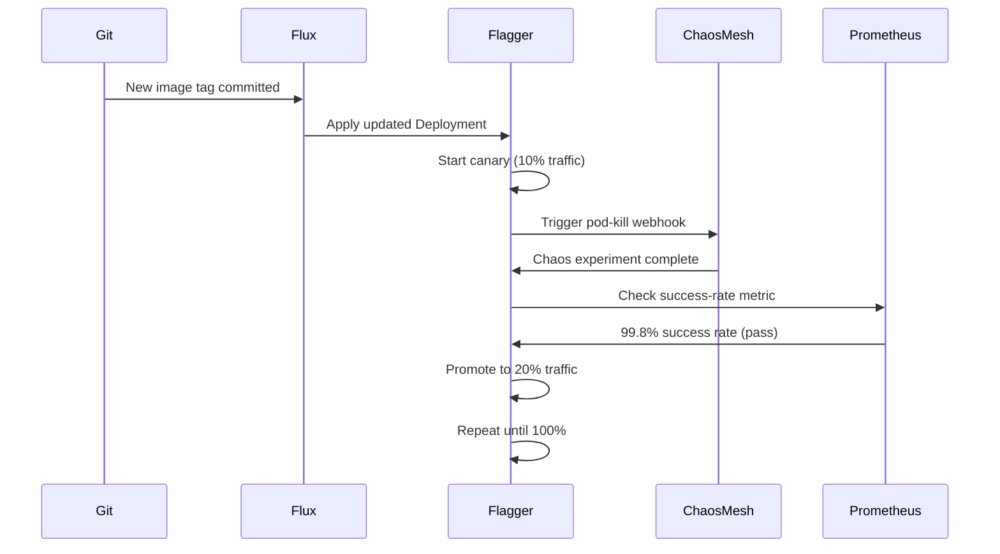

# How to Integrate Chaos Experiments with Flagger Canary Analysis

Author: [nawazdhandala](https://github.com/nawazdhandala)

Tags: Flux CD, Kubernetes, GitOps, Chaos Engineering, Flagger, Canary Deployments

Description: Run chaos experiments as part of Flagger canary analysis gates managed by Flux CD to validate resilience before promoting a new release.

---

## Introduction

Progressive delivery and chaos engineering are two practices that are even more powerful together. Flagger automates canary deployments by gradually shifting traffic to new releases while checking metrics and webhooks. Chaos experiments integrated as Flagger webhook gates mean that every new release is automatically tested for resilience — not just correctness — before it reaches 100% of traffic.

Flux CD ties the two together: it manages both the Flagger installation and the canary configuration in Git, ensuring that your resilience gates are version-controlled and consistently applied across environments. If a chaos experiment reveals that a new release cannot handle pod kills or network latency, Flagger rolls back automatically.

This guide covers setting up Flagger with Chaos Mesh, configuring a canary resource with chaos webhook gates, and integrating the full workflow under Flux CD management.

## Prerequisites

- Flux CD bootstrapped on the cluster
- Flagger deployed via Flux HelmRelease
- Chaos Mesh deployed via Flux HelmRelease
- A test application deployed in the cluster
- An Ingress controller (Nginx or Istio) configured with Flagger

## Step 1: Deploy Flagger via Flux HelmRelease

```yaml
# clusters/my-cluster/flagger/helmrelease.yaml
apiVersion: helm.toolkit.fluxcd.io/v2
kind: HelmRelease
metadata:
  name: flagger
  namespace: flux-system
spec:
  interval: 15m
  targetNamespace: flagger-system
  chart:
    spec:
      chart: flagger
      version: "1.x.x"
      sourceRef:
        kind: HelmRepository
        name: flagger
        namespace: flux-system
  values:
    # Use Prometheus for metric analysis
    metricsServer: http://prometheus.monitoring:9090
    meshProvider: nginx
```

## Step 2: Create a Chaos Webhook Service

Flagger calls webhook URLs during analysis gates. Create a small service that triggers a Chaos Mesh experiment when called.

```yaml
# clusters/my-cluster/flagger/chaos-webhook/deployment.yaml
apiVersion: apps/v1
kind: Deployment
metadata:
  name: chaos-gate
  namespace: flagger-system
spec:
  replicas: 1
  selector:
    matchLabels:
      app: chaos-gate
  template:
    metadata:
      labels:
        app: chaos-gate
    spec:
      serviceAccountName: chaos-gate
      containers:
        - name: chaos-gate
          # A simple webhook server that applies a PodChaos manifest
          image: curlimages/curl:latest
          command:
            - sh
            - -c
            - |
              while true; do
                nc -l -p 8080 -e sh -c \
                  'read req; kubectl apply -f /experiments/pod-kill.yaml && echo "HTTP/1.1 200 OK\r\n\r\n"'
              done
```

In practice, use a purpose-built webhook adapter or the Flagger load tester with a chaos gate:

```yaml
# clusters/my-cluster/flagger/loadtester-helmrelease.yaml
apiVersion: helm.toolkit.fluxcd.io/v2
kind: HelmRelease
metadata:
  name: flagger-loadtester
  namespace: flux-system
spec:
  interval: 15m
  targetNamespace: flagger-system
  chart:
    spec:
      chart: loadtester
      version: "0.x.x"
      sourceRef:
        kind: HelmRepository
        name: flagger
        namespace: flux-system
```

## Step 3: Configure the Canary with Chaos Webhooks

```yaml
# clusters/my-cluster/apps/myapp-canary.yaml
apiVersion: flagger.app/v1beta1
kind: Canary
metadata:
  name: myapp
  namespace: default
spec:
  targetRef:
    apiVersion: apps/v1
    kind: Deployment
    name: myapp
  progressDeadlineSeconds: 120
  service:
    port: 80
  analysis:
    interval: 1m
    threshold: 5
    maxWeight: 50
    stepWeight: 10
    metrics:
      - name: request-success-rate
        thresholdRange:
          min: 99
        interval: 1m
    # Chaos gate: run pod kill experiment before each promotion step
    webhooks:
      - name: chaos-pod-kill
        type: pre-rollout
        url: http://flagger-loadtester.flagger-system/
        timeout: 30s
        metadata:
          type: bash
          cmd: |
            kubectl apply -f - <<EOF
            apiVersion: chaos-mesh.org/v1alpha1
            kind: PodChaos
            metadata:
              name: canary-pod-kill
              namespace: chaos-mesh
            spec:
              action: pod-kill
              mode: one
              selector:
                namespaces: [default]
                labelSelectors:
                  app: myapp
              duration: "30s"
            EOF
      - name: load-test
        url: http://flagger-loadtester.flagger-system/
        timeout: 5s
        metadata:
          type: cmd
          cmd: "hey -z 1m -q 10 -c 2 http://myapp-canary.default/"
```

## Step 4: Observe Canary Promotion with Chaos Gates



## Step 5: Manage Everything with Flux Kustomizations

```yaml
# clusters/my-cluster/kustomization.yaml
apiVersion: kustomize.toolkit.fluxcd.io/v1
kind: Kustomization
metadata:
  name: progressive-delivery
  namespace: flux-system
spec:
  interval: 5m
  path: ./clusters/my-cluster/flagger
  prune: true
  sourceRef:
    kind: GitRepository
    name: flux-system
  dependsOn:
    - name: chaos-mesh
```

## Best Practices

- Use `type: pre-rollout` webhooks for chaos gates so experiments run before traffic is shifted, not during.
- Set `threshold` in the canary analysis to allow a small number of failures before rolling back, preventing flappy promotions.
- Keep chaos experiment duration shorter than the Flagger analysis `interval` to ensure the experiment completes before the next metric check.
- Use the Flagger load tester for simple webhook commands rather than building custom webhook services.
- Version both the Canary resource and the chaos experiment parameters in Git so changes are reviewed together.

## Conclusion

Integrating chaos experiments into Flagger canary analysis creates a powerful resilience gate that validates every release under fault conditions before it reaches full production traffic. Managed by Flux CD, this entire workflow — from deployment to chaos to promotion decision — is declarative, reproducible, and auditable, making resilience a built-in property of your delivery pipeline rather than an afterthought.
