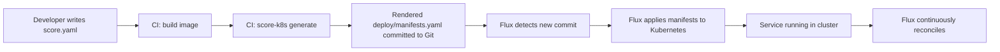

# How to Integrate Flux CD with Humanitec Score Workloads

Author: [nawazdhandala](https://github.com/nawazdhandala)

Tags: Flux CD, Kubernetes, GitOps, Humanitec, Score, Platform Engineering, Workload specification

Description: Use Score workload specifications with Flux CD for platform abstractions so developers write platform-agnostic workload definitions that Flux deploys to Kubernetes.

---

## Introduction

Score is an open-source workload specification format developed by Humanitec that separates what a developer wants to deploy from how it gets deployed on a specific platform. A developer writes a `score.yaml` describing their service's containers, ports, and dependencies, and the Score CLI translates this into platform-specific manifests. Combined with Flux CD, Score creates a powerful abstraction layer: developers describe workloads in platform-agnostic terms, and Flux ensures those workloads continuously run in Kubernetes.

This integration is particularly valuable for organizations that run multiple platforms (Kubernetes, local Docker Compose for dev) or plan to migrate between cloud providers. The Score specification stays constant; only the platform-specific rendering changes. Flux handles the Kubernetes side of this equation, providing the reconciliation loop that keeps deployed workloads in sync with the Score-rendered manifests.

In this guide you will install Score for Kubernetes, write a Score workload specification, integrate the rendering pipeline into CI/CD, and have Flux reconcile the output manifests.

## Prerequisites

- Flux CD v2 bootstrapped in your cluster
- Score CLI (`score-k8s`) installed locally
- A CI/CD pipeline (GitHub Actions or similar)
- Application repository with a `score.yaml` file

## Step 1: Install Score for Kubernetes

```bash
# Install score-k8s CLI
curl -L https://github.com/score-spec/score-k8s/releases/latest/download/score-k8s_linux_amd64.tar.gz | tar xz
sudo mv score-k8s /usr/local/bin/

# Verify installation
score-k8s --version
```

## Step 2: Write a Score Workload Specification

The `score.yaml` describes the workload without any Kubernetes-specific details.

```yaml
# score.yaml (in the application repository root)
apiVersion: score.dev/v1b1
metadata:
  name: my-service

containers:
  api:
    image: ghcr.io/acme/my-service:${IMAGE_TAG}
    command: []
    args: []

    # Environment variables with platform resource references
    variables:
      DATABASE_URL: ${resources.db.host}:${resources.db.port}/${resources.db.name}
      REDIS_URL: redis://${resources.cache.host}:${resources.cache.port}
      LOG_LEVEL: info
      PORT: "8080"

    resources:
      requests:
        cpu: 100m
        memory: 128Mi
      limits:
        cpu: 500m
        memory: 256Mi

    livenessProbe:
      httpGet:
        path: /healthz
        port: 8080

    readinessProbe:
      httpGet:
        path: /ready
        port: 8080

service:
  ports:
    http:
      port: 80
      targetPort: 8080

resources:
  db:
    type: postgres
    metadata:
      annotations:
        score.dev/description: "Primary PostgreSQL database"
  cache:
    type: redis
    metadata:
      annotations:
        score.dev/description: "Redis cache for session storage"
```

## Step 3: Create Platform Resource Provisioners

Define how Score resources map to Kubernetes resources in your platform.

```yaml
# .score-k8s/provisioners.yaml
- uri: template://postgres
  type: postgres
  outputs:
    host: postgresql.team-alpha.svc.cluster.local
    port: 5432
    name: ${resource.metadata.name}
    username:
      secret:
        name: postgresql-credentials
        key: username
    password:
      secret:
        name: postgresql-credentials
        key: password

- uri: template://redis
  type: redis
  outputs:
    host: redis.team-alpha.svc.cluster.local
    port: 6379
```

## Step 4: Render Score to Kubernetes Manifests in CI

```yaml
# .github/workflows/score-render.yml
name: Render Score Manifests

on:
  push:
    branches: [main]
    paths:
      - score.yaml
      - .score-k8s/**

jobs:
  render:
    runs-on: ubuntu-latest
    steps:
      - uses: actions/checkout@v4
        with:
          token: ${{ secrets.GITHUB_TOKEN }}

      - name: Install score-k8s
        run: |
          curl -L https://github.com/score-spec/score-k8s/releases/latest/download/score-k8s_linux_amd64.tar.gz | tar xz
          sudo mv score-k8s /usr/local/bin/

      - name: Build and push image
        id: docker
        run: |
          IMAGE_TAG=main-$(git rev-parse --short HEAD)
          echo "tag=$IMAGE_TAG" >> $GITHUB_OUTPUT
          docker build -t ghcr.io/acme/my-service:$IMAGE_TAG .
          docker push ghcr.io/acme/my-service:$IMAGE_TAG

      - name: Initialize Score state
        run: |
          score-k8s init \
            --provisioners .score-k8s/provisioners.yaml

      - name: Render Score to Kubernetes manifests
        run: |
          score-k8s generate score.yaml \
            --image api=ghcr.io/acme/my-service:${{ steps.docker.outputs.tag }} \
            --namespace team-alpha \
            --output deploy/manifests.yaml

      - name: Commit rendered manifests
        run: |
          git config user.name "Score Bot"
          git config user.email "score-bot@acme.com"
          git add deploy/manifests.yaml
          git diff --staged --quiet || git commit -m "chore: render Score manifests for ${{ steps.docker.outputs.tag }}"
          git push
```

## Step 5: Configure Flux to Reconcile Score Manifests

```yaml
# tenants/overlays/team-alpha/kustomization-my-service.yaml
apiVersion: kustomize.toolkit.fluxcd.io/v1
kind: Kustomization
metadata:
  name: my-service
  namespace: team-alpha
spec:
  interval: 2m
  # Point at the directory containing Score-rendered manifests
  path: ./deploy
  prune: true
  sourceRef:
    kind: GitRepository
    name: team-alpha-apps
  targetNamespace: team-alpha
  healthChecks:
    - apiVersion: apps/v1
      kind: Deployment
      name: my-service
      namespace: team-alpha
```

## Step 6: Visualize the Score + Flux Pipeline



## Step 7: Validate Score Manifests Before Commit

```yaml
# Add a validation step to your CI pipeline
- name: Validate rendered manifests
  run: |
    # Check manifests are valid YAML and Kubernetes-parseable
    kubectl --dry-run=client apply -f deploy/manifests.yaml

    # Check for common security issues with kubesec
    kubesec scan deploy/manifests.yaml

    # Check that the output includes the expected resources
    kubectl get -f deploy/manifests.yaml --ignore-not-found -o name | grep deployment
```

## Best Practices

- Commit the Score-rendered manifests to a separate `deploy/` directory distinct from application source code
- Use Score's `${IMAGE_TAG}` substitution pattern and inject the tag at render time in CI, not at Flux reconcile time
- Keep provisioner definitions in a shared platform repository so multiple teams benefit from the same resource abstractions
- Version your provisioners alongside your platform Helm charts to ensure consistency
- Use `score-k8s validate` in CI to catch Score specification errors before the render step
- Document available resource types (postgres, redis, kafka) in your internal developer portal

## Conclusion

Combining Score with Flux CD creates a developer experience where writing a platform-agnostic `score.yaml` is all that's needed to deploy to Kubernetes. Score handles the translation from workload spec to Kubernetes manifests, and Flux handles the continuous reconciliation. Developers never write Kubernetes YAML directly, platform teams retain full control over how resources are provisioned, and the Git history captures both the Score specification and the rendered manifests for complete auditability.
