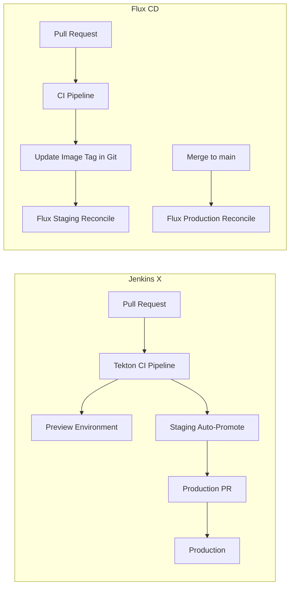

# Jenkins X to Flux CD Migration

Author: [nawazdhandala](https://github.com/nawazdhandala)

Tags: Flux CD, Jenkins X, GitOps, Migration, Kubernetes, CI/CD

Description: A practical guide to migrating from Jenkins X to Flux CD, covering architecture differences, pipeline mapping, and a phased migration approach.

---

## Introduction

Jenkins X is an opinionated CI/CD platform for Kubernetes that automates GitOps with built-in preview environments, automated pull request promotion, and integrated CI pipelines. Migrating to Flux CD means separating CI (keeping Jenkins X's Tekton pipelines or moving to GitHub Actions) from CD (replacing Jenkins X's GitOps delivery with Flux).

Jenkins X v3 already uses Flux CD under the hood for some operations, making migration paths more natural. This guide covers migrating the GitOps delivery aspects from Jenkins X to a standalone Flux CD setup.

## Prerequisites

- Existing Jenkins X cluster with applications to migrate
- New or same Kubernetes cluster for Flux CD
- Git repositories for both application code and GitOps configs
- `flux` CLI installed
- `jx` CLI installed for exporting current configuration

## Step 1: Audit Current Jenkins X Configuration

```bash
# List all Jenkins X applications
jx get apps

# Export current pipeline and environment configurations
jx get environments -o yaml > jx-environments.yaml

# List all preview environments
jx get previews

# Export all helm releases managed by Jenkins X
jx get helmrelease -A -o yaml > jx-helmreleases.yaml

# Check the GitOps repository structure used by Jenkins X
ls -la ~/.jx/
jx get activity
```

## Step 2: Understand the Architecture Difference

Jenkins X manages a development, staging, and production lifecycle with automatic promotion:



## Step 3: Set Up the Flux GitOps Repository

```bash
# Bootstrap Flux on the cluster
export GITHUB_TOKEN=your-token
flux bootstrap github \
  --owner=my-org \
  --repository=fleet-infra \
  --branch=main \
  --path=clusters/production \
  --personal

# Create the GitOps directory structure
# (equivalent to Jenkins X's environment repositories)
mkdir -p fleet-infra/apps/{staging,production}/{base,overlays}
```

## Step 4: Migrate Application Helm Releases

Export Jenkins X Helm releases and convert to Flux HelmRelease resources:

```bash
# Export a specific app's helm config from Jenkins X
jx get helmrelease my-app -n jx-staging -o yaml

# Convert to Flux HelmRelease format
cat > fleet-infra/apps/staging/my-app-helmrelease.yaml << 'EOF'
apiVersion: source.toolkit.fluxcd.io/v1
kind: HelmRepository
metadata:
  name: my-app
  namespace: flux-system
spec:
  interval: 1h
  url: https://charts.my-org.com
---
apiVersion: helm.toolkit.fluxcd.io/v2beta2
kind: HelmRelease
metadata:
  name: my-app
  namespace: staging
spec:
  interval: 5m
  chart:
    spec:
      chart: my-app
      version: ">=1.0.0"
      sourceRef:
        kind: HelmRepository
        name: my-app
        namespace: flux-system
  values:
    image:
      tag: "1.2.3"   # Replace with current version from Jenkins X
    replicaCount: 2
EOF
```

## Step 5: Replace Jenkins X CI with GitHub Actions + Flux

Jenkins X's auto-promotion via Tekton can be replaced with a GitHub Actions workflow that updates image tags in Git:

```yaml
# .github/workflows/deploy.yaml - Replace Jenkins X CI pipeline
name: Build and Update Image
on:
  push:
    branches: [main]

jobs:
  build-and-deploy:
    runs-on: ubuntu-latest
    steps:
      - uses: actions/checkout@v4

      - name: Build and push image
        run: |
          docker build -t ghcr.io/${{ github.repository }}:${{ github.sha }} .
          docker push ghcr.io/${{ github.repository }}:${{ github.sha }}

      - name: Update staging image tag
        uses: actions/checkout@v4
        with:
          repository: my-org/fleet-infra
          token: ${{ secrets.GITOPS_TOKEN }}
          path: fleet-infra

      - name: Commit new image tag
        run: |
          cd fleet-infra
          # Update the staging HelmRelease with the new image tag
          yq e ".spec.values.image.tag = \"${{ github.sha }}\"" \
            -i apps/staging/my-app-helmrelease.yaml
          git config user.email "ci@my-org.com"
          git config user.name "CI Bot"
          git commit -am "feat: update my-app to ${{ github.sha }}"
          git push
```

## Step 6: Cutover and Decommission Jenkins X

```bash
# Phase 1: Verify Flux manages staging successfully for 1 week
flux get kustomizations -A
flux get helmreleases -n staging

# Phase 2: Move production to Flux
# Update production Flux Kustomization to point to production path

# Phase 3: Disable Jenkins X environments
jx delete environment staging --confirm
jx delete environment production --confirm

# Phase 4: Uninstall Jenkins X
jx uninstall --force
```

## Best Practices

- Run Flux and Jenkins X in parallel for 2-4 weeks before full migration
- Replace Jenkins X's preview environments with Flux + dynamic namespace creation from CI
- Use Flux's notification controller to replace Jenkins X's deployment notifications
- Document your promotion workflow clearly — Flux requires explicit Git commits for promotion unlike Jenkins X's automatic promotion
- Keep Jenkins X's Tekton pipelines as the CI system if they work well; only migrate the CD/GitOps layer

## Conclusion

Migrating from Jenkins X to Flux CD simplifies the CD layer by replacing Jenkins X's opinionated automation with Flux's explicit, Git-driven reconciliation. Teams gain more control and transparency over their deployment process, though they lose Jenkins X's automated preview environments and promotion workflows. The migration is most successful when done incrementally, replacing one environment at a time while maintaining the existing CI pipeline.
