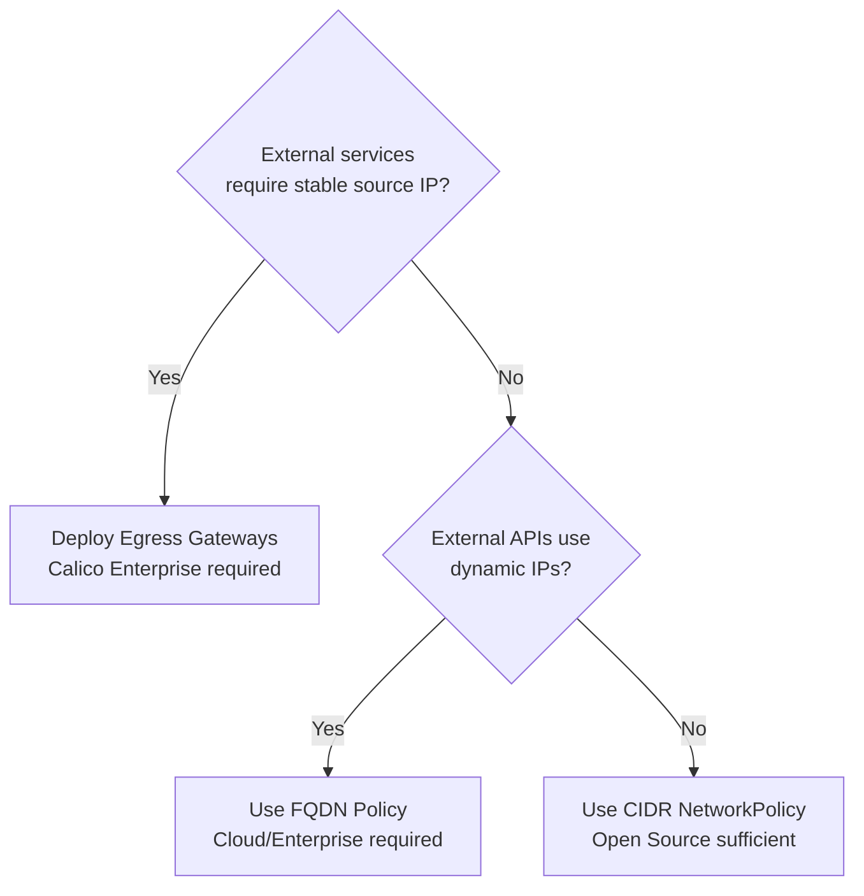

# How to Choose Kubernetes Egress with Calico for Production

Author: [nawazdhandala](https://github.com/nawazdhandala)

Tags: Calico, Kubernetes, Egress, CNI, Production, Egress Gateway, FQDN, Decision Framework

Description: A decision framework for choosing between Calico egress gateway, FQDN-based policy, and CIDR-based NetworkPolicy for production Kubernetes egress control.

---

## Introduction

Production egress control involves choosing between several Calico mechanisms: CIDR-based NetworkPolicy, FQDN-based policy (Cloud/Enterprise), and egress gateways (Enterprise). Each mechanism addresses a different use case, and most production environments need a combination of all three.

Making the wrong egress choice has concrete security and operational consequences. CIDR-based policies break when external APIs change their IP addresses. No egress gateways means external firewalls must allowlist entire node IP ranges instead of stable gateway IPs. This post provides a decision framework for assembling the right egress control stack for your production environment.

## Prerequisites

- Documented list of external services your workloads communicate with
- Understanding of whether external firewalls require stable source IPs
- Knowledge of which Calico edition you are deploying (Open Source vs. Cloud/Enterprise)
- Security policy requirements for egress control (audit, block, or observe)

## Decision 1: Do You Need IP Allowlisting by External Services?

The first decision is whether any external service requires your pods to connect from a known, stable IP address:

If your external payment processor, SaaS CRM, or data provider requires you to register source IPs for allowlisting, you need egress gateways. Without them, each node's IP is the source IP, requiring you to allowlist every node in your cluster (and update the allowlist every time you scale).

## Decision 2: How Dynamic Are Your External Endpoints?

External SaaS APIs (Stripe, Salesforce, Okta, Datadog) use CDNs and load balancers with frequently rotating IP addresses. Maintaining CIDR-based policies for these endpoints is operationally unsustainable.

Use FQDN-based policies for:
- Any external SaaS endpoint
- Any external API using a CDN
- Any endpoint where the IP-to-hostname mapping changes more than once per quarter

Use CIDR-based policies for:
- On-premises endpoints with static IPs
- Endpoints in your own AWS VPC or GCP VPC with stable CIDR blocks
- Databases or services where you control the IP addressing

## Decision 3: What Is Your Default Egress Posture?

Choose between three default egress postures:

| Posture | Implementation | Risk Level |
|---|---|---|
| Allow all (default) | No egress policy applied | High — any pod can reach any destination |
| Allow by exception | Deny-all default, explicit allow per workload | Medium — requires all egress to be declared |
| Block all | Global deny-all with no exceptions by default | Low — requires all egress to be explicitly authorized |

For production, "allow by exception" is the recommended starting point. It requires workload teams to declare their egress requirements explicitly while still being operationally manageable for teams adopting egress control gradually.

## Decision 4: Egress Gateway Sizing

If deploying egress gateways (Enterprise), plan the gateway topology:

- Dedicated egress gateway nodes (prevent interference with application workloads)
- One egress gateway pool per security zone (e.g., one for PCI workloads, one for non-PCI)
- High availability: at least two egress gateway pods per pool with anti-affinity
- IP range: pre-allocate a stable IP range for gateway pods and register it with external services

## Best Practices

- Never rely on node IP allowlisting for external services in clusters that autoscale — new nodes bring new IPs
- Implement egress policy incrementally: start by observing traffic (flow logs), then build allow rules, then apply deny-all default
- For egress gateways, use Calico's `EgressGatewayPolicy` resource to bind namespaces to specific gateway pools
- Test egress policy enforcement after every node pool upgrade — new node images can sometimes reset iptables or eBPF state

## Conclusion

Production egress control with Calico requires matching the mechanism to the requirement: egress gateways for stable source IP, FQDN policy for dynamic SaaS endpoints, and CIDR NetworkPolicy for static internal endpoints. The default posture should be "allow by exception" with workloads explicitly declaring their egress requirements. Building this control stack systematically prevents both the security risks of unrestricted egress and the operational risks of overly rigid policies that break legitimate workload connectivity.
