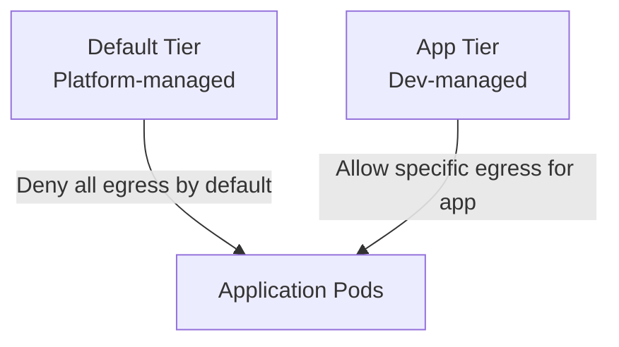

# How to Explain Kubernetes Egress with Calico to Your Team

Author: [nawazdhandala](https://github.com/nawazdhandala)

Tags: Calico, Kubernetes, Egress, CNI, Team Communication, Security, Network Policy

Description: A practical guide for explaining Kubernetes egress traffic control with Calico to engineering teams, covering why egress control matters and how to implement it.

---

## Introduction

Egress control is often the last security layer teams think about in Kubernetes — most attention goes to ingress (who can reach my services). But unrestricted egress means any compromised pod can phone home to an attacker's infrastructure, exfiltrate data, or participate in a botnet. Calico's egress controls are the primary mechanism for preventing this.

Explaining egress to your team requires making the threat concrete, showing the Calico controls that address it, and demonstrating that implementing egress policy does not require a deep understanding of networking internals. This post gives you the messaging and examples to run that conversation.

## Prerequisites

- A working Calico cluster with default egress behavior observable
- Example workloads that need external connectivity
- Understanding of Calico's NetworkPolicy egress rules

## The Core Concept: Default Allow-All Egress is Dangerous

Start with a demonstration that makes the risk real:

```bash
# Deploy a pod with no egress restrictions
kubectl run test-pod --image=nicolaka/netshoot -- sleep 3600

# Show it can reach arbitrary external services
kubectl exec test-pod -- curl -s https://ifconfig.me
# Returns the node's IP - proving the pod reached the internet

kubectl exec test-pod -- curl -s http://malware-domain.example.com
# This would succeed - any external endpoint is reachable
```

The message: by default, any pod in your cluster can reach any IP on the internet. If a pod is compromised, the attacker has outbound network access from inside your cluster.

## Framing Egress for Security Teams

Security teams respond to the concept of "least privilege egress":

> "Calico egress policy lets us define exactly which external endpoints each workload is allowed to contact. A payment processor should only reach the payment gateway. A frontend should only reach the API tier and CDN. Everything else should be denied by default."

Show the policy:

```yaml
apiVersion: projectcalico.org/v3
kind: NetworkPolicy
metadata:
  name: payment-egress-policy
  namespace: payments
spec:
  selector: app == 'payment-processor'
  egress:
  - action: Allow
    destination:
      domains:
      - api.stripe.com
  - action: Deny
```

This is immediately understandable to security stakeholders — it reads like a firewall rule.

## Framing Egress for Developers

Developers care about not breaking their services:

> "Egress policy is like a firewall allowlist for your pod's outbound connections. You tell Calico which external services your code needs to reach, and everything else is blocked. This means you need to declare your external dependencies explicitly."

Provide a workflow: developers declare their egress requirements in a NetworkPolicy alongside their deployment manifests. The platform team reviews and approves. This creates an audit trail of which workloads are allowed to reach which external services.

## Framing Egress for Platform Engineers

For platform engineers, focus on the implementation model:



Calico's tiered policy (Enterprise) lets platform engineers set a baseline deny-all egress at a platform tier that developers cannot override. Developers then add explicit allow rules in the application tier. This separation of concerns prevents developers from accidentally creating overly permissive egress policies.

## Common Questions from Teams

**Q: Will this break my pods that need to reach the internet?**
A: Only if you apply a deny-all egress policy without first adding allow rules for your legitimate external dependencies. The workflow is: audit current egress, build allow rules for legitimate traffic, then apply the deny-all default.

**Q: What about DNS? Won't blocking egress break DNS resolution?**
A: CoreDNS runs inside the cluster. Pod-to-DNS traffic is intra-cluster, not egress. Your egress policy only affects traffic leaving the cluster CIDR.

## Best Practices

- Start with observation (Calico flow logs) before enforcement — know what your pods are talking to before you start blocking it
- Implement egress policy namespace by namespace, starting with the most security-sensitive workloads
- Use FQDN-based policies for external SaaS endpoints to avoid IP-based policy drift

## Conclusion

Explaining egress control to your team requires demonstrating the default insecure behavior, framing the least-privilege egress concept in terms each stakeholder cares about, and providing a workflow that doesn't require developers to become networking experts. Calico's declarative NetworkPolicy model makes egress control accessible to teams at any networking experience level.
