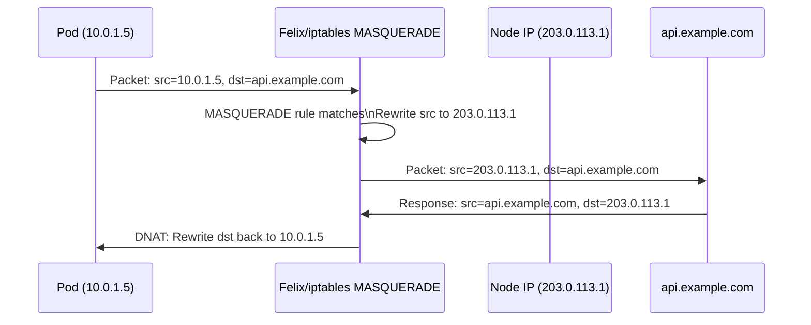
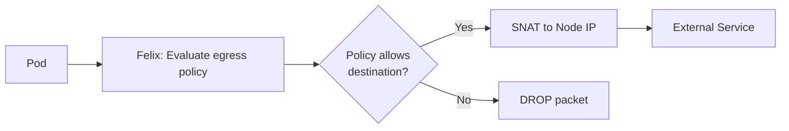
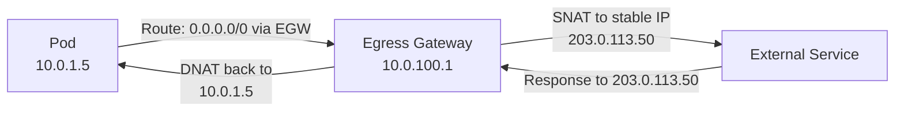
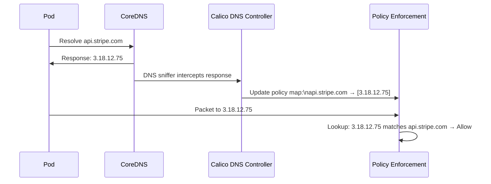

# How to Map Kubernetes Egress with Calico to Real Kubernetes Traffic

Author: [nawazdhandala](https://github.com/nawazdhandala)

Tags: Calico, Kubernetes, Egress, CNI, Traffic Flows, Networking, Egress Gateway

Description: A packet-level walkthrough of real egress traffic scenarios in a Calico cluster, from basic SNAT to egress gateways and FQDN-based policy enforcement.

---

## Introduction

Egress traffic in Calico is more complex than it appears. A single pod attempting to reach `api.stripe.com` traverses multiple Calico components - IPAM, iptables/eBPF SNAT rules, NetworkPolicy enforcement, and optionally an egress gateway. Tracing this path makes egress behavior predictable and debuggable.

This post maps three egress scenarios to their actual packet paths: default SNAT egress, egress with NetworkPolicy, and egress via an egress gateway. For each scenario, we show the packet flow and the Calico artifacts you can observe.

## Prerequisites

- A Calico cluster with at least one egress policy applied
- Understanding of SNAT and NAT mechanics
- Basic familiarity with iptables for iptables-mode clusters

## Scenario 1: Default Egress (SNAT to Node IP)



The key Calico artifact is the MASQUERADE iptables rule:
```bash
sudo iptables -t nat -L CALICO-MASQ -n -v
# Shows: MASQUERADE rules for pod CIDRs exiting the cluster
```

## Scenario 2: Egress with NetworkPolicy (IP-Based)

When a NetworkPolicy with egress rules is applied, Felix adds iptables rules (or eBPF programs) that are evaluated before the MASQUERADE rule:



The policy evaluation happens in the pod's network namespace interface TC hook (eBPF) or via iptables rules in the `cali-tw-*` chain (iptables mode):

```bash
# iptables mode: inspect egress policy chains
sudo iptables -L cali-po-<pod-interface> -n -v
# Shows: ACCEPT/DROP rules for the pod's egress destinations
```

## Scenario 3: Egress via Egress Gateway (Enterprise)

With an egress gateway, the pod's traffic is routed to the gateway pod before exiting the cluster:



Calico programs a policy-based route on the source node that sends traffic from specific pods via the egress gateway pod instead of directly to the gateway. This is implemented using Linux routing policy rules:

```bash
# On the source node, verify egress gateway routing rule
ip rule list
# Expected: rule pointing pod subnet traffic to a specific routing table
# that contains the route via the egress gateway
```

## Scenario 4: FQDN Egress Policy (Cloud/Enterprise)

FQDN egress policies require Calico's DNS sniffer component to intercept DNS responses and update eBPF/iptables rules with resolved IPs:



This dynamic DNS-to-IP mapping is what makes FQDN policies resilient to IP address rotation.

## Observing Egress Flows

Use Felix metrics to observe egress policy decisions:

```bash
# Felix Prometheus metrics (iptables mode)
kubectl exec -n calico-system daemonset/calico-node -- \
  curl -s http://localhost:9091/metrics | grep felix_calc_policy
```

## Best Practices

- Use `tcpdump` on the egress gateway pod's interface to confirm traffic is routing through the gateway
- Verify SNAT source IP with `curl https://ifconfig.me` from within pods after policy changes
- Monitor Felix's DNS controller logs for FQDN policy update events

## Conclusion

Mapping egress traffic to Calico components - MASQUERADE rules, policy chains, egress gateway routes, and DNS-based IP mapping - turns egress debugging from guesswork into systematic investigation. Each egress scenario leaves observable artifacts in iptables, routing tables, and Felix logs that can be inspected directly during an incident.
