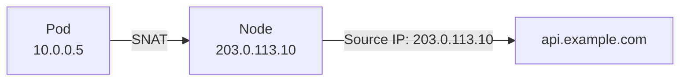
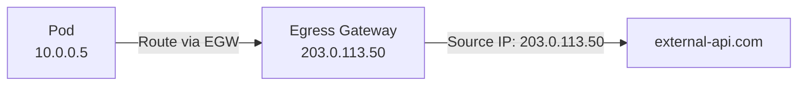

# How to Understand Kubernetes Egress with Calico

Author: [nawazdhandala](https://github.com/nawazdhandala)

Tags: Calico, Kubernetes, Egress, CNI, Networking, Egress Gateway, Network Policy

Description: A comprehensive guide to how Calico handles pod egress traffic, covering SNAT, egress gateways, FQDN policies, and egress network policies.

---

## Introduction

Egress traffic - traffic originating from pods and destined for services outside the cluster - is one of the most security-critical traffic flows in a Kubernetes cluster. Without controls, any pod can reach any external endpoint. Calico provides multiple layers of egress control, from simple NetworkPolicy egress rules to dedicated egress gateways with stable source IPs.

Understanding Calico's egress capabilities requires understanding the default behavior (SNAT to the node IP), the policy mechanisms available (IP-based and FQDN-based), and the enterprise capability of egress gateways that provide stable, predictable source IPs for external communication.

## Prerequisites

- Understanding of Kubernetes pod networking basics
- Familiarity with network address translation (SNAT/MASQUERADE)
- Awareness of your cluster's external connectivity requirements

## Default Egress Behavior: SNAT

By default, when a pod initiates traffic to a destination outside the cluster CIDR, Calico applies SNAT (Source Network Address Translation) - rewriting the source IP from the pod's RFC 1918 address to the node's external IP.



The SNAT rule is added by Felix when `natOutgoing: true` is set on the IPPool. This allows pods to reach the internet but means the receiving service sees the node IP, not the pod IP.

## Egress NetworkPolicy

Calico can restrict which external destinations pods are allowed to reach using `egress` rules in NetworkPolicy or CalicNetworkPolicy:

```yaml
apiVersion: projectcalico.org/v3
kind: NetworkPolicy
metadata:
  name: restrict-payment-egress
  namespace: payments
spec:
  selector: app == 'payment-processor'
  egress:
  - action: Allow
    destination:
      nets:
      - 203.0.113.0/24  # Payment gateway CIDR
  - action: Deny
```

This restricts the `payment-processor` pods to only contact the payment gateway IP range.

## FQDN-Based Egress Policy (Cloud/Enterprise)

IP-based egress policy is brittle for external SaaS APIs that use dynamic IPs. Calico Cloud and Enterprise support FQDN-based egress policy:

```yaml
apiVersion: projectcalico.org/v3
kind: NetworkPolicy
metadata:
  name: allow-stripe-fqdn
  namespace: payments
spec:
  selector: app == 'payment-processor'
  egress:
  - action: Allow
    destination:
      domains:
      - '*.stripe.com'
  - action: Deny
```

Calico's DNS controller watches DNS responses and dynamically updates the policy enforcement rules as IP addresses change.

## Egress Gateways (Enterprise)

Egress gateways provide a stable source IP for pod egress traffic. Instead of SNAT to a random node IP, all egress traffic from a namespace or pod is routed through a dedicated gateway pod with a reserved IP:



External services can allowlist a single stable IP instead of the entire node IP range. This is required in environments where external firewalls need to allowlist specific IPs.

```yaml
apiVersion: projectcalico.org/v3
kind: EgressGatewayPolicy
metadata:
  name: payments-egress
spec:
  rules:
  - destination: {}
    gateway:
      namespaceSelector: egress-gateway == 'true'
```

## Best Practices

- Always enable egress NetworkPolicy in production - the default allow-all egress posture is insecure
- Use FQDN policies instead of IP-based policies for any external SaaS endpoints to prevent policy drift as IP addresses rotate
- Deploy egress gateways for any workload that communicates with external services requiring IP allowlisting
- Monitor egress traffic volume by destination using Calico flow logs (Cloud/Enterprise) or network monitoring tools

## Conclusion

Calico provides a layered approach to egress control: default SNAT handles basic internet connectivity, NetworkPolicy egress rules restrict which destinations pods can reach, FQDN policies handle dynamic external SaaS APIs, and egress gateways provide stable source IPs for firewall-allowlisted external services. Implementing the full egress control stack is essential for production security postures.
