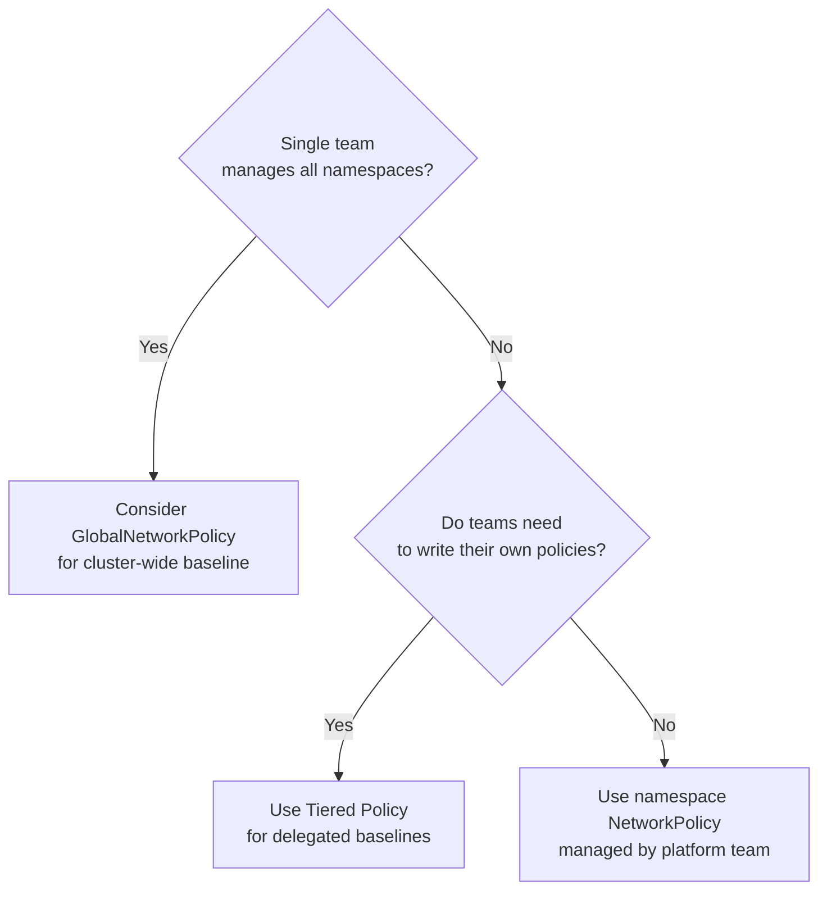

# How to Choose Kubernetes Ingress with Calico for Production

Author: [nawazdhandala](https://github.com/nawazdhandala)

Tags: Calico, Kubernetes, Ingress, CNI, Production, Network Policy, Decision Framework

Description: A decision framework for selecting the right Calico ingress policy strategy for production Kubernetes environments based on security requirements and team structure.

---

## Introduction

Ingress policy strategy for production involves deciding at what granularity to apply policies (namespace, workload, or global), which policy type to use (Kubernetes NetworkPolicy vs. Calico NetworkPolicy), and how to manage policy authorship across teams. Making these decisions upfront prevents policy sprawl and enforcement gaps.

This post provides a decision framework for the key ingress policy questions production teams face, with concrete recommendations for common organizational structures.

## Prerequisites

- Understanding of your organization's security requirements for inter-pod communication
- Knowledge of how teams are organized relative to namespaces
- Decision on Calico edition and which policy features you plan to use

## Decision 1: Default Ingress Posture

The most fundamental decision is whether to start open (allow all ingress by default) or closed (deny all ingress by default):

| Posture | Implementation | Best For |
|---|---|---|
| Open by default | No NetworkPolicy | Small teams, early development |
| Closed by default | deny-all NetworkPolicy per namespace | Production, regulated industries |
| Closed at cluster level | GlobalNetworkPolicy | Enterprises with centralized security |

For production environments, always choose closed by default. The operational overhead of writing explicit allow rules is far smaller than the security risk of unrestricted pod-to-pod communication.

## Decision 2: Policy Scope (Namespace vs. Global)


```mermaid
graph TD
    Q1{Single team\nmanages all namespaces?}
    Q1 -->|Yes| GNP[Consider GlobalNetworkPolicy\nfor cluster-wide baseline]
    Q1 -->|No| Q2{Do teams need\nto write their own policies?}
    Q2 -->|Yes| TIERED[Use Tiered Policy\nfor delegated baselines]
    Q2 -->|No| NP[Use namespace NetworkPolicy\nmanaged by platform team]
```

For single-team clusters, GlobalNetworkPolicy with cluster-wide baselines is the cleanest approach. For multi-team clusters, Calico's tiered policy model lets platform teams set higher-priority baselines that application teams cannot override.

## Decision 3: Standard Kubernetes NetworkPolicy vs. Calico NetworkPolicy

Use standard Kubernetes NetworkPolicy when:
- Your team has limited networking expertise (Kubernetes NetworkPolicy is more widely documented)
- You want portability across CNI plugins
- Your policy requirements are simple (source/destination pod selectors, port matching)

Use Calico NetworkPolicy when:
- You need explicit `Deny` actions, or `Log` actions for visibility into allowed or denied traffic
- You need policy ordering (Calico's `order` field)
- You need ICMP matching
- You need service account-based selectors
- You are using Calico's tiers

Both types can coexist in the same cluster. Calico policies add ordering, explicit `Allow`/`Deny` actions, and tiers; standard Kubernetes NetworkPolicy rules remain additive, so use Calico `order` values and tiers deliberately when both policy types apply.

## Decision 4: Health Check and Kubelet Ingress

Many teams worry about kubelet health check traffic in their deny-all policies. Standard Kubernetes NetworkPolicy allows traffic from the pod's node, but Calico host endpoint policy or more restrictive node-level controls can still affect probes. If you use those controls, verify that readiness and liveness probes from the kubelet can reach the probe ports.

If you must model probe traffic explicitly, scope the source to your node CIDR rather than using an empty `from` list. In Kubernetes NetworkPolicy, an empty or omitted `from` matches all sources for that rule:

```yaml
ingress:
- from:
  - ipBlock:
      cidr: 10.0.0.0/16  # Your node CIDR
  ports:
  - port: 8080  # Your health check port
```

With a Calico HostEndpoint policy approach, allow traffic from the node network CIDR to probe ports.

## Decision 5: Ingress Controller Traffic

If you are using an ingress controller (NGINX, Traefik, etc.), you need an explicit ingress allow rule from the ingress controller's pod selector to the backend pods:

```yaml
ingress:
- from:
  - namespaceSelector:
      matchLabels:
        kubernetes.io/metadata.name: ingress-nginx
    podSelector:
      matchLabels:
        app.kubernetes.io/name: ingress-nginx
  ports:
  - port: 8080
```

## Best Practices

- Apply deny-all ingress to every namespace at creation time, before deploying any workloads
- Use Calico GlobalNetworkPolicy for cluster-wide baseline rules (allow required platform traffic such as health checks and DNS egress, block known bad CIDRs)
- For multi-team clusters, use higher-priority tiers to prevent application teams from accidentally writing overly permissive policies
- Include ingress controller and, if applicable, kubelet health check allows in your namespace creation template

## Conclusion

Production ingress policy decisions center on three choices: default closed posture (deny-all), policy scope (namespace vs. global vs. tiered), and Kubernetes vs. Calico NetworkPolicy type. Start with deny-all, use Calico NetworkPolicy for its additional expressiveness, and implement tiered policies for multi-team environments. The combination of a closed default and explicit allow rules for every legitimate ingress path provides both security and auditability.
