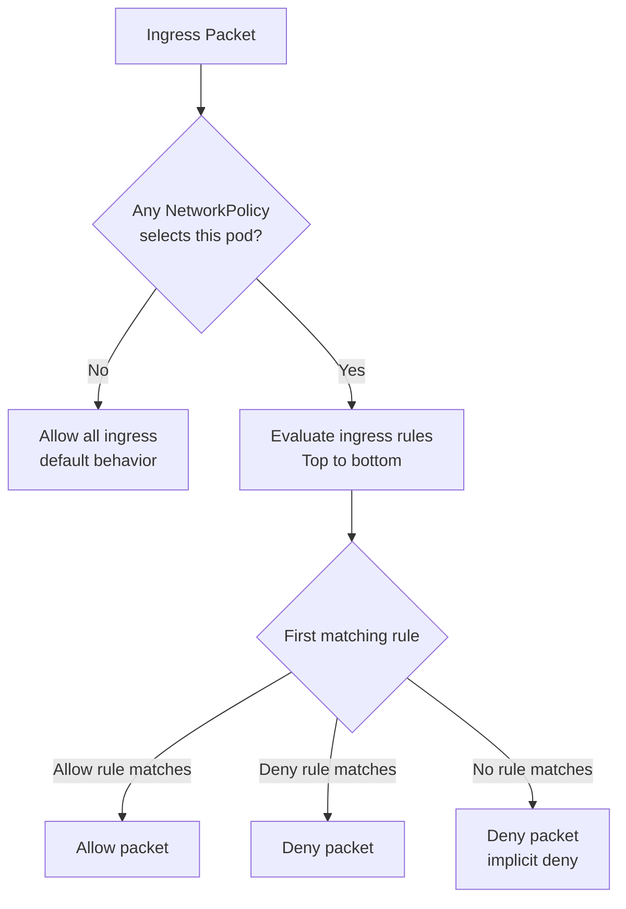

# How to Explain Kubernetes Ingress with Calico to Your Team

Author: [nawazdhandala](https://github.com/nawazdhandala)

Tags: Calico, Kubernetes, Ingress, CNI, Team Communication, Network Policy, Security

Description: Practical approaches for teaching ingress traffic control and Calico network policies to engineering teams, with examples and analogies for different audiences.

---

## Introduction

Ingress policy is the most discussed aspect of Kubernetes network security, yet it remains poorly understood in most organizations. Teams apply NetworkPolicy without a clear mental model of how rules are evaluated, leading to policies that accidentally block legitimate traffic or leave gaps that allow unintended connections.

Explaining ingress to your team requires establishing the right mental model (deny-all with explicit allows), demonstrating the rule evaluation order, and connecting policy decisions to observable behavior. This post gives you the tools to run that training session effectively.

## Prerequisites

- A working Calico cluster for live demonstrations
- Example application with at least two components (e.g., frontend and backend)
- `kubectl` access for policy application and connectivity testing

## The Firewall Analogy

The most effective way to introduce ingress policy to developers is the firewall analogy:

> "Think of each pod as having its own personal firewall. By default, that firewall allows all inbound connections. We can configure it to only allow connections from specific sources. Calico NetworkPolicy is how we configure that per-pod firewall."

This analogy works because developers already understand firewalls. The key extension: unlike traditional firewalls that use IP addresses, Calico's firewall uses Kubernetes labels — so you can write rules like "allow connections from pods with label `app=frontend`" instead of specifying IPs that change as pods restart.

## Live Demo: From Open to Controlled

Start with a demo that shows the default open posture and progressively restricts it:

```bash
# Deploy a simple two-tier app
kubectl apply -f frontend-deployment.yaml
kubectl apply -f backend-deployment.yaml

# Show that frontend can reach backend
kubectl exec frontend-pod -- wget -qO- http://backend-service

# Now show what happens with a deny-all policy
kubectl apply -f deny-all-ingress.yaml

# Frontend can no longer reach backend
kubectl exec frontend-pod -- wget --timeout=5 -qO- http://backend-service
# Timeout — policy is working

# Add a specific allow rule
kubectl apply -f allow-frontend-to-backend.yaml

# Now frontend can reach backend again, but nothing else can
kubectl exec kubectl-exec -- wget --timeout=5 -qO- http://backend-service
# Still times out — only frontend is allowed
```

This sequence makes the policy model tangible.

## Explaining Rule Evaluation to Developers

Developers often struggle with why their policy "isn't working." The key concept to explain:



Key insight for developers: **once any NetworkPolicy selects your pod, the default changes from allow-all to deny-all**. You must explicitly allow every legitimate ingress path, including health check ports.

## Explaining Calico's Extensions

For engineers who will write policies, explain what Calico adds over standard Kubernetes NetworkPolicy:

| Feature | Kubernetes NetworkPolicy | Calico NetworkPolicy |
|---|---|---|
| Rule ordering | No | Yes (order field) |
| Explicit deny action | No (implicit) | Yes |
| ICMP matching | No | Yes |
| Global scope | No | Yes (GlobalNetworkPolicy) |
| Service account selector | No | Yes |

The most commonly needed extension is explicit deny — Calico's `action: Deny` lets you write policies that explicitly reject traffic and log the denial, rather than relying on implicit drop.

## Common Questions and Answers

**Q: What happens if I have two NetworkPolicies that select the same pod?**
A: They are merged. Ingress is allowed if *any* policy allows it. This is union semantics, not intersection.

**Q: Can I write a policy that applies to all namespaces?**
A: Use Calico's `GlobalNetworkPolicy` (not standard Kubernetes NetworkPolicy). It applies cluster-wide.

## Best Practices

- Use live demos with a real cluster rather than slides — policy behavior is counterintuitive until seen in action
- Start with a deny-all policy and add allows incrementally rather than starting open and adding denies
- Give developers a policy template for common patterns (allow from frontend, allow health checks)

## Conclusion

Explaining Calico ingress to your team is most effective when you start with the firewall analogy, demonstrate the deny-all behavior live, explain rule evaluation order, and show what Calico adds over standard Kubernetes NetworkPolicy. The combination of correct mental model and observable behavior eliminates most ingress policy confusion.
