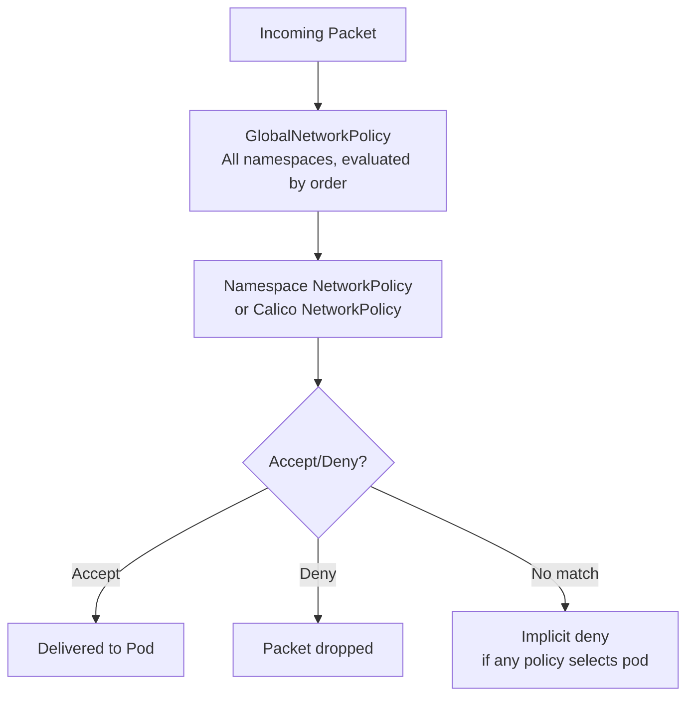
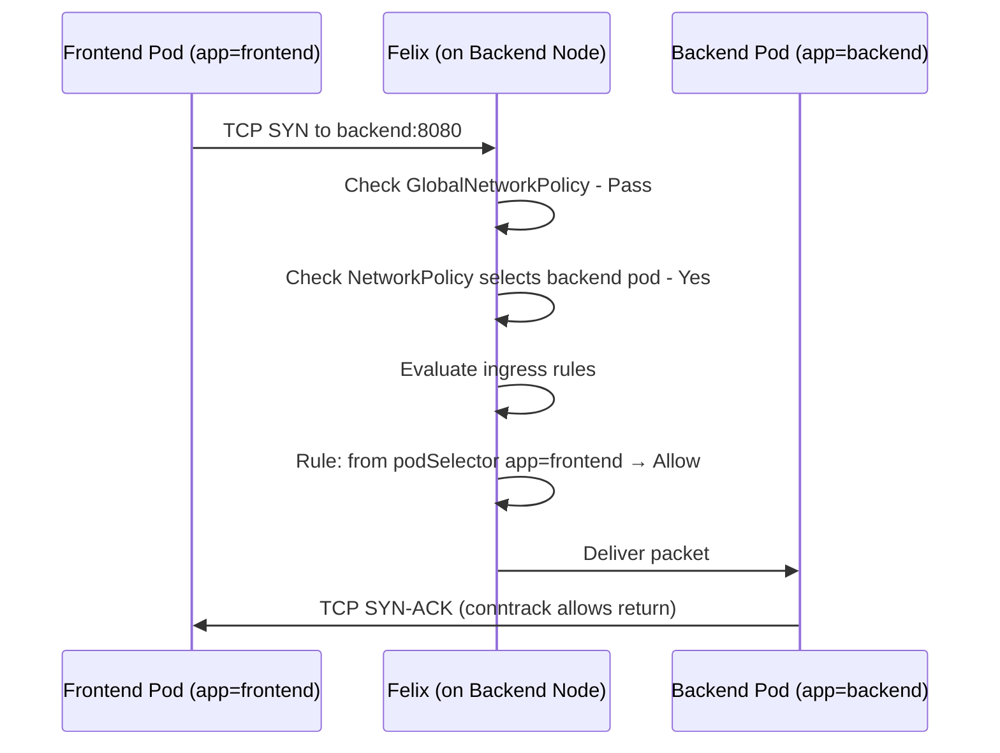
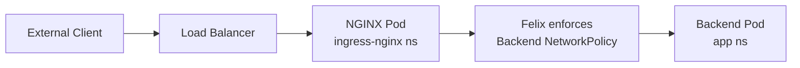
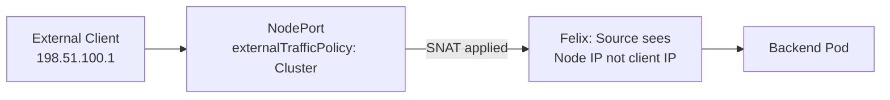
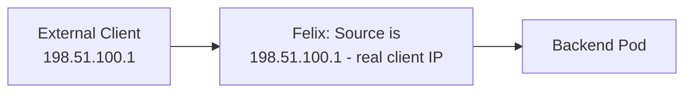

# How to Map Kubernetes Ingress with Calico to Real Kubernetes Traffic

Author: [nawazdhandala](https://github.com/nawazdhandala)

Tags: Calico, Kubernetes, Ingress, CNI, Traffic Flows, Networking, Network Policy

Description: A concrete walkthrough of real ingress traffic scenarios in a Calico cluster, tracing packets from source to destination through policy enforcement.

---

## Introduction

Understanding how ingress traffic actually flows through Calico's policy enforcement helps you debug connectivity issues and design policies with confidence. The policy model is clear in documentation, but understanding what happens at the packet level - which hooks are evaluated, in what order, and what causes a packet to be dropped - requires tracing real traffic through the system.

This post maps three ingress traffic scenarios to their actual enforcement paths: pod-to-pod ingress, ingress controller to backend, and external load balancer traffic.

## Prerequisites

- A running Calico cluster with ingress policies applied
- Understanding of Calico's NetworkPolicy model
- Basic familiarity with iptables or eBPF (depending on your dataplane)

## How Calico Evaluates Ingress Policy

Before tracing scenarios, understand the evaluation order:



GlobalNetworkPolicies are evaluated first (by `order` value), then namespace-scoped policies. The first matching rule in the first matching policy wins.

## Scenario 1: Frontend Pod to Backend Pod (Same Namespace)



The ingress enforcement happens at Felix on the receiving node, not the sending node. The return traffic is automatically allowed by connection tracking.

In iptables mode, inspect the enforcement chain:
```bash
# On the node running the backend pod
sudo iptables -L cali-pi-<backend-interface> -n -v
# Shows the allow rule for frontend pods
```

## Scenario 2: Ingress Controller to Backend (Cross-Namespace)

When an NGINX ingress controller pod in the `ingress-nginx` namespace proxies to a backend in the `app` namespace:



The NetworkPolicy that allows this traffic uses a cross-namespace selector:

```yaml
ingress:
- from:
  - namespaceSelector:
      matchLabels:
        kubernetes.io/metadata.name: ingress-nginx
    podSelector:
      matchLabels:
        app.kubernetes.io/name: ingress-nginx
  ports:
  - port: 8080
```

Calico Felix on the backend's node evaluates this rule when the packet arrives from the ingress controller pod's IP. The source is the ingress controller pod's IP (the backend receives the actual pod-to-pod traffic after the ingress controller has terminated the external TLS connection).

## Scenario 3: External LoadBalancer Traffic

When traffic arrives from an external load balancer to a NodePort service and then to a backend pod:



With `externalTrafficPolicy: Cluster` (default), Calico sees the node IP as the ingress source, not the external client IP. This means client-IP-based ingress policies will not work.

With `externalTrafficPolicy: Local` or Calico eBPF mode:


Now ingress policies can match on the actual client IP for IP-based access control.

## Observing Policy Enforcement in Real Time

Use Felix's policy logging to observe ingress decisions:

```bash
# Enable policy logging (generates kernel log entries for policy decisions)
kubectl patch felixconfiguration default \
  --type merge -p '{"spec":{"policySyncPathPrefix":"/var/run/nodeagent"}}'

# On a node, watch for deny events
sudo journalctl -f | grep -i "calico.*deny"
```

## Best Practices

- Remember that ingress policy is enforced at the receiving node, not the sending pod
- For external traffic, check `externalTrafficPolicy` before writing client-IP-based ingress rules
- Use `calicoctl get workloadendpoint` to see which policies are applied to a specific pod

## Conclusion

Calico ingress enforcement happens at Felix on the node receiving the traffic. GlobalNetworkPolicies are evaluated first, then namespace-scoped policies. The evaluation is deterministic and inspectable via iptables chains or eBPF program hooks. Understanding the enforcement location and evaluation order is the foundation for debugging any ingress connectivity issue.
