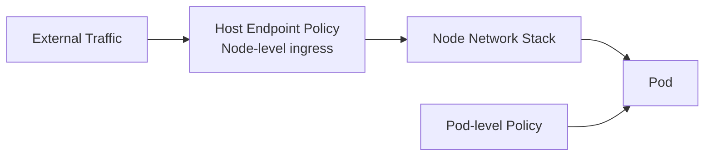

# How to Understand Kubernetes Ingress with Calico

Author: [nawazdhandala](https://github.com/nawazdhandala)

Tags: Calico, Kubernetes, Ingress, CNI, Networking, Network Policy, Security

Description: A comprehensive guide to how Calico handles ingress traffic control and policies, covering NetworkPolicy ingress rules, host endpoint policies, and ingress threat mitigation.

---

## Introduction

Ingress traffic — traffic arriving at a pod from any source — is the attack surface that network policy was designed to protect. Calico provides multiple layers of ingress control: Kubernetes NetworkPolicy ingress rules, Calico's extended NetworkPolicy with more expressive selectors, GlobalNetworkPolicy for cluster-wide rules, and HostEndpoint policies for traffic arriving at the node itself.

Understanding Calico ingress means understanding both which traffic flows are subject to policy enforcement and which Calico resources control each type of flow. This post covers the ingress control model from pod-level to cluster-level.

## Prerequisites

- Understanding of Kubernetes NetworkPolicy basics
- Familiarity with label selectors
- A Calico cluster to test against

## The Default Ingress Posture

Without any NetworkPolicy, Kubernetes allows all ingress to all pods. This means any pod can receive connections from any other pod or from external sources (depending on service type). Calico inherits this default — no policy means all traffic is allowed.

The correct production default is a deny-all ingress policy per namespace, with explicit allow rules for legitimate ingress:

```yaml
apiVersion: networking.k8s.io/v1
kind: NetworkPolicy
metadata:
  name: default-deny-ingress
  namespace: my-app
spec:
  podSelector: {}
  policyTypes:
  - Ingress
  ingress: []
```

This blocks all ingress to all pods in `my-app` namespace until an explicit allow rule is added.

## Calico NetworkPolicy Ingress Rules

Calico extends the Kubernetes NetworkPolicy with more expressive selectors and an explicit `action` field:

```yaml
apiVersion: projectcalico.org/v3
kind: NetworkPolicy
metadata:
  name: allow-frontend-ingress
  namespace: backend
spec:
  selector: app == 'api'
  ingress:
  - action: Allow
    source:
      selector: app == 'frontend'
      namespaceSelector: kubernetes.io/metadata.name == 'frontend'
    destination:
      ports:
      - 8080
  - action: Deny
```

Key Calico extensions over standard NetworkPolicy:
- **Explicit `action`**: `Allow`, `Deny`, or `Pass` (send to next tier)
- **Ordered rules**: Rules are evaluated top-to-bottom; first match wins
- **Cross-namespace selectors**: More expressive namespace matching
- **Protocol and port flexibility**: ICMP, UDP, port ranges

## GlobalNetworkPolicy for Cluster-Wide Ingress Rules

Calico's `GlobalNetworkPolicy` applies to all pods across all namespaces, enabling cluster-wide baseline rules:

```yaml
apiVersion: projectcalico.org/v3
kind: GlobalNetworkPolicy
metadata:
  name: block-known-bad-actors
spec:
  order: 100
  ingress:
  - action: Deny
    source:
      nets:
      - 198.51.100.0/24  # Known malicious CIDR
  - action: Pass
```

This policy runs before namespace-level policies, blocking traffic from a malicious CIDR cluster-wide without requiring individual namespace policies.

## HostEndpoint Ingress Policy

Calico can also apply ingress policy to the node itself (not just pods). This controls traffic arriving at the node's physical interfaces:



HostEndpoint policies protect the node itself from unwanted direct connections, separate from pod-level policy.

## Ingress from Services and Load Balancers

When traffic arrives via a Kubernetes Service (NodePort, LoadBalancer), the source IP that Calico sees depends on the `externalTrafficPolicy` setting:

- `externalTrafficPolicy: Cluster` (default): Calico sees the node IP (SNAT applied by kube-proxy), not the original client IP
- `externalTrafficPolicy: Local`: Calico sees the original client IP, enabling client-IP-based ingress policy

For Calico eBPF mode, source IP preservation works regardless of `externalTrafficPolicy` setting.

## Best Practices

- Apply a default-deny-ingress NetworkPolicy to every namespace at namespace creation
- Use Calico GlobalNetworkPolicy (not Kubernetes NetworkPolicy) for cluster-wide baseline rules
- Test ingress policy with explicit connectivity tests — a missing allow rule causes silent connection drops
- Use `order` on GlobalNetworkPolicies to ensure they are evaluated before namespace-level policies

## Conclusion

Calico's ingress control model layers from cluster-wide GlobalNetworkPolicy through namespace-level NetworkPolicy to pod-level rules. Starting with a deny-all default and adding explicit allow rules for each legitimate ingress path is the most secure and auditable approach. Understanding the interaction between GlobalNetworkPolicy ordering, namespace policies, and HostEndpoint policies gives you full control over every ingress path in your cluster.
