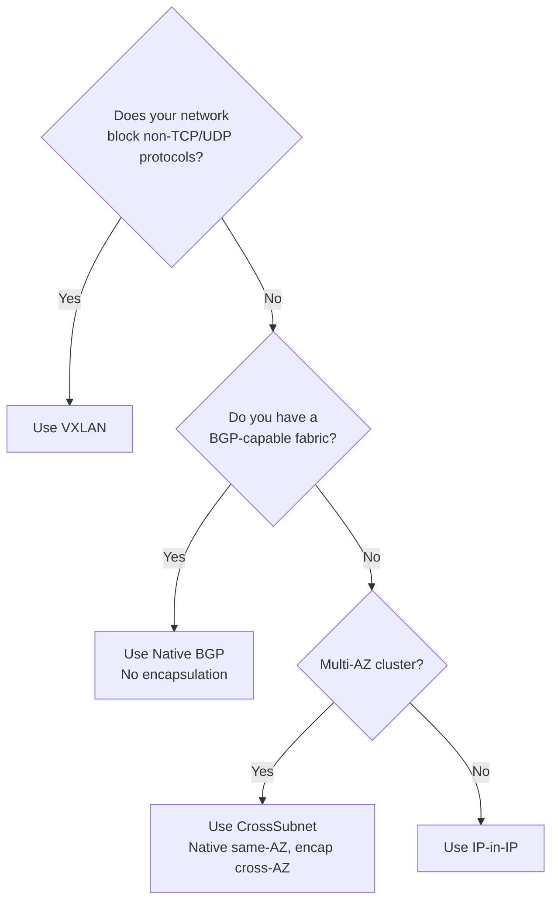

# How to Choose Kubernetes Networking for Calico Users for Production

Author: [nawazdhandala](https://github.com/nawazdhandala)

Tags: Calico, Kubernetes, CNI, Production, Networking, BGP, VXLAN, IP-in-IP

Description: A decision framework for selecting Calico networking modes and IP address management strategies for production Kubernetes deployments.

---

## Introduction

Choosing the right networking configuration for a production Calico deployment involves several interconnected decisions: encapsulation mode, BGP peering topology, IP pool sizing, and IPv6 support. Each decision has performance, operational, and compatibility implications that compound in a production environment.

This post provides a structured decision framework for the key networking choices Calico users face when designing for production. The framework is opinionated - based on what works in real production environments - while acknowledging that every infrastructure environment has unique constraints.

## Prerequisites

- Understanding of your cloud provider or on-premises network topology
- Knowledge of whether your network fabric supports BGP
- Decision made on eBPF vs iptables dataplane (covered in a separate post)
- Capacity planning: estimated node count and pod density

## Decision 1: Encapsulation Mode

| Mode | When to Use | Overhead |
|---|---|---|
| IP-in-IP | Cloud VPCs without BGP peering, heterogeneous node types | Low (20 bytes per packet) |
| VXLAN | Cloud environments blocking non-TCP/UDP protocols | Medium (50 bytes per packet) |
| Native (BGP) | On-premises with BGP-capable ToR switches | None |
| CrossSubnet | Multi-AZ deployments where same-subnet traffic is native and cross-subnet is encapsulated | Variable |

For AWS, GCP, and Azure with VPC routing, VXLAN or IP-in-IP are standard. For bare-metal deployments with a BGP-capable fabric (Junos, EOS, Cumulus), native routing eliminates encapsulation overhead entirely.



## Decision 2: IP Pool Sizing

The most common production mistake is an undersized IP pool. Calculate your pool size:

- Calico allocates IPs in blocks (default /26 = 64 IPs per block per node)
- Each node pre-allocates one block, preventing fragmentation
- Add 30% headroom for burst scaling and rolling upgrades

For a cluster with maximum 100 nodes at 50 pods per node:
- Required: 100 × 64 = 6,400 IPs minimum
- With headroom: ~10,000 IPs → use a /18 (16,382 IPs)

```bash
# Check current allocation
calicoctl ipam show
```

## Decision 3: BGP Peering Topology

If using native BGP routing, choose between:

- **Node-to-node mesh**: Every node peers with every other node. Simple, but O(n²) peer relationships. Use for clusters with fewer than 50 nodes.
- **Route reflectors**: Designated nodes act as BGP route reflectors. Scales to thousands of nodes. Required for large clusters.

```bash
# Disable node-to-node mesh for large clusters
calicoctl patch bgpconfiguration default \
  -p '{"spec":{"nodeToNodeMeshEnabled":false}}'
```

## Decision 4: IPv4 vs. Dual-Stack

Calico supports IPv4-only, IPv6-only, and dual-stack configurations. For most production clusters, IPv4-only is the default. Enable dual-stack only if your workloads require IPv6 reachability:

```yaml
apiVersion: projectcalico.org/v3
kind: IPPool
metadata:
  name: default-ipv6-pool
spec:
  cidr: fd00::/96
  nodeSelector: all()
```

Dual-stack requires Kubernetes 1.20+ and must be enabled at cluster creation - it cannot be retrofitted to existing single-stack clusters without downtime.

## Best Practices

- Size IP pools at cluster creation - resizing requires careful IPAM migration
- Use CrossSubnet mode for multi-AZ deployments to avoid unnecessary encapsulation overhead within an AZ
- For clusters > 50 nodes with BGP, deploy route reflectors on dedicated non-worker nodes
- Document your encapsulation mode, pool CIDR, and BGP topology in your cluster runbook - these are the facts you need fastest during incidents

## Conclusion

Production Calico networking decisions center on four choices: encapsulation mode (matched to your fabric capabilities), IP pool size (sized generously at creation), BGP topology (mesh for small, route reflectors for large), and IPv4/dual-stack. Making these decisions explicitly before cluster creation - and documenting the rationale - prevents the most common production networking problems.
