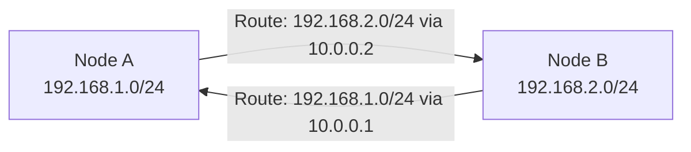

# How to Explain Kubernetes Networking for Calico Users to Your Team

Author: [nawazdhandala](https://github.com/nawazdhandala)

Tags: Calico, Kubernetes, CNI, Networking, Team Communication, Pod Networking

Description: Practical approaches for teaching Kubernetes networking concepts to your team using Calico as the concrete implementation example.

---

## Introduction

Kubernetes networking is one of the hardest topics to teach because it sits at the intersection of Linux networking, distributed systems, and Kubernetes-specific abstractions. Most documentation explains the theory without connecting it to what actually happens on a real node.

Using Calico as the teaching vehicle changes this dynamic. Calico's components map directly to Kubernetes networking concepts in a way that is observable and inspectable. You can point to a Felix log, a BGP route, or an IPPool and show your team exactly how the abstract networking model becomes concrete reality.

This post gives you a structured teaching approach for walking your team through Kubernetes networking with Calico as the reference implementation.

## Prerequisites

- A working Calico cluster your team can interact with
- Basic familiarity with IP addresses and routing
- `kubectl` and `calicoctl` access for live demonstrations

## Start with the Problem: Why Does Pod Networking Need a CNI?

Begin by showing what a cluster looks like without a CNI. Create a kind cluster without CNI and observe that nodes are NotReady:

```bash
kind create cluster --config kind-no-cni.yaml
kubectl get nodes
# All nodes show NotReady
```

This makes the CNI's role concrete: without it, pods cannot be scheduled and nodes cannot communicate. Calico is what makes the cluster functional at the network layer.

## Teaching the Pod IP Model

The best way to teach pod IP uniqueness is through live observation:

```bash
# Create two pods
kubectl run pod-a --image=nginx
kubectl run pod-b --image=busybox -- sleep 3600

# Show each has a unique IP
kubectl get pods -o wide

# Show they can communicate directly
kubectl exec pod-b -- ping $(kubectl get pod pod-a -o jsonpath='{.status.podIP}')
```

Then show where the IP came from:

```bash
calicoctl ipam show --show-blocks
```

This connects the abstract concept (every pod gets a unique IP) to the mechanism (Calico IPAM draws from the IPPool).

## Teaching Cross-Node Routing

Show the host routing table on a node to make cross-node routing visible:

```bash
# On a worker node
ip route show | grep "via"
```

Each entry is a route Felix programmed for pods on another node. This is the "every pod can reach every other pod" guarantee made concrete — there is literally a route for each remote pod subnet.



## Teaching Network Policy

Demonstrate policy by blocking traffic and showing the result:

```bash
# Confirm connectivity before policy
kubectl exec pod-b -- wget -qO- $(kubectl get pod pod-a -o jsonpath='{.status.podIP}')

# Apply a deny policy
kubectl apply -f deny-all-ingress.yaml

# Show connectivity is now blocked
kubectl exec pod-b -- wget --timeout=5 -qO- $(kubectl get pod pod-a -o jsonpath='{.status.podIP}')
# Should time out

# Show the iptables rule that enforces it (iptables mode)
# On the node running pod-a:
sudo iptables -L cali-pi-inbound-policy -n --line-numbers
```

## Common Questions and Answers

**Q: Why does my pod have a /32 IP when the pool is a /16?**
A: Calico allocates host routes per-pod — each pod gets a host route on the node, not a subnet broadcast domain. The /32 makes routing more specific and avoids broadcast traffic.

**Q: What happens if the IPPool runs out of IPs?**
A: New pods will fail to schedule with IPAM exhaustion errors. Show with `calicoctl ipam show` and walk through how to expand the pool.

## Best Practices

- Use live cluster demos rather than slides wherever possible — networking concepts land better when observable
- Walk through the pod creation flow: kubelet → CNI → IPAM → veth → Felix → route table
- Assign the team a troubleshooting exercise: disconnect a pod network policy and find the bug using kubectl and calicoctl

## Conclusion

Teaching Kubernetes networking with Calico is most effective when you tie every abstract concept to an observable artifact: an IPPool, a route table entry, an iptables rule, or a Felix log. This hands-on approach transforms networking from a black box into a system your team can inspect, understand, and confidently operate.
