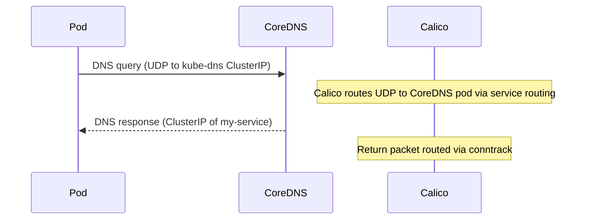
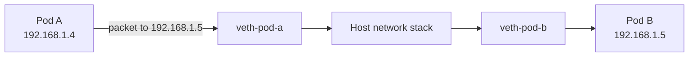
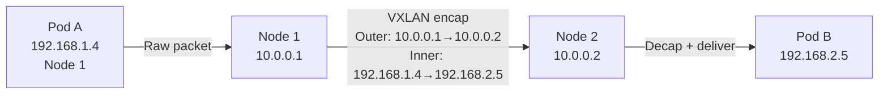
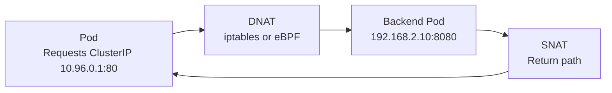
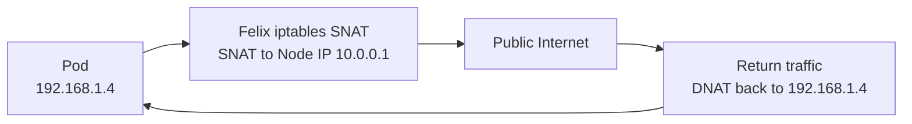

# How to Map Kubernetes Networking for Calico Users to Real Kubernetes Traffic

Author: [nawazdhandala](https://github.com/nawazdhandala)

Tags: Calico, Kubernetes, CNI, Networking, Traffic Flows, Pod Networking, BGP

Description: A concrete walkthrough of real Kubernetes traffic flows in a Calico cluster, connecting abstract networking concepts to observable packet paths and routing decisions.

---

## Introduction

Kubernetes networking concepts — pod IPs, service CIDRs, BGP routes — become meaningful when you trace a real packet through the system. Mapping these flows to what you can actually observe on nodes and in Calico resources transforms networking from theory into a debuggable system.

This post traces five real traffic scenarios through a Calico cluster, showing what happens at each hop, which Calico component is responsible, and what you can observe to verify the behavior. Each scenario builds on the previous one in complexity.

## Prerequisites

- A running Calico cluster with at least two nodes
- `kubectl` and `calicoctl` access
- SSH access to nodes for route table inspection

## Scenario 1: Pod Requests a DNS Name

Every Kubernetes workload starts with DNS. When a pod resolves `my-service.default.svc.cluster.local`:



Calico is responsible for routing the UDP packet from the pod to the CoreDNS pod IP. Verify:
```bash
kubectl exec my-pod -- nslookup my-service.default.svc.cluster.local
```

## Scenario 2: Pod-to-Pod on the Same Node



On the same node, traffic flows through veth pairs in the host network namespace. No encapsulation is used — it's direct kernel forwarding. Felix programs the route: `192.168.1.5 dev veth-pod-b scope link`.

```bash
# Verify on the node:
ip route show 192.168.1.5
# Output: 192.168.1.5 dev cali<hash> scope link
```

## Scenario 3: Pod-to-Pod Across Nodes (VXLAN mode)



Felix programs a route on Node 1: `192.168.2.0/26 via 10.0.0.2 dev vxlan.calico`. The kernel encapsulates the packet in VXLAN (UDP/4789) and sends it to Node 2, which decapsulates and delivers to Pod B.

Verify the VXLAN route:
```bash
ip route show | grep vxlan.calico
```

## Scenario 4: Pod to ClusterIP Service



kube-proxy (iptables mode) or Calico eBPF intercepts the packet to the ClusterIP, selects a backend pod via load balancing, and rewrites the destination IP. Verify:
```bash
# iptables mode: inspect DNAT rules
sudo iptables -t nat -L KUBE-SERVICES -n | grep 10.96.0.1

# eBPF mode: inspect service map
sudo bpftool map dump name cali_v4_svc_ports | grep -A5 "10.96.0.1"
```

## Scenario 5: Pod Egress to the Public Internet



With `natOutgoing: true` on the IPPool, Felix adds an iptables masquerade rule that translates the pod's RFC 1918 IP to the node's external IP for traffic destined outside the cluster CIDR.

```bash
sudo iptables -t nat -L CALICO-MASQ -n
```

## Best Practices

- Trace each scenario in your lab cluster to build intuition before production incidents
- Keep a network diagram with node IPs, pod CIDRs, service CIDR, and external CIDRs visible during incident response
- Use `tcpdump` at the veth interface to observe packets between a pod and the host network

## Conclusion

Mapping real traffic flows to Calico components — veth pairs, VXLAN tunnels, iptables DNAT rules, eBPF service maps — gives you a concrete mental model for debugging networking issues. Each flow is traceable from source to destination through observable artifacts on the node. Building this traceability into your team's troubleshooting workflow transforms networking incidents from mysterious to diagnosable.
