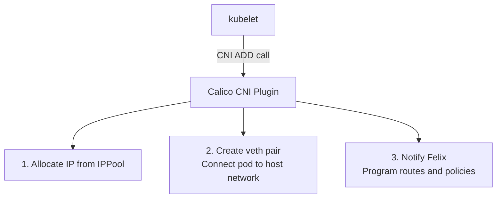

# How to Understand Kubernetes Networking for Calico Users

Author: [nawazdhandala](https://github.com/nawazdhandala)

Tags: Calico, Kubernetes, CNI, Networking, Pod Networking, Services, Network Policy

Description: Kubernetes networking fundamentals explained from a Calico user's perspective, covering the networking model, CNI role, and how Calico implements each requirement.

---

## Introduction

Kubernetes imposes a specific networking model on all CNI plugins: every pod gets its own IP, every pod can reach every other pod without NAT (unless policy prevents it), and every node can reach every pod IP. This model is what makes Kubernetes networking portable across providers — but it is CNI plugins like Calico that actually implement it.

Understanding Kubernetes networking from a Calico perspective means understanding both the requirements the Kubernetes model imposes and the specific mechanisms Calico uses to satisfy them. This post covers the networking model, the CNI interface, and how Calico maps its components to each Kubernetes networking requirement.

## Prerequisites

- Basic familiarity with Linux networking (IP addresses, routing tables)
- Understanding of what a Kubernetes pod is
- No prior CNI or Calico knowledge required

## The Kubernetes Networking Model

Kubernetes specifies four networking requirements:

1. Every pod gets a unique cluster-wide IP address
2. Pods can communicate with any other pod without NAT
3. Agents on a node can communicate with all pods on that node
4. Services have their own IP space separate from pod IPs

Calico satisfies each of these:

| Requirement | Calico Mechanism |
|---|---|
| Unique pod IP | IPAM via `IPPool` resources |
| No-NAT pod-to-pod | BGP routing or VXLAN overlay |
| Node-to-pod communication | Routes programmed by Felix on each node |
| Service IP space | kube-proxy (iptables) or Calico eBPF |

## How CNI Works with Calico

When the kubelet creates a pod, it calls the CNI plugin (Calico) via a standardized JSON interface. Calico's CNI plugin does three things:



1. **IP allocation**: The Calico IPAM plugin selects an IP from the configured `IPPool` and records the allocation in the Calico datastore
2. **Network namespace setup**: A veth pair is created — one end in the pod's network namespace, one end on the host — giving the pod its network interface
3. **Routing**: Felix programs a host route for the pod's IP pointing to the pod's veth interface

## IP Pools and IPAM

Calico manages pod IP allocation through `IPPool` resources:

```yaml
apiVersion: projectcalico.org/v3
kind: IPPool
metadata:
  name: default-ipv4-pool
spec:
  cidr: 192.168.0.0/16
  ipipMode: Always
  natOutgoing: true
```

The `cidr` field defines the address space for pod IPs. `ipipMode` controls whether IP-in-IP encapsulation is used for cross-node traffic. `natOutgoing` enables SNAT for pods communicating with destinations outside the cluster.

## Cross-Node Pod Routing

Calico supports three cross-node routing modes:

- **IP-in-IP**: Pod packets are encapsulated inside an IP tunnel between nodes. Works in most network environments.
- **VXLAN**: Pod packets are encapsulated in VXLAN (UDP). Works in environments that block IP protocols other than TCP/UDP.
- **Native routing (BGP)**: Routes are distributed via BGP — no encapsulation. Requires a BGP-capable network fabric.

## Network Policy Integration

Calico implements both the Kubernetes `NetworkPolicy` resource and its own extended `CalicNetworkPolicy` and `GlobalNetworkPolicy` resources. Both are enforced by Felix, which programs iptables (or eBPF) rules on each node based on policy resources stored in the datastore.

## Best Practices

- Always size your `IPPool` CIDR large enough for your maximum expected pod count per node
- Prefer VXLAN mode in cloud environments where BGP is not available
- Use `calicoctl ipam show` to monitor IP allocation and detect exhaustion before it becomes an outage
- Understand the `natOutgoing` setting — disabling it requires that your network fabric can route pod CIDRs

## Conclusion

Kubernetes defines a networking model and leaves the implementation to CNI plugins. Calico implements this model through IPAM (`IPPool`), veth-pair network namespace setup, Felix-managed routes, and a BGP or VXLAN overlay for cross-node traffic. Understanding these mechanisms gives you the foundation to troubleshoot networking issues, design IP plans, and make informed dataplane decisions for your cluster.
