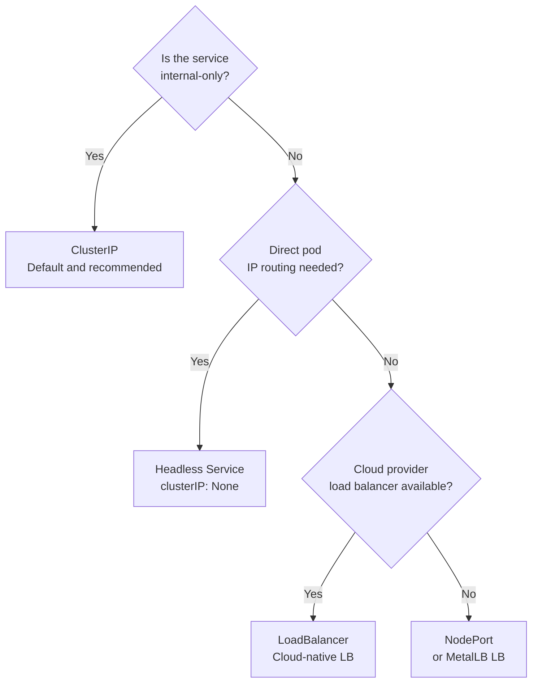

# How to Choose Kubernetes Services with Calico for Production

Author: [nawazdhandala](https://github.com/nawazdhandala)

Tags: Calico, Kubernetes, Services, CNI, Production, EBPF, Kube-proxy, Decision Framework

Description: A decision framework for choosing between kube-proxy and Calico eBPF service routing, and for configuring service types correctly for production Kubernetes workloads.

---

## Introduction

Production service networking decisions with Calico center on two questions: should you use kube-proxy (iptables) or Calico eBPF for service routing, and which service type is appropriate for each workload? These decisions affect performance, source IP visibility, and operational complexity.

Most teams default to kube-proxy without evaluating whether Calico eBPF would better serve their workloads. This post provides a structured framework for making the service networking choice consciously.

## Prerequisites

- Knowledge of your cluster's kernel version (eBPF requires 5.3+)
- Understanding of which workloads need external access
- Awareness of whether client source IP matters for your applications

## Decision 1: kube-proxy vs. Calico eBPF Service Routing

| Factor | Favor kube-proxy | Favor Calico eBPF |
|---|---|---|
| Kernel version | < 5.3 | 5.3+ (5.8+ for DSR) |
| Cluster size | < 100 services | > 100 services |
| Source IP preservation for external traffic | Not required | Required |
| Windows nodes in cluster | Yes | No (Linux-only) |
| Team eBPF expertise | No | Yes or learning |

For most modern Linux clusters with more than 100 services, Calico eBPF is the better choice. For small clusters or mixed OS environments, kube-proxy is appropriate.

## Decision 2: Service Type Selection



## Decision 3: External Traffic Policy for LoadBalancer and NodePort

For LoadBalancer and NodePort services receiving external traffic:

**`externalTrafficPolicy: Cluster` (default)**:
- Load balances across all nodes
- Source IP is SNAT'd to node IP (client IP not visible to pod)
- Best for stateless services where client IP doesn't matter

**`externalTrafficPolicy: Local`**:
- Only routes to pods on the same node that received the request
- Preserves original client source IP
- Can cause uneven load distribution if pods are not spread across nodes
- Required for applications that do IP-based access control

**Calico eBPF with DSR**:
- Preserves client source IP for all service types
- Does not require `externalTrafficPolicy: Local`
- The recommended approach for source IP preservation

## Decision 4: Session Affinity

If your application requires the same client to always reach the same backend pod (stateful protocols, sticky sessions), enable session affinity:

```yaml
apiVersion: v1
kind: Service
spec:
  sessionAffinity: ClientIP
  sessionAffinityConfig:
    clientIP:
      timeoutSeconds: 10800
```

Session affinity works in both kube-proxy and Calico eBPF modes but has different implementation mechanisms.

## Decision 5: Service CIDR Sizing

The service CIDR (set at cluster creation via `--service-cluster-ip-range`) cannot be changed without cluster recreation. Size it adequately:

- Default in many distributions: 10.96.0.0/12 (~1 million addresses)
- For most clusters, this is adequate
- Ensure the service CIDR does not overlap with pod CIDR, node CIDR, or any external network

## Best Practices

- For clusters with 50+ services, enable Calico eBPF to eliminate kube-proxy DNAT overhead
- Use `externalTrafficPolicy: Local` or Calico eBPF DSR for any service that needs accurate client IPs in application logs
- Apply a `ClusterIP: None` (headless) configuration for stateful workloads (databases, message queues) where pods need direct addressing
- Monitor service endpoint counts - services with zero endpoints are silently unreachable

## Conclusion

Production service networking decisions with Calico involve choosing the right service routing mechanism (kube-proxy vs. eBPF), service type (ClusterIP, NodePort, LoadBalancer, Headless), and external traffic policy. Calico eBPF is the preferred service routing mechanism for modern clusters, providing better performance and native source IP preservation. Service type and external traffic policy should be selected based on each workload's external accessibility and source IP requirements.
