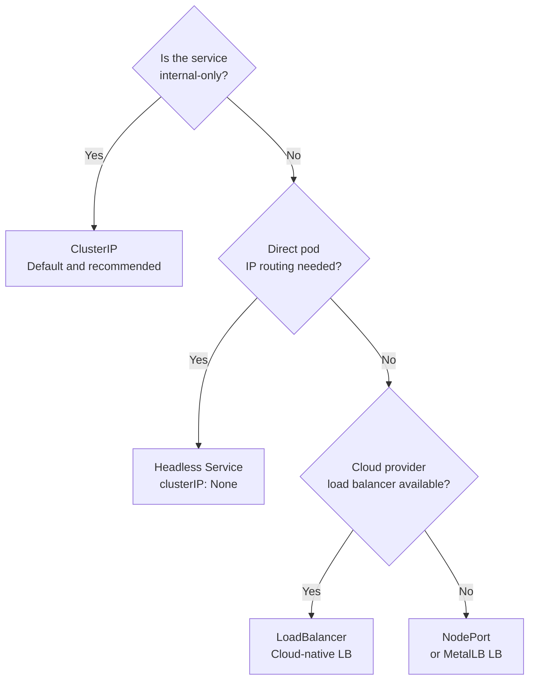

# How to Choose Kubernetes Services with Calico for Production

Author: [nawazdhandala](https://github.com/nawazdhandala)

Tags: Calico, Kubernetes, Service, CNI, Production, eBPF, Kube-proxy, Decision Framework

Description: A decision framework for choosing between kube-proxy and Calico eBPF service routing, and for configuring service types correctly for production Kubernetes workloads.

---

## Introduction

Production service networking decisions with Calico center on two questions: should you use kube-proxy (iptables) or Calico eBPF for service routing, and which service type is appropriate for each workload? These decisions affect performance, source IP visibility, and operational complexity.

Most teams default to kube-proxy without evaluating whether Calico eBPF would better serve their workloads. This post provides a structured framework for making the service networking choice consciously.

## Prerequisites

- Knowledge of your cluster's kernel version and distribution support (Calico eBPF generally requires a supported Linux distribution with kernel 5.10+, with some vendor backports such as RHEL 8.4's 4.18 kernel)
- Understanding of which workloads need external access
- Awareness of whether client source IP matters for your applications

## Decision 1: kube-proxy vs. Calico eBPF Service Routing

| Factor | Favor kube-proxy | Favor Calico eBPF |
|---|---|---|
| Kernel version | Older or unsupported Linux kernel/distribution | Supported Linux kernel/distribution; DSR also requires compatible underlying network fabric |
| Cluster size | Small or static service set | Large clusters or high service churn |
| Source IP preservation for external traffic | Not required | Required |
| Windows nodes in cluster | Yes | No (Linux-only) |
| Team eBPF expertise | No | Yes or learning |

For modern Linux clusters that meet Calico eBPF support requirements and have significant service scale, service churn, or source IP requirements, Calico eBPF is often the better choice. For small clusters or mixed OS environments, kube-proxy is appropriate.

## Decision 2: Service Type Selection


```mermaid
graph TD
    Q1{Is the service\ninternal-only?}
    Q1 -->|Yes| CIP[ClusterIP\nDefault and recommended]
    Q1 -->|No| Q2{Direct pod\nIP routing needed?}
    Q2 -->|Yes| HS[Headless Service\nclusterIP: None]
    Q2 -->|No| Q3{Cloud provider\nload balancer available?}
    Q3 -->|Yes| LB[LoadBalancer\nCloud-native LB]
    Q3 -->|No| NP[NodePort\nor MetalLB LB]
```

## Decision 3: External Traffic Policy for LoadBalancer and NodePort

For LoadBalancer and NodePort services receiving external traffic:

**`externalTrafficPolicy: Cluster` (default)**:
- Load balances across all nodes
- Source IP is SNAT'd to node IP (client IP not visible to pod)
- Best for stateless services where client IP doesn't matter

**`externalTrafficPolicy: Local`**:
- Only routes to pods on the same node that received the request
- Preserves original client source IP
- Can cause uneven load distribution if pods are not spread across nodes
- Required for applications that do IP-based access control

**Calico eBPF with DSR**:
- Preserves client source IP for external service traffic when the load balancer and network path forward the original client packets
- Does not require `externalTrafficPolicy: Local`
- The recommended approach for source IP preservation when the underlying network supports DSR

## Decision 4: Session Affinity

If your application requires the same client to always reach the same backend pod (stateful protocols, sticky sessions), enable session affinity:

```yaml
apiVersion: v1
kind: Service
spec:
  sessionAffinity: ClientIP
  sessionAffinityConfig:
    clientIP:
      timeoutSeconds: 10800
```

Session affinity works in both kube-proxy and Calico eBPF modes but has different implementation mechanisms.

## Decision 5: Service CIDR Sizing

The service CIDR is usually set at cluster creation via `--service-cluster-ip-range`. Newer Kubernetes clusters can support additional Service CIDR ranges with the MultiCIDRServiceAllocator feature, but changing service ranges remains distribution-specific and should be planned carefully. Size the initial range adequately:

- Default in many distributions: 10.96.0.0/12 (~1 million addresses)
- For most clusters, this is adequate
- Ensure the service CIDR does not overlap with pod CIDR, node CIDR, or any external network

## Best Practices

- For large clusters or clusters with high service churn, evaluate Calico eBPF to reduce kube-proxy service handling overhead
- Use `externalTrafficPolicy: Local` or Calico eBPF DSR for any service that needs accurate client IPs in application logs
- Apply a `ClusterIP: None` (headless) configuration for stateful workloads (databases, message queues) where pods need direct addressing
- Monitor service endpoint counts - services with zero endpoints are silently unreachable

## Conclusion

Production service networking decisions with Calico involve choosing the right service routing mechanism (kube-proxy vs. eBPF), service type (ClusterIP, NodePort, LoadBalancer, Headless), and external traffic policy. Calico eBPF is a strong service routing option for supported modern Linux clusters, providing better performance and native source IP preservation for external service traffic. Service type and external traffic policy should be selected based on each workload's external accessibility and source IP requirements.
