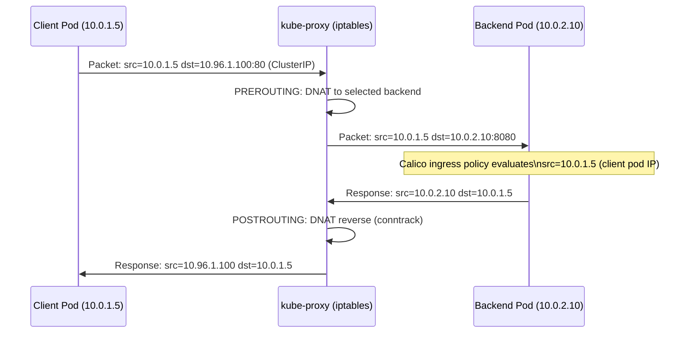
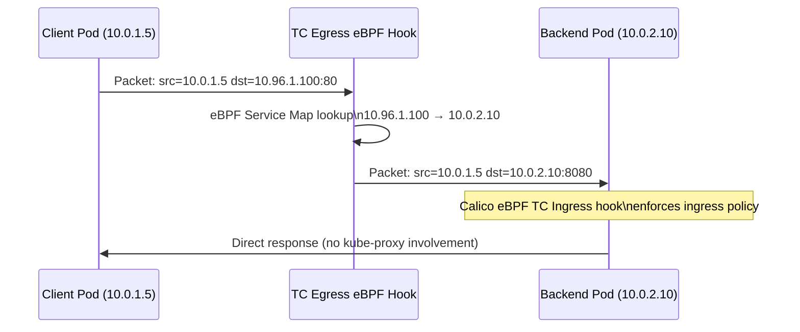
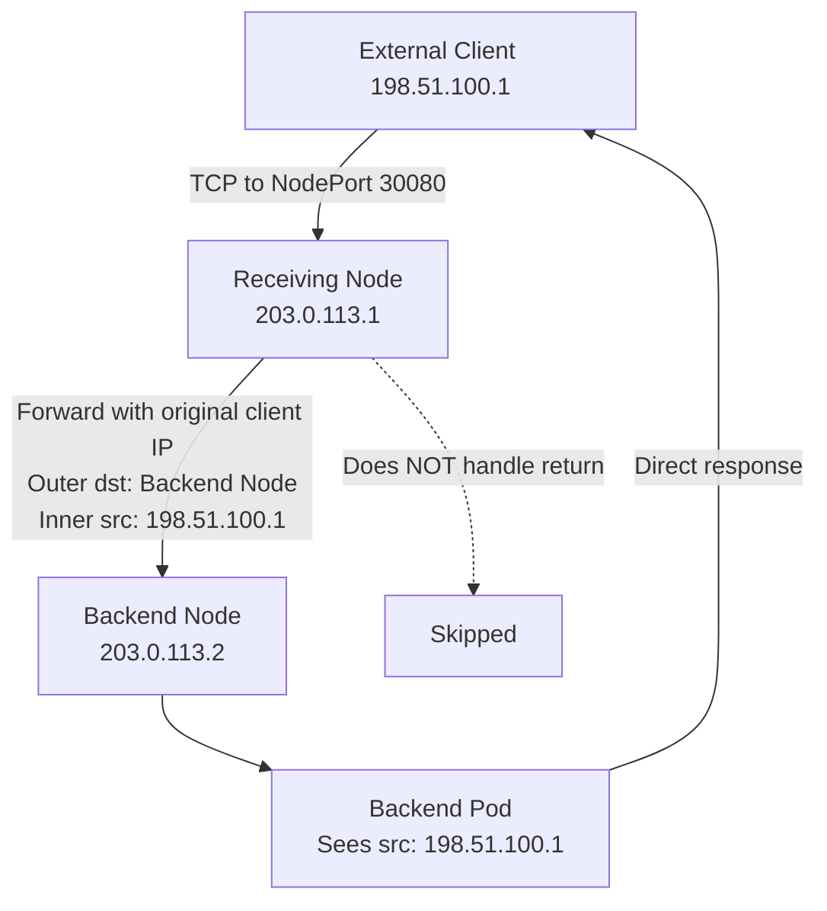
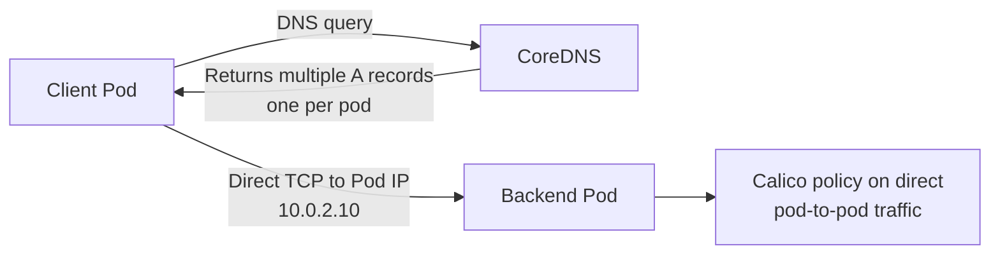

# How to Map Kubernetes Services with Calico to Real Kubernetes Traffic

Author: [nawazdhandala](https://github.com/nawazdhandala)

Tags: Calico, Kubernetes, Services, CNI, Traffic Flows, Networking, kube-proxy, eBPF

Description: A detailed walkthrough of how Kubernetes service traffic flows through Calico's networking components, from ClusterIP DNAT to policy enforcement.

---

## Introduction

Kubernetes service traffic involves multiple transformation steps before it reaches a backend pod. Understanding these steps — which component performs each transformation, in what order, and what the packet looks like at each stage — is the foundation for correct policy design and effective troubleshooting.

This post traces the complete packet path for four service traffic scenarios: ClusterIP (kube-proxy mode), ClusterIP (eBPF mode), NodePort external traffic, and headless service direct routing.

## Prerequisites

- Understanding of Kubernetes service types
- Familiarity with kube-proxy and Calico eBPF modes
- Comfort with basic NAT concepts (DNAT, SNAT)

## Scenario 1: ClusterIP Traffic (kube-proxy mode)



The client pod sees the ClusterIP as the source of the response — the DNAT is transparent. Calico policy on the backend pod sees the actual client pod IP as the source, not the ClusterIP.

## Scenario 2: ClusterIP Traffic (Calico eBPF mode)



In eBPF mode, the DNAT happens at the sending pod's TC egress hook — earlier in the path than kube-proxy. This eliminates the kube-proxy conntrack entry and reduces NAT overhead.

## Scenario 3: NodePort External Traffic (with DSR)



With Calico eBPF DSR enabled, the return path bypasses the receiving node entirely. The backend pod's response goes directly to the external client. This preserves source IP and reduces load on the receiving node.

## Scenario 4: Headless Service Traffic

Headless services have no ClusterIP and no kube-proxy involvement:



For headless services, the client performs the load balancing by choosing which pod IP to connect to (usually the first A record). Calico policy applies exactly as for direct pod-to-pod traffic.

## Observing Service Routing in Practice

Inspect kube-proxy iptables rules (iptables mode):
```bash
# Show service DNAT rules
sudo iptables -t nat -L KUBE-SVC-<hash> -n -v
# Shows: probability-based selection of backend pod IPs
```

Inspect Calico eBPF service map:
```bash
# On a node (eBPF mode)
sudo bpftool map dump name cali_v4_svc_ports | head -40
# Shows: ClusterIP:port → backend pod IP mappings
```

## Best Practices

- For debugging service connectivity, always check both the service endpoints and the Calico WorkloadEndpoint policies on the backend pod
- Use `kubectl get endpoints` to verify that backend pods are in the endpoints list before investigating Calico policy
- For eBPF mode, use `bpftool map dump` to verify service entries are in the eBPF service map after updating services

## Conclusion

Service traffic flows through multiple transformation layers in Calico: kube-proxy (iptables) or eBPF programs perform DNAT from ClusterIP to pod IP, Calico policy is evaluated against pod IPs (not ClusterIPs), and return traffic is handled by conntrack (iptables) or eBPF maps. Understanding these transformations is essential for writing correct NetworkPolicy for service traffic and for tracing connectivity issues effectively.
