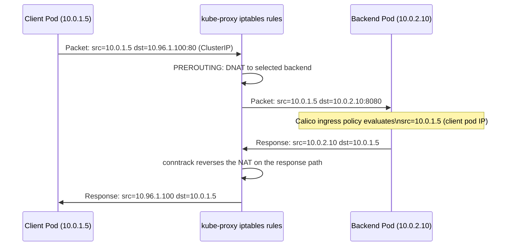
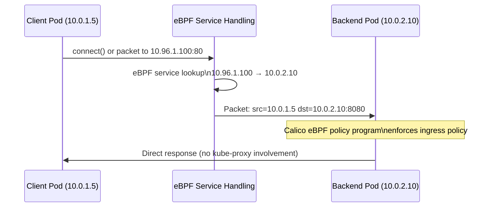
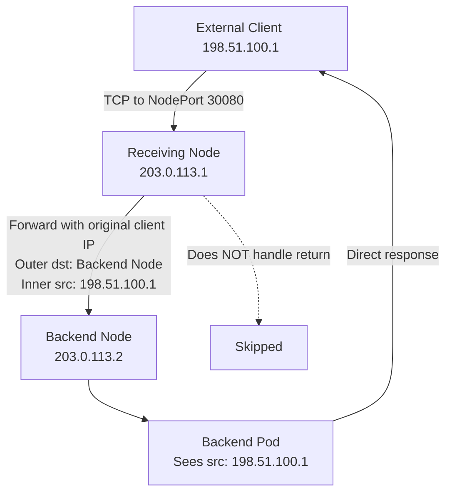
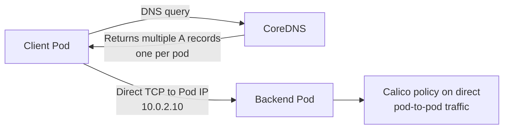

# How to Map Kubernetes Services with Calico to Real Kubernetes Traffic

Author: [nawazdhandala](https://github.com/nawazdhandala)

Tags: Calico, Kubernetes, Service, CNI, Traffic Flows, Networking, Kube-proxy, eBPF

Description: A detailed walkthrough of how Kubernetes service traffic flows through Calico's networking components, from ClusterIP DNAT to policy enforcement.

---

## Introduction

Kubernetes service traffic involves multiple transformation steps before it reaches a backend pod. Understanding these steps - which component performs each transformation, in what order, and what the packet looks like at each stage - is the foundation for correct policy design and effective troubleshooting.

This post traces the complete packet path for four service traffic scenarios: ClusterIP (kube-proxy mode), ClusterIP (eBPF mode), NodePort external traffic, and headless service direct routing.

## Prerequisites

- Understanding of Kubernetes service types
- Familiarity with kube-proxy and Calico eBPF modes
- Comfort with basic NAT concepts (DNAT, SNAT)

## Scenario 1: ClusterIP Traffic (kube-proxy mode)


```mermaid
sequenceDiagram
    participant ClientPod as Client Pod (10.0.1.5)
    participant KubeProxy as kube-proxy iptables rules
    participant Backend as Backend Pod (10.0.2.10)

    ClientPod->>KubeProxy: Packet: src=10.0.1.5 dst=10.96.1.100:80 (ClusterIP)
    KubeProxy->>KubeProxy: PREROUTING: DNAT to selected backend
    KubeProxy->>Backend: Packet: src=10.0.1.5 dst=10.0.2.10:8080
    Note over Backend: Calico ingress policy evaluates\nsrc=10.0.1.5 (client pod IP)
    Backend->>KubeProxy: Response: src=10.0.2.10 dst=10.0.1.5
    KubeProxy->>KubeProxy: conntrack reverses the NAT on the response path
    KubeProxy->>ClientPod: Response: src=10.96.1.100 dst=10.0.1.5
```

The client pod sees the ClusterIP as the source of the response - the DNAT is transparent. Calico policy on the backend pod sees the actual client pod IP as the source, not the ClusterIP.

## Scenario 2: ClusterIP Traffic (Calico eBPF mode)


```mermaid
sequenceDiagram
    participant ClientPod as Client Pod (10.0.1.5)
    participant BPFService as eBPF Service Handling
    participant Backend as Backend Pod (10.0.2.10)

    ClientPod->>BPFService: connect() or packet to 10.96.1.100:80
    BPFService->>BPFService: eBPF service lookup\n10.96.1.100 → 10.0.2.10
    BPFService->>Backend: Packet: src=10.0.1.5 dst=10.0.2.10:8080
    Note over Backend: Calico eBPF policy program\nenforces ingress policy
    Backend->>ClientPod: Direct response (no kube-proxy involvement)
```

In eBPF mode, Calico replaces kube-proxy service handling with eBPF programs and maps. For in-cluster TCP service connections, Calico can use connect-time load balancing by hooking socket operations so the socket connects directly to the selected backend pod IP, removing service NAT overhead for those connections.

## Scenario 3: NodePort External Traffic (with DSR)


```mermaid
graph TD
    Client[External Client 198.51.100.1] -->|TCP to NodePort 30080| RecvNode[Receiving Node\n203.0.113.1]
    RecvNode -->|Forward with original client IP\nOuter dst: Backend Node\nInner src: 198.51.100.1| BackendNode[Backend Node\n203.0.113.2]
    BackendNode --> Pod[Backend Pod\nSees src: 198.51.100.1]
    Pod -->|Direct response| Client
    RecvNode -.->|Does NOT handle return| SKIP[Skipped]
```

With Calico eBPF DSR enabled, the return path bypasses the receiving node entirely. The backend pod's response goes directly to the external client. This preserves source IP and reduces load on the receiving node.

## Scenario 4: Headless Service Traffic

Headless services have no ClusterIP and no kube-proxy involvement:


```mermaid
graph LR
    ClientPod[Client Pod] -->|DNS query| CoreDNS[CoreDNS]
    CoreDNS -->|Returns multiple A records\none per pod| ClientPod
    ClientPod -->|Direct TCP to Pod IP\n10.0.2.10| Backend[Backend Pod]
    Backend --> Calico[Calico policy on direct\npod-to-pod traffic]
```

For headless services, the client performs the load balancing by choosing which pod IP to connect to according to its resolver and application behavior. Calico policy applies exactly as for direct pod-to-pod traffic.

## Observing Service Routing in Practice

Inspect kube-proxy iptables rules (iptables mode):
```bash
# Show service DNAT rules

sudo iptables -t nat -L KUBE-SVC-<hash> -n -v
# Shows: probability-based selection of backend pod IPs
```

Inspect Calico eBPF NAT table:
```bash
# From a calico-node pod (eBPF mode)
kubectl exec -n calico-system <calico-node-name> -- calico-node -bpf nat dump
# Shows: ClusterIP:port -> backend pod IP mappings
```

## Best Practices

- For debugging service connectivity, always check both the service endpoints and the Calico WorkloadEndpoint policies on the backend pod
- Use `kubectl get endpointslice -l kubernetes.io/service-name=<service-name>` to verify that backend pods are in the service endpoint slices before investigating Calico policy
- For eBPF mode, use `calico-node -bpf nat dump` to verify service entries are in the eBPF NAT table after updating services

## Conclusion

Service traffic flows through multiple transformation layers in Calico: kube-proxy (iptables) performs DNAT from ClusterIP to pod IP, while Calico eBPF service handling uses BPF programs and maps, including connect-time load balancing for in-cluster TCP service connections. Calico policy is evaluated against pod IPs (not ClusterIPs), and return traffic is handled by conntrack (iptables) or eBPF maps. Understanding these transformations is essential for writing correct NetworkPolicy for service traffic and for tracing connectivity issues effectively.
