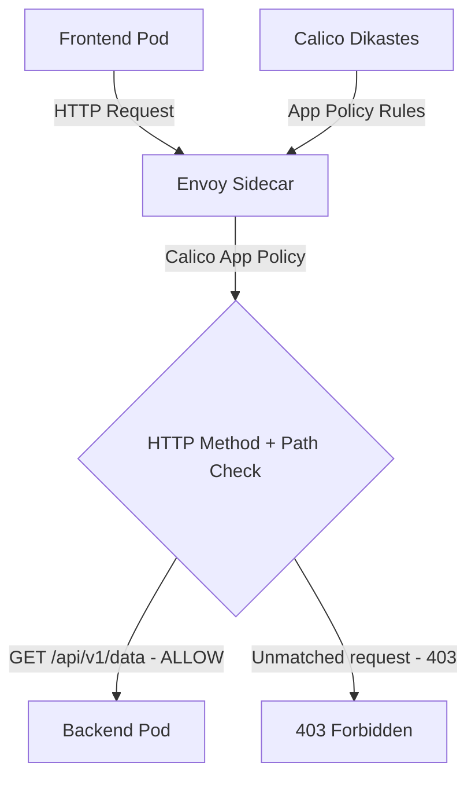

# How to Log and Audit Application-Layer Policy with Calico and Istio

Author: [nawazdhandala](https://github.com/nawazdhandala)

Tags: Calico, Kubernetes, Network Policy, Istio, Application Layer, Security

Description: Log Audit Calico application-layer network policies using Istio integration for HTTP method and path-based access control.

---

## Introduction

Application-Layer Policy with Calico and Istio combines Calico's network-layer enforcement with Istio's application-layer visibility. This powerful combination lets you write policies that reference HTTP attributes - methods and paths - in addition to network-level properties like IP addresses and ports.

Calico's `projectcalico.org/v3` NetworkPolicy application-layer match criteria (available with Istio integration) allows you to write rules that are evaluated by Istio's Envoy sidecar proxies rather than only at the network layer. This enables fine-grained control like "allow GET requests to /api/health but reject unmatched requests to /api/admin."

This guide covers log audit App-Layer Policy using Calico and Istio together.

## Prerequisites

- Kubernetes 1.29+ cluster with Calico CNI and Istio 1.22+ installed
- Calico-Istio integration configured with the Dikastes sidecar, Felix Policy Sync API, and Envoy authorization services
- `calicoctl`, `kubectl`, and `istioctl` installed
- Workloads with Istio sidecar injection enabled and the Dikastes injection template configured

## Core Configuration

```yaml
apiVersion: projectcalico.org/v3
kind: NetworkPolicy
metadata:
  name: log-audit-app-layer-policy
  namespace: production
spec:
  order: 100
  selector: app == 'backend-api'
  ingress:
    - action: Allow
      source:
        selector: app == 'frontend'
      http:
        methods:
          - GET
          - POST
        paths:
          - exact: /api/v1/data
          - prefix: /api/v1/public
  types:
    - Ingress
```

Application-layer HTTP match criteria are supported only on ingress rules with `Allow` actions. Requests that do not match an explicit allow rule are rejected by Dikastes with a default-deny response.

## Istio + Calico Setup

```bash
# Verify Calico-Istio integration

kubectl get pods -n istio-system | grep calico
kubectl get pods -n calico-system | grep dikastes

# Enable sidecar injection for namespace
kubectl label namespace production istio-injection=enabled

# Ensure application pods request both the Istio and Dikastes templates
kubectl get deployment -n production backend-api -o yaml | grep inject.istio.io/templates
```

## Test Application-Layer Policy

```bash
# Test allowed method
kubectl exec -n production frontend-pod -- curl -X GET http://backend-api:8080/api/v1/data
echo "GET /api/v1/data (should pass): $?"

# Test denied method/path
kubectl exec -n production frontend-pod -- curl -X DELETE http://backend-api:8080/api/v1/admin
echo "DELETE /api/v1/admin (should be denied): $?"
```

## Architecture



## Conclusion

Application-Layer Policy with Calico and Istio provides fine-grained network security in Kubernetes, combining network-layer enforcement with application-layer policy evaluation. By filtering on HTTP methods and paths, you can implement access controls that are impossible with pure network-layer policies. Ensure your Calico-Istio integration is properly configured and test both allowed and denied request patterns to verify your application-layer policies are working correctly.
