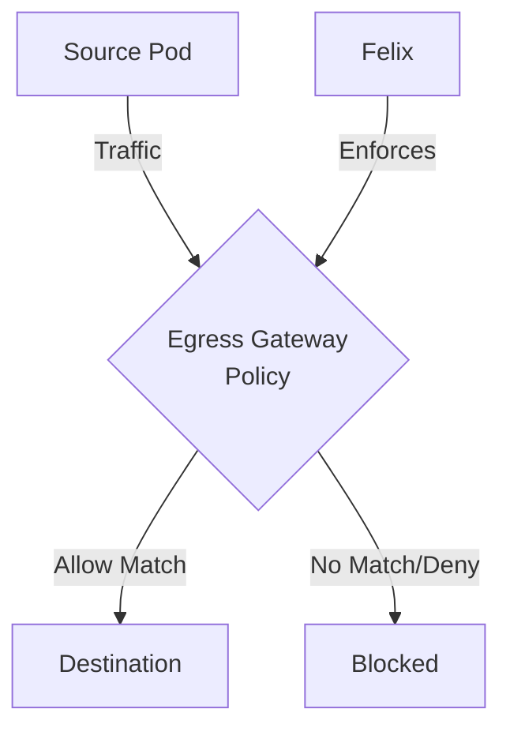

# How to Log and Audit Calico Egress Gateway Policies

Author: [nawazdhandala](https://github.com/nawazdhandala)

Tags: Calico, Kubernetes, Network Policy, Egress Gateway, Security

Description: Log Audit Calico egress gateway policies to control and secure outbound traffic leaving your Kubernetes cluster.

---

## Introduction

Calico network policies can log and audit traffic that uses egress gateways using the `projectcalico.org/v3` API. This guide covers log audit Egress Gateway with production-ready configurations.

## Prerequisites

- Kubernetes cluster with Calico v3.26+
- Calico Enterprise or Calico Cloud for egress gateway routing
- `calicoctl` and `kubectl` installed

## Core Configuration

```yaml
apiVersion: projectcalico.org/v3
kind: GlobalNetworkPolicy
metadata:
  name: log-audit-egress-gateway
spec:
  order: 100000
  selector: app == 'authorized'
  egress:
    - action: Log
      protocol: UDP
      destination:
        ports: [53]
    - action: Allow
      protocol: UDP
      destination:
        ports: [53]
    - action: Log
      destination:
        nets:
          - 203.0.113.0/24
    - action: Allow
      destination:
        nets:
          - 203.0.113.0/24
    - action: Log
    - action: Deny
  types:
    - Egress
```

## Implementation

```bash
# Apply policy

calicoctl apply -f log-audit-egress-gateway.yaml

# Verify policy is active
calicoctl get globalnetworkpolicy -o wide

# Test connectivity
kubectl exec -n test test-pod -- curl -s --max-time 5 http://target:8080
echo "Result: $?"
```

## Verification

```bash
# Check policy hit counters
curl -s http://localhost:9091/metrics | grep calico_denied_packets

# Review packet logs from Log actions
sudo journalctl -k -f | grep calico-packet
```

## Architecture



## Conclusion

Log Audit Egress Gateway in Calico ensures your network policies are properly configured, tested, and monitored. Follow the patterns in this guide, validate in staging first, and maintain comprehensive logging for security visibility. Regular policy audits help you keep your cluster's security posture aligned with evolving requirements.
