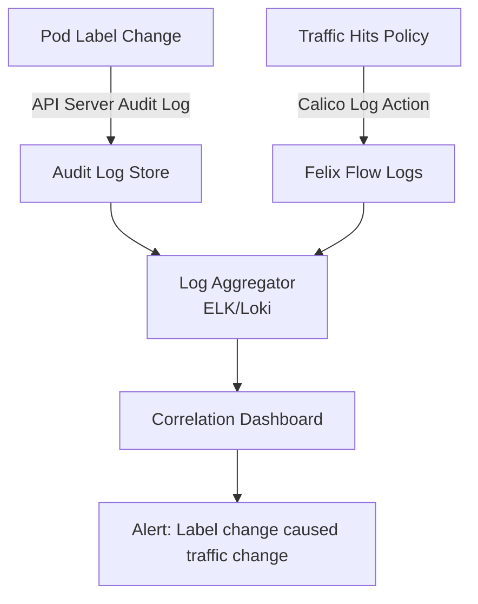

# How to Log and Audit Calico Label-Based Network Policies

Author: [nawazdhandala](https://github.com/nawazdhandala)

Tags: Calico, Kubernetes, Network Policy, Labels, Logging, Audit

Description: Set up comprehensive logging and auditing for Calico label-based network policies to track policy evaluations and label changes across your cluster.

---

## Introduction

Auditing label-based network policies requires two layers of visibility: tracking traffic decisions made by your policies, and tracking changes to the labels that determine policy scope. A pod that gets mislabeled in production might silently bypass security controls or trigger unexpected denials - and without proper logging, these changes are invisible.

Calico's `Log` action captures policy-level traffic decisions. Kubernetes API server audit logs capture label changes on pods and deployments. Together, they give you a complete audit trail: what labels exist, what policies they triggered, and what traffic was allowed or denied as a result.

This guide shows you how to configure both levels of logging, correlate policy decisions with label changes, and use this data for compliance reporting and security investigations.

## Prerequisites

- Kubernetes cluster with Calico v3.26+
- Kubernetes API audit logging enabled
- `calicoctl` and `kubectl` installed
- A log aggregation system (ELK, Loki)

## Step 1: Enable API Audit Logging for Label Changes

```yaml
# /etc/kubernetes/audit-policy.yaml
apiVersion: audit.k8s.io/v1
kind: Policy
rules:
  # Log all pod label changes
  - level: RequestResponse
    verbs: ["patch", "update"]
    resources:
      - group: ""
        resources: ["pods"]
    omitStages: ["RequestReceived"]
  # Log deployment template label changes
  - level: RequestResponse
    verbs: ["patch", "update"]
    resources:
      - group: "apps"
        resources: ["deployments"]
```

## Step 2: Add Log Actions to Label-Based Policies

```yaml
apiVersion: projectcalico.org/v3
kind: NetworkPolicy
metadata:
  name: log-web-to-api
  namespace: production
spec:
  order: 100
  selector: tier == 'api'
  ingress:
    - action: Log
      source:
        selector: tier == 'web'
    - action: Allow
      source:
        selector: tier == 'web'
    - action: Log
    - action: Deny
  types:
    - Ingress
```

## Step 3: Correlate Label Changes with Traffic Anomalies

```bash
# Find traffic denials in Calico logs
sudo journalctl | grep "CALICO.*DENY" | grep "api" | tail -20

# Find recent label changes in audit log
cat /var/log/kubernetes/audit.log | jq '. | select(.verb=="patch" and .objectRef.resource=="pods")' | tail -20
```

## Step 4: Build a Label Change Report

```bash
#!/bin/bash
# label-audit-report.sh
echo "=== Pod Label Audit Report ==="
echo "Generated: $(date)"
echo ""
echo "Current label distribution:"
kubectl get pods --all-namespaces -o json | jq -r '.items[] | "\(.metadata.namespace)/\(.metadata.name): \(.metadata.labels | to_entries | map("\(.key)=\(.value)") | join(","))"' | sort

echo ""
echo "Pods missing required labels:"
kubectl get pods --all-namespaces -o json | jq -r '.items[] | select(.metadata.labels.tier == null) | "\(.metadata.namespace)/\(.metadata.name): missing tier label"'
```

## Step 5: Alert on Label Drift

```yaml
# Prometheus alert for unlabeled pods
apiVersion: monitoring.coreos.com/v1
kind: PrometheusRule
metadata:
  name: label-drift-alert
  namespace: monitoring
spec:
  groups:
    - name: calico.labels
      rules:
        - alert: PodsWithoutRequiredLabels
          expr: |
            count(kube_pod_labels{label_tier=""}) > 0
          for: 5m
          labels:
            severity: warning
          annotations:
            summary: "Pods found without required tier label"
```

## Logging Architecture



## Conclusion

Auditing label-based Calico policies requires monitoring both the data plane (traffic decisions) and the control plane (label changes). By combining Calico's `Log` action with Kubernetes API audit logs and shipping everything to a centralized platform, you can trace every traffic decision back to the label state that caused it. This is invaluable for incident response and compliance audits.
