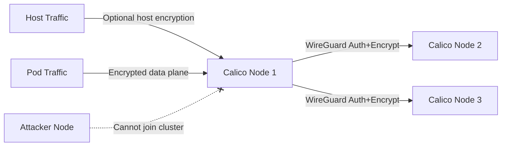

# How to Log and Audit Crypto Authentication for Calico Node Traffic

Author: [nawazdhandala](https://github.com/nawazdhandala)

Tags: Calico, Kubernetes, Network Policy, Encryption, WireGuard, Node Security

Description: Log Audit WireGuard-based crypto authentication for Calico node traffic to secure inter-node communication.

---

## Introduction

Crypto authentication for Calico node traffic uses WireGuard to authenticate and encrypt supported communication between Calico nodes. By default, this protects inter-node pod traffic from interception and spoofing on the host-to-host portion of the path, even on untrusted networks. Host-to-host traffic, such as traffic from host-networked pods or node processes, requires `wireguardHostEncryptionEnabled` and is supported only for specific deployment modes.

Calico's `projectcalico.org/v3` FelixConfiguration resource controls WireGuard settings, enabling you to turn on node-level encryption with a single configuration change. Node-to-node authentication ensures that only legitimate Calico nodes can exchange routing information and forward pod traffic.

This guide covers log audit crypto authentication for Calico node traffic, focusing on data plane encryption and optional host-to-host encryption where supported.

## Prerequisites

- Kubernetes cluster with Calico v3.26+
- WireGuard installed or available in the kernel on nodes that should participate in encryption
- `calicoctl` and `kubectl` installed

## Enable Crypto Authentication

```yaml
apiVersion: projectcalico.org/v3
kind: FelixConfiguration
metadata:
  name: default
spec:
  wireguardEnabled: true
  wireguardMTU: 1440
  wireguardListeningPort: 51820
```

```bash
# Apply configuration

calicoctl apply -f wireguard-config.yaml

# Verify on each node
kubectl get node -o custom-columns='NAME:.metadata.name,WIREGUARD:.metadata.annotations.projectcalico\.org/WireguardPublicKey'
```

## Verify Node Authentication

```bash
# Check WireGuard peers (all Calico nodes should be listed)
kubectl exec -n kube-system calico-node-xxx -- wg show

# Verify peer connections
kubectl exec -n kube-system calico-node-node1 -- wg show wireguard.cali peers

# Check that traffic between nodes is encrypted
kubectl debug node/node1 -it --image=nicolaka/netshoot -- tcpdump -i eth0 -n port 51820 -c 10
```

## Architecture



## Conclusion

Crypto authentication for Calico node traffic provides mutual authentication and encryption for supported inter-node communication. Enable WireGuard in FelixConfiguration to protect the data plane (inter-node pod traffic) from interception and injection, and enable host-to-host encryption only where your deployment supports it. Monitor WireGuard peer connections and transfer statistics to ensure encryption is active across all nodes and detect any nodes that have lost their crypto authentication.
