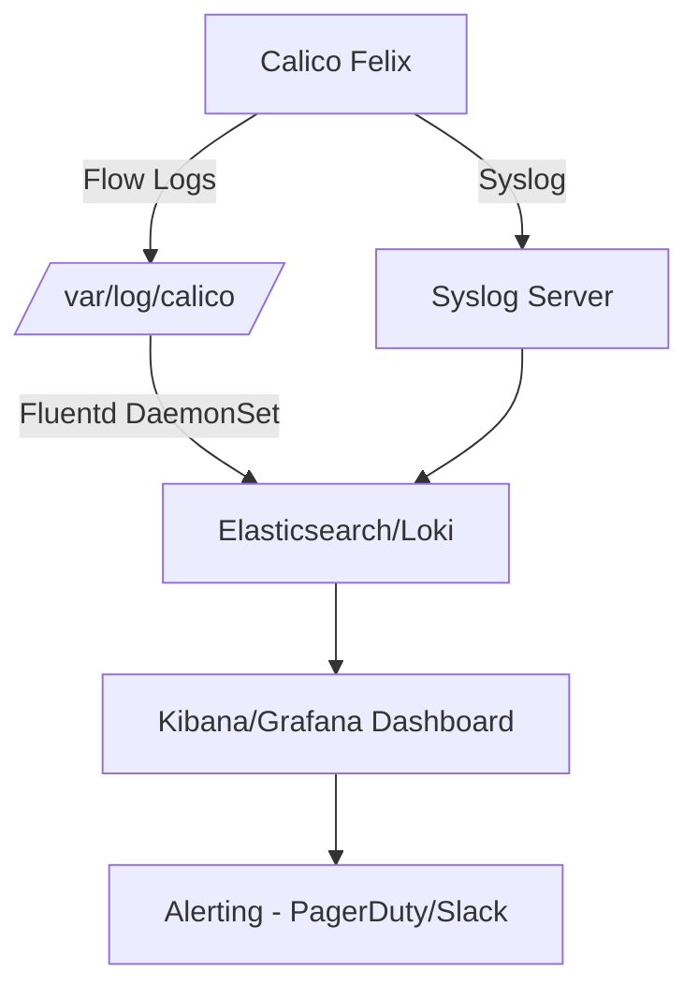

# How to Log and Audit Default Deny Policies in Calico

Author: [nawazdhandala](https://github.com/nawazdhandala)

Tags: Calico, Kubernetes, Network Policy, Security, Audit, Logging

Description: Learn how to enable comprehensive logging and auditing for Calico default deny network policies to maintain visibility into your cluster's traffic decisions.

---

## Introduction

Logging and auditing are essential companions to any default deny policy. Without visibility into what traffic is being denied (and what is being allowed), you cannot confidently operate a secure cluster. Logs provide the forensic trail needed to investigate incidents, demonstrate compliance, and refine your policies over time.

Calico supports multiple logging mechanisms: Felix flow logs, policy action logs (via the `Log` action in policy rules), and integration with external SIEM systems through syslog or Fluentd. Combined with Kubernetes audit logs for policy changes, you get complete end-to-end visibility.

This guide shows you how to configure policy-level logging, enable Felix flow logs, and ship those logs to a centralized system for analysis and alerting.

## Prerequisites

- Kubernetes cluster with Calico v3.26+
- `calicoctl` and `kubectl` installed
- A log aggregation system (ELK Stack, Loki, or Splunk recommended)
- Sufficient storage for log retention

## Step 1: Enable Felix Flow Logging

Flow logs capture all traffic decisions at the Felix data plane level:

```bash
kubectl patch felixconfiguration default --type=merge -p '{
  "spec": {
    "flowLogsEnabled": true,
    "flowLogsFlushInterval": "15s",
    "flowLogsFileMaxFiles": 5,
    "flowLogsFileMaxFileSizeMB": 100
  }
}'
```

## Step 2: Add Log Actions to Your Deny Policy

Calico supports a `Log` action that fires before other actions:

```yaml
apiVersion: projectcalico.org/v3
kind: GlobalNetworkPolicy
metadata:
  name: log-and-deny-all
spec:
  order: 1000
  selector: all()
  ingress:
    - action: Log
    - action: Deny
  egress:
    - action: Log
    - action: Deny
  types:
    - Ingress
    - Egress
```

```bash
calicoctl apply -f log-and-deny-all.yaml
```

## Step 3: Configure Syslog Export

Direct Felix logs to syslog for centralized collection:

```bash
kubectl patch felixconfiguration default --type=merge -p '{
  "spec": {
    "logSeveritySys": "info",
    "logSeverityScreen": "warning"
  }
}'
```

## Step 4: Set Up Fluentd to Ship Logs

Deploy Fluentd as a DaemonSet to collect and forward Calico logs:

```yaml
apiVersion: v1
kind: ConfigMap
metadata:
  name: fluentd-calico-config
  namespace: kube-system
data:
  fluent.conf: |
    <source>
      @type tail
      path /var/log/calico/flow-logs/*.log
      tag calico.flow
      format json
    </source>
    <match calico.**>
      @type elasticsearch
      host elasticsearch.logging.svc.cluster.local
      port 9200
      index_name calico-flows
    </match>
```

## Step 5: Create Audit Alerts

Set up alerts for high-volume denials that may indicate a scan or misconfiguration:

```bash
# Query Elasticsearch for denial spikes
curl -X GET "http://elasticsearch:9200/calico-flows/_search" -H 'Content-Type: application/json' -d '{
  "query": {
    "bool": {
      "must": [
        {"term": {"action": "deny"}},
        {"range": {"@timestamp": {"gte": "now-1h"}}}
      ]
    }
  },
  "aggs": {
    "denials_per_source": {
      "terms": {"field": "src_ip"}
    }
  }
}'
```

## Logging Architecture



## Conclusion

Comprehensive logging transforms your default deny policy from a silent traffic blocker into a rich source of security intelligence. By combining Felix flow logs with policy-level `Log` actions and shipping those logs to a centralized platform, you gain the visibility needed to operate confidently, detect anomalies, and satisfy compliance requirements. Regularly review your denial logs to identify opportunities to refine your allow rules.
