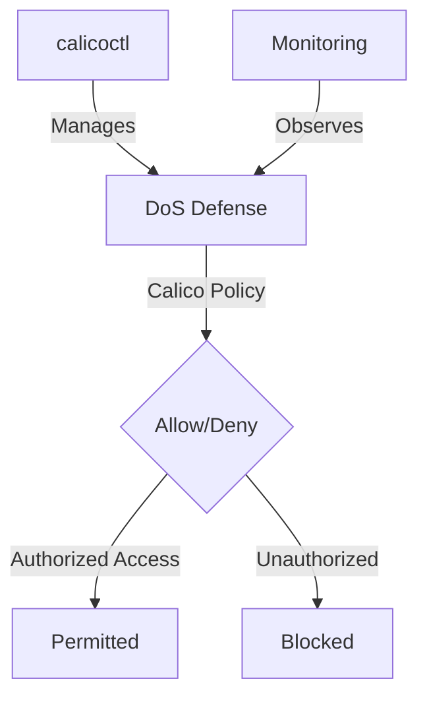

# How to Log and Audit DoS Defense Calico Policies

Author: [nawazdhandala](https://github.com/nawazdhandala)

Tags: Calico, Kubernetes, Network Policy, DoS Defense, Security

Description: Log Audit Calico network policies for DoS defense to protect cluster workloads from denial of service attacks.

---

## Introduction

DoS Defense with Calico Policies is an important security consideration for production Calico deployments. The `projectcalico.org/v3` API provides the tools needed to log and audit DoS Defense decisions effectively, combining Calico's network policy with proper access controls and monitoring.

This guide covers log audit DoS Defense in Calico with practical configurations and operational best practices.

## Prerequisites

- Kubernetes cluster with Calico v3.26+
- `calicoctl` and `kubectl` installed
- Understanding of Calico's monitoring and security architecture

## Core Configuration

```yaml
apiVersion: projectcalico.org/v3
kind: GlobalNetworkPolicy
metadata:
  name: dos-defense-log-and-allow
spec:
  order: 50
  selector: app == 'web-frontend'
  ingress:
    - action: Log
      protocol: TCP
      source:
        nets:
          - 0.0.0.0/0
      destination:
        ports: [80, 443]
    - action: Allow
      protocol: TCP
      source:
        nets:
          - 0.0.0.0/0
      destination:
        ports: [80, 443]
    - action: Allow
  types:
    - Ingress
---
# Block example bad actors

apiVersion: projectcalico.org/v3
kind: GlobalNetworkPolicy
metadata:
  name: dos-block-bad-actors
spec:
  order: 10
  selector: app == 'web-frontend'
  ingress:
    - action: Log
      source:
        nets:
          - 198.51.100.0/24  # Example blocked source
          - 203.0.113.0/24
    - action: Deny
      source:
        nets:
          - 198.51.100.0/24  # Example blocked source
          - 203.0.113.0/24
  types:
    - Ingress
```

## Implementation

```bash
# Apply DoS defense policies
calicoctl apply -f dos-defense.yaml

# View policy log entries on iptables dataplane nodes
journalctl -k | grep calico-packet

# View policy log entries on eBPF dataplane nodes
kubectl exec -n calico-system -it ds/calico-node -- bpftool prog tracelog
```

## eBPF Dataplane (Optional)

```bash
# Enable eBPF dataplane support with the Tigera operator
kubectl patch installation.operator.tigera.io default --type merge -p '{"spec":{"calicoNetwork":{"linuxDataplane":"BPF", "bpfNetworkBootstrap":"Enabled", "kubeProxyManagement":"Enabled"}}}'
```

## Architecture



## Conclusion

Log Audit DoS Defense in Calico requires a combination of proper policy configuration, regular monitoring, and proactive testing. Use the patterns in this guide as a foundation and adapt them to your specific security requirements. Always validate changes in staging before production and maintain comprehensive logging for security visibility.
