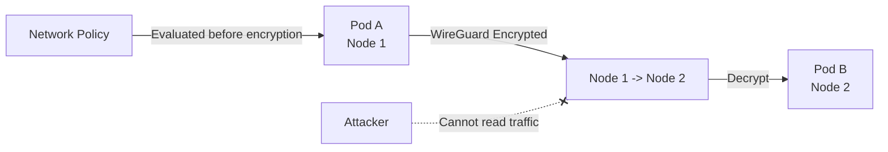

# How to Log and Audit Encrypted Pod Traffic in Calico

Author: [nawazdhandala](https://github.com/nawazdhandala)

Tags: Calico, Kubernetes, Network Policy, Encryption, WireGuard, Security

Description: Log Audit Calico WireGuard encrypted pod traffic to ensure all inter-pod communication is encrypted in transit.

---

## Introduction

Encrypted Pod Traffic in Calico ensures that pod-to-pod communication cannot be intercepted or tampered with, even by other processes on the same node. Using WireGuard or IPsec, Calico encrypts all data-plane traffic transparently, without requiring application changes.

Calico's encryption works alongside network policies - traffic is still subject to policy evaluation, but the payload is encrypted in transit. This combination of network-layer policy enforcement and encryption provides defense in depth for sensitive workloads.

This guide covers log audit WireGuard Encryption in Calico, including enabling WireGuard encryption and combining it with network policy for a complete zero-trust data plane.

## Prerequisites

- Kubernetes cluster with Calico v3.26+ (WireGuard requires Linux kernel 5.6+)
- `calicoctl` and `kubectl` installed
- WireGuard kernel module available on all nodes

## Enable WireGuard Encryption

```bash
# Enable WireGuard encryption cluster-wide
kubectl patch felixconfiguration default --type=merge -p '{
  "spec": {
    "wireguardEnabled": true,
    "wireguardInterfaceMTU": 1440
  }
}'

# Verify WireGuard is active
kubectl get node -o yaml | grep wireguard
kubectl exec -n kube-system calico-node-xxx -- wg show
```

## Combine with Network Policy

```yaml
# Encrypt and restrict
apiVersion: projectcalico.org/v3
kind: NetworkPolicy
metadata:
  name: log-audit-wireguard-encryption
  namespace: production
spec:
  order: 100
  selector: app == 'payment-service'
  ingress:
    - action: Allow
      source:
        selector: app == 'authorized-client'
      destination:
        ports: [8443]
  egress:
    - action: Allow
      destination:
        selector: app == 'payment-db'
      destination:
        ports: [5432]
    - action: Allow
      protocol: UDP
      destination:
        ports: [53]
  types:
    - Ingress
    - Egress
```

## Verify Encryption

```bash
# Verify WireGuard tunnel is established between nodes
kubectl exec -n kube-system calico-node-node1 -- wg show all

# Check encryption statistics
kubectl exec -n kube-system calico-node-node1 -- wg show all | grep transfer

# Verify no unencrypted traffic (packet capture should show WireGuard frames)
kubectl debug node/node1 -it --image=busybox -- tcpdump -i any -n port 51820
```

## Architecture



## Conclusion

Encrypted Pod Traffic with Calico provides transparent, high-performance encryption for all pod-to-pod traffic. WireGuard integration in Calico makes it straightforward to enable encryption across the entire cluster without changing application code. Combine encryption with strict network policies for a complete zero-trust data plane where traffic is both encrypted and access-controlled. Monitor WireGuard statistics regularly to ensure encryption is active and performing well.
