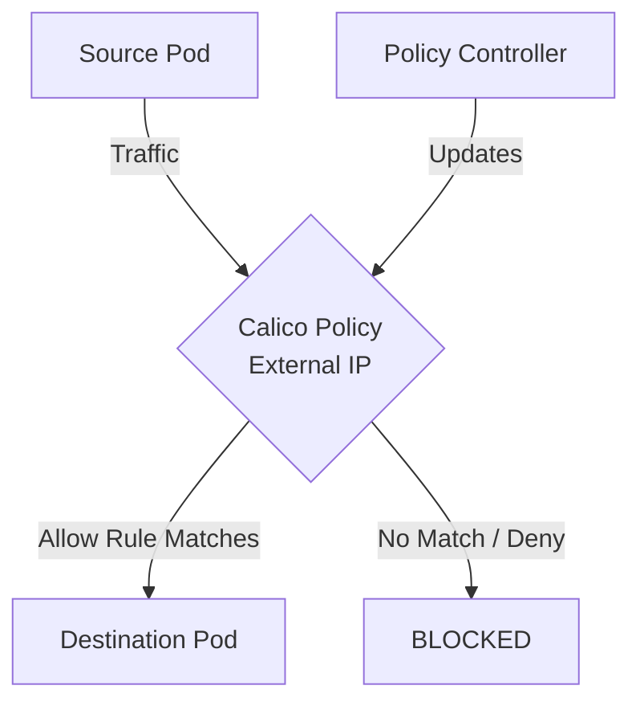

# How to Log and Audit External IP Policies in Calico

Author: [nawazdhandala](https://github.com/nawazdhandala)

Tags: Calico, Kubernetes, Network Policy, External IP, Security

Description: Configure logging and auditing for External IP Policies in Calico for security visibility.

---

## Introduction

External IP Policies in Calico provides fine-grained network security controls using the `projectcalico.org/v3` API. This guide covers how to log audit External IP effectively.

Calico's extensible policy model supports External IP through its `GlobalNetworkPolicy` and `NetworkPolicy` resources, giving you cluster-wide and namespace-scoped control over traffic that matches your External IP criteria.

This guide provides practical techniques for log audit External IP in your Kubernetes cluster, following security best practices and production-tested patterns.

## Prerequisites

- Kubernetes cluster with Calico v3.26+
- `calicoctl` and `kubectl` installed
- Basic understanding of Calico network policy concepts

## Step 1: Enable Flow Logging

```bash
kubectl patch felixconfiguration default --type=merge -p '{"spec":{"flowLogsEnabled":true}}'
```

## Step 2: Add Log Actions to Policy

```yaml
apiVersion: projectcalico.org/v3
kind: NetworkPolicy
metadata:
  name: log-external-ip
  namespace: production
spec:
  order: 100
  selector: all()
  ingress:
    - action: Log
    - action: Allow
      source:
        selector: app == 'authorized'
    - action: Log
    - action: Deny
  types:
    - Ingress
```

## Step 3: Ship Logs to Central Store

```bash
kubectl patch felixconfiguration default --type=merge -p '{"spec":{"logSeveritySys":"info"}}'
```

## Step 4: Query and Alert

```bash
grep "CALICO.*DENY" /var/log/calico/flow-logs/*.log | tail -20
```

## Architecture



## Conclusion

Log Audit External IP policies in Calico requires attention to policy ordering, selector accuracy, and bidirectional rule coverage. Follow the patterns in this guide to ensure your External IP policies are correctly configured, tested, and monitored. Always validate in staging before applying to production, and maintain comprehensive logging for visibility into policy decisions.
