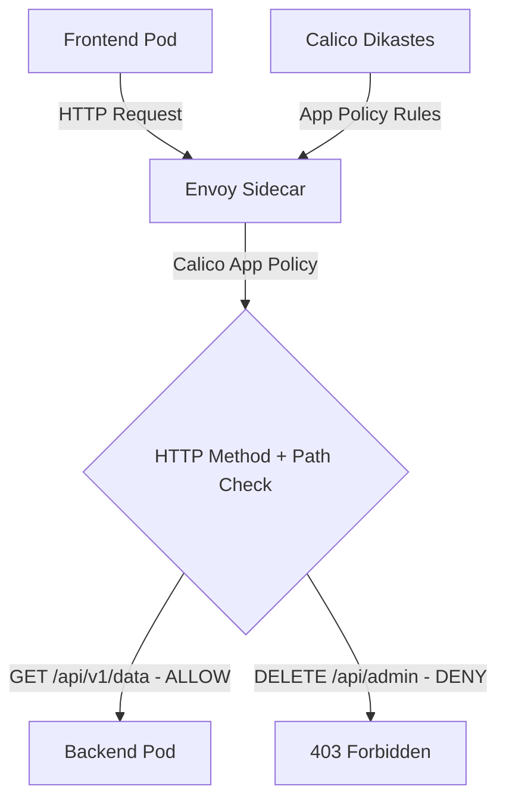

# How to Log and Audit HTTP Method Policies with Calico and Istio

Author: [nawazdhandala](https://github.com/nawazdhandala)

Tags: Calico, Kubernetes, Network Policy, Istio, HTTP Methods, Security

Description: Log Audit Calico HTTP method-based network policies using Istio to control access by HTTP verb (GET, POST, DELETE, etc.).

---

## Introduction

HTTP Method Policies with Calico and Istio combines Calico's network-layer enforcement with Istio's application-layer visibility. This powerful combination lets you write policies that reference HTTP attributes - methods and paths - in addition to network-level properties like IP addresses and ports.

Calico's `projectcalico.org/v3` NetworkPolicy and GlobalNetworkPolicy resources (with application layer policy enabled for Istio integration) allow you to write HTTP match rules that are enforced through Istio's Envoy sidecar proxies and the Calico Dikastes sidecar. This enables fine-grained control like "allow GET requests to /api/health while leaving POST requests to /api/admin denied."

This guide covers log audit HTTP Method Policies using Calico and Istio together.

## Prerequisites

- Kubernetes cluster with Calico Istio application layer policy support and Istio installed
- Calico-Istio integration configured (Dikastes sidecar)
- `kubectl` installed
- Workloads with Istio sidecar injection enabled and the Dikastes injection template annotation configured

## Core Configuration

```yaml
apiVersion: projectcalico.org/v3
kind: NetworkPolicy
metadata:
  name: log-audit-http-method-policies
  namespace: production
spec:
  order: 100
  selector: app == 'backend-api'
  ingress:
    - action: Allow
      source:
        selector: app == 'frontend'
      http:
        methods:
          - GET
          - POST
        paths:
          - exact: /api/v1/data
          - prefix: /api/v1/public
  types:
    - Ingress
```

HTTP match clauses are supported only on ingress `Allow` rules. Requests that do not match an explicit allow rule, such as `DELETE /api/v1/admin`, are denied by the Calico application layer policy default-deny behavior.

## Istio + Calico Setup

```bash
# Verify Calico-Istio integration

kubectl get configmap -n istio-system istio-sidecar-injector -o yaml | grep "dikastes:" -A 5
kubectl get pods -n calico-system -l k8s-app=csi-node-driver

# Enable sidecar injection for namespace
kubectl label namespace production istio-injection=enabled

# After redeploying the backend, verify the Dikastes sidecar
kubectl get pod -n production -l app=backend-api -o jsonpath='{.items[0].spec.containers[*].name}'
kubectl logs -n production -l app=backend-api -c dikastes
```

## Test Application-Layer Policy

```bash
# Test allowed method
kubectl exec -n production frontend-pod -- \
  curl -s -o /dev/null -w "GET /api/v1/data: %{http_code}\n" \
  -X GET http://backend-api:8080/api/v1/data

# Test denied method/path
kubectl exec -n production frontend-pod -- \
  curl -s -o /dev/null -w "DELETE /api/v1/admin: %{http_code}\n" \
  -X DELETE http://backend-api:8080/api/v1/admin
```

## Architecture



## Conclusion

HTTP Method Policies with Calico and Istio provides fine-grained network security in Kubernetes, combining network-layer enforcement with application-layer policy evaluation. By filtering on HTTP methods and paths, you can implement access controls that are impossible with pure network-layer policies. Ensure your Calico-Istio integration is properly configured and test both allowed and denied request patterns to verify your application-layer policies are working correctly.
