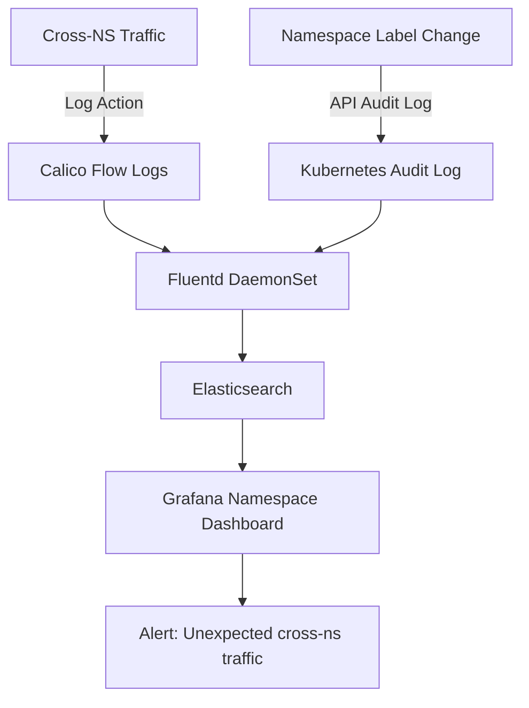

# How to Log and Audit Namespace-Based Policies in Calico

Author: [nawazdhandala](https://github.com/nawazdhandala)

Tags: Calico, Kubernetes, Network Policy, Namespace, Logging, Audit

Description: Configure comprehensive logging and auditing for Calico namespace-based network policies to track cross-namespace traffic decisions.

---

## Introduction

Auditing namespace-based policies means tracking both cross-namespace traffic decisions and changes to namespace labels that affect policy scope. When a namespace label changes, it can silently change which policies apply - without proper logging, this is invisible.

Calico provides the `Log` action in `projectcalico.org/v3` policies that captures traffic decisions, while Kubernetes API audit logs track namespace label modifications. Together, these give you a complete picture of what traffic is flowing between namespaces and why.

This guide shows you how to configure namespace-level logging in Calico, capture label change events from the Kubernetes API server, and correlate these two data sources for comprehensive namespace security auditing.

## Prerequisites

- Kubernetes cluster with Calico v3.26+
- Kubernetes API audit logging enabled
- A log aggregation system (ELK or Loki recommended)
- `calicoctl` and `kubectl` installed

## Step 1: Add Log Actions to Namespace Policies

```yaml
apiVersion: projectcalico.org/v3
kind: GlobalNetworkPolicy
metadata:
  name: log-cross-namespace-traffic
spec:
  order: 900
  selector: all()
  ingress:
    - action: Log
      source:
        namespaceSelector: environment != 'production'
    - action: Allow
      source:
        namespaceSelector: kubernetes.io/metadata.name == 'monitoring'
    - action: Deny
      source:
        namespaceSelector: environment != 'production'
  types:
    - Ingress
```

## Step 2: Enable Namespace Label Change Audit

```yaml
# audit-policy.yaml
apiVersion: audit.k8s.io/v1
kind: Policy
rules:
  - level: RequestResponse
    verbs: ["patch", "update"]
    resources:
      - group: ""
        resources: ["namespaces"]
    omitStages: ["RequestReceived"]
```

## Step 3: Ship Logs to Central Store

```yaml
apiVersion: v1
kind: ConfigMap
metadata:
  name: fluentd-calico-ns
  namespace: kube-system
data:
  fluent.conf: |
    <source>
      @type tail
      path /var/log/calico/flow-logs/*.log
      tag calico.namespace
      format json
    </source>
    <match calico.namespace>
      @type elasticsearch
      host elasticsearch.logging.svc
      port 9200
      index_name calico-namespace-logs
    </match>
```

## Step 4: Query Cross-Namespace Denials

```bash
# Query for cross-namespace denials in the last hour
curl -X GET "http://elasticsearch:9200/calico-namespace-logs/_search" -H 'Content-Type: application/json' -d '{
  "query": {
    "bool": {
      "must": [
        {"term": {"action": "deny"}},
        {"range": {"@timestamp": {"gte": "now-1h"}}}
      ]
    }
  },
  "aggs": {
    "by_source_namespace": {
      "terms": {"field": "src_namespace"}
    }
  }
}'
```

## Logging Architecture



## Conclusion

Comprehensive logging for namespace-based policies requires tracking both the data plane (traffic decisions) and the control plane (namespace label changes). By shipping both Calico flow logs and Kubernetes audit logs to a centralized platform, you can correlate policy changes with traffic behavior changes and detect suspicious cross-namespace communication patterns in real time.
