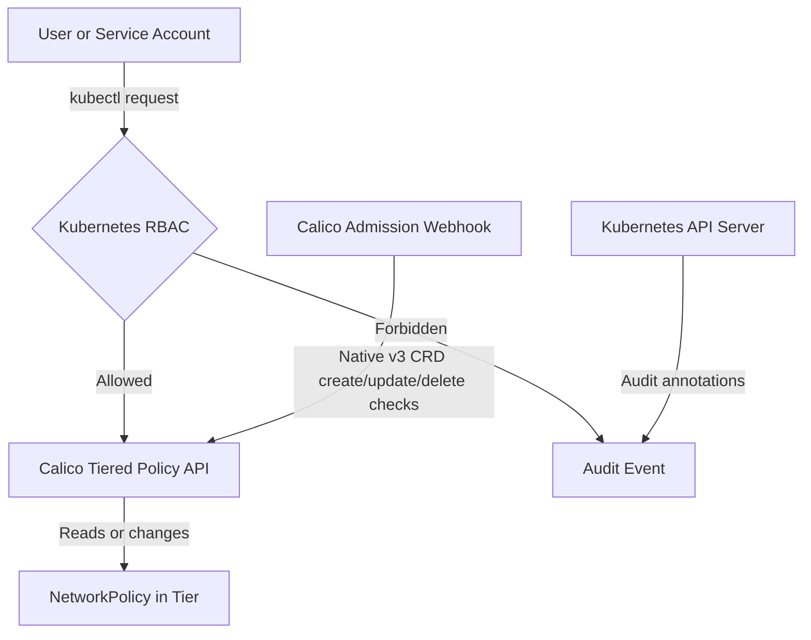

# How to Log and Audit RBAC for Calico Tiered Policies

Author: [nawazdhandala](https://github.com/nawazdhandala)

Tags: Calico, Kubernetes, Network Policy, RBAC, Policy Tiers, Security

Description: Configure comprehensive logging and auditing for RBAC for Tiered Policies in Calico.

---

## Introduction

RBAC for Tiered Policies is a Calico feature that provides fine-grained access controls for who can view and manage policies in each tier using the `projectcalico.org/v3` API. This guide covers how to configure and audit RBAC for Tiered Policies effectively in your Kubernetes cluster.

Calico associates `GlobalNetworkPolicy` and `NetworkPolicy` resources with tiers, and access to those policies is controlled with standard Kubernetes `Role`, `ClusterRole`, `RoleBinding`, and `ClusterRoleBinding` resources. Proper configuration of RBAC for Tiered Policies is essential for maintaining a secure, well-controlled network fabric.

This guide provides practical patterns for auditing RBAC for Tiered Policies, including YAML examples, CLI commands, and troubleshooting techniques.

## Prerequisites

- Kubernetes cluster with Calico policy tiers enabled
- `calicoctl` and `kubectl` installed  
- Basic understanding of Calico network policy concepts
- Cluster-admin permissions to create RBAC resources

## Core Configuration

The following YAML demonstrates the key pattern for granting a user read access to Calico `NetworkPolicy` resources in the `security` tier and the `production` namespace:

```yaml
apiVersion: rbac.authorization.k8s.io/v1
kind: ClusterRole
metadata:
  name: security-tier-viewer
rules:
  - apiGroups: ["projectcalico.org"]
    resources: ["tiers"]
    resourceNames: ["security"]
    verbs: ["get"]
---
apiVersion: rbac.authorization.k8s.io/v1
kind: ClusterRole
metadata:
  name: security-tier-policy-reader
rules:
  - apiGroups: ["projectcalico.org"]
    resources: ["tier.networkpolicies"]
    resourceNames: ["security.*"]
    verbs: ["get", "list", "watch"]
---
apiVersion: rbac.authorization.k8s.io/v1
kind: ClusterRoleBinding
metadata:
  name: john-can-view-security-tier
subjects:
  - kind: User
    name: john
    apiGroup: rbac.authorization.k8s.io
roleRef:
  kind: ClusterRole
  name: security-tier-viewer
  apiGroup: rbac.authorization.k8s.io
---
apiVersion: rbac.authorization.k8s.io/v1
kind: RoleBinding
metadata:
  name: john-can-read-security-tier-policies
  namespace: production
subjects:
  - kind: User
    name: john
    apiGroup: rbac.authorization.k8s.io
roleRef:
  kind: ClusterRole
  name: security-tier-policy-reader
  apiGroup: rbac.authorization.k8s.io
```

## Implementation Steps

```bash
# 1. Apply the policy

kubectl apply -f log-audit-rbac-tiered-policies.yaml

# 2. Verify RBAC objects are active
kubectl get clusterrole security-tier-viewer security-tier-policy-reader -o yaml
kubectl get clusterrolebinding john-can-view-security-tier -o yaml
kubectl get rolebinding john-can-read-security-tier-policies -n production -o yaml

# 3. Audit the resulting access as the target user
kubectl get networkpolicies.p -n production --field-selector spec.tier=security --as=john

# 4. Check Kubernetes audit logs for RBAC authorization decisions if API server auditing is enabled
grep 'authorization.k8s.io/decision' /var/log/kubernetes/audit.log
```

## Operational Commands

```bash
# List all relevant policies
calicoctl get networkpolicies --all-namespaces
calicoctl get globalnetworkpolicies
kubectl get networkpolicies.p --all-namespaces --field-selector spec.tier=security

# View policy details in the security tier
kubectl get networkpolicies.p security.log-audit-policy -n production -o yaml

# Delete role bindings if needed
kubectl delete clusterrolebinding john-can-view-security-tier
kubectl delete rolebinding john-can-read-security-tier-policies -n production
```

## Architecture



## Common Issues

1. **RBAC object not applying**: Verify the API version is `rbac.authorization.k8s.io/v1` and run `kubectl apply --dry-run=server -f log-audit-rbac-tiered-policies.yaml` first
2. **Tier access missing**: To access Calico policy in a tier, the user needs `get` access to the `tiers` resource for that tier
3. **Policy access missing**: Use the Calico pseudo resources `tier.networkpolicies` and `tier.globalnetworkpolicies` with resource names such as `security.*`
4. **Unexpected read access with native v3 CRDs**: Native `projectcalico.org/v3` CRD tier RBAC is enforced for create, update, and delete operations by the admission webhook; GET, LIST, and WATCH operations are not enforced by admission webhooks

## Conclusion

Log Audit RBAC Tiered Policies in Calico requires careful attention to tier permissions, pseudo resource names, namespace bindings, and Kubernetes audit logging. Use the patterns in this guide as a starting point, adapt them to your specific requirements, and always validate changes in a staging environment before applying to production. Consistent auditing and monitoring will help you detect and resolve issues quickly when they occur.
