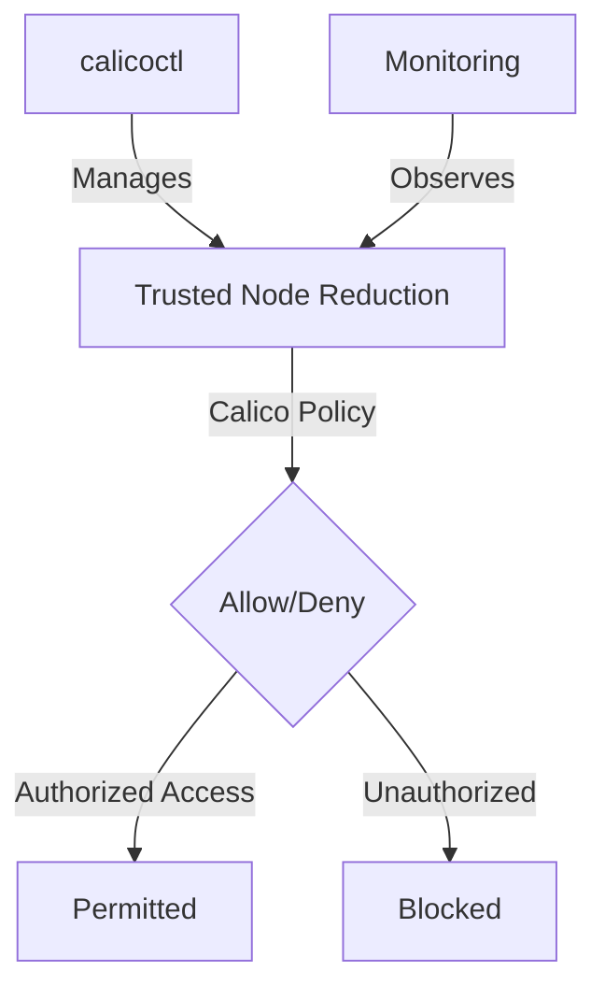

# How to Log and Audit Calico Policies for Reducing Trusted Nodes

Author: [nawazdhandala](https://github.com/nawazdhandala)

Tags: Calico, Kubernetes, Network Policy, Node Security, Zero Trust

Description: Log Audit Calico policies for reducing the number of trusted nodes to minimize attack surface.

---

## Introduction

Reducing Trusted Nodes with Calico is an important security consideration for production Calico deployments. The `projectcalico.org/v3` API provides the tools needed to log audit Trusted Node Reduction effectively, combining Calico's network policy with proper access controls and monitoring.

This guide covers log audit Trusted Node Reduction in Calico with practical configurations and operational best practices.

## Prerequisites

- Kubernetes cluster with Calico v3.26+
- `calicoctl` and `kubectl` installed
- Understanding of Calico's monitoring and security architecture
- HostEndpoint resources for the node interfaces you want Calico to protect
- Replacement allow rules for required access before narrowing Calico's default failsafe host ports

## Core Configuration

```yaml
# Restrict cross-node trust - only allow specific node-to-node traffic

apiVersion: projectcalico.org/v3
kind: HostEndpoint
metadata:
  name: trusted-node-01-eth0
  labels:
    role: k8s-node
    trusted-node: "true"
spec:
  node: trusted-node-01
  interfaceName: eth0
  expectedIPs:
    - 10.0.0.10
---
apiVersion: projectcalico.org/v3
kind: GlobalNetworkPolicy
metadata:
  name: reduce-trusted-nodes
spec:
  order: 100
  selector: role == 'k8s-node'
  ingress:
    - action: Allow
      protocol: TCP
      source:
        selector: trusted-node == 'true'
      destination:
        ports: [2380, 2379]  # etcd
    - action: Allow
      protocol: TCP
      source:
        nets:
          - 10.0.0.0/24  # Management subnet only
      destination:
        ports: [22, 6443]  # SSH and k8s API
    - action: Log
      protocol: TCP
      destination:
        ports: [22, 2379, 2380, 6443]
    - action: Deny
      protocol: TCP
      destination:
        ports: [22, 2379, 2380, 6443]
  types:
    - Ingress
```

## Implementation

```bash
# Apply trusted node policy
calicoctl apply -f reduce-trusted-nodes.yaml

# Calico's default failsafe host ports include SSH, etcd, and the Kubernetes API.
# After replacement allow rules are in place, narrow Felix failsafe ports for your environment
# so those ports are governed by policy.

# Test that restricted ports are blocked from untrusted IPs
# From an untrusted node:
nc -zv node-ip 2379
echo "etcd access from untrusted node (should fail): $?"

# From a trusted node:
nc -zv node-ip 2379
echo "etcd access from trusted node (should work): $?"
```

## Architecture



## Conclusion

Log Audit Trusted Node Reduction in Calico requires a combination of proper policy configuration, regular monitoring, and proactive testing. Use the patterns in this guide as a foundation and adapt them to your specific security requirements. Always validate changes in staging before production and maintain comprehensive logging for security visibility.
