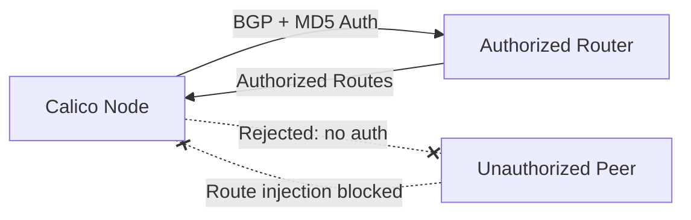

# How to Log and Audit BGP Sessions in Calico

Author: [nawazdhandala](https://github.com/nawazdhandala)

Tags: Calico, Kubernetes, BGP, Security, Network Policy

Description: Log Audit secure BGP sessions in Calico to prevent route injection and unauthorized BGP peering.

---

## Introduction

BGP (Border Gateway Protocol) sessions in Calico are used to distribute pod routes between nodes and to upstream routers. Unsecured BGP sessions are vulnerable to route injection attacks, where a malicious peer could inject false routes and redirect cluster traffic. Securing BGP sessions is an essential part of hardening a production Calico deployment.

Calico supports BGP session authentication using MD5 passwords and can be configured to only peer with authorized BGP peers. The `projectcalico.org/v3` BGPPeer resource lets you configure per-peer authentication settings.

This guide covers log audit BGP sessions in Calico to prevent unauthorized route injection and BGP hijacking.

## Prerequisites

- Kubernetes cluster with Calico v3.26+ in BGP mode
- `calicoctl` and `kubectl` installed
- Access to BGP peer configuration on both sides

## Secure BGP Configuration

```yaml
apiVersion: projectcalico.org/v3
kind: BGPPeer
metadata:
  name: secure-bgp-peer-router01
spec:
  peerIP: 192.168.1.1
  asNumber: 65001
  password:
    secretKeyRef:
      name: bgp-peer-secrets
      key: router01-password
  node: "node01"
---
apiVersion: rbac.authorization.k8s.io/v1
kind: Role
metadata:
  name: bgp-peer-secrets-reader
  namespace: calico-system # Use kube-system for manifest-based installs.
rules:
  - apiGroups: [""]
    resources: ["secrets"]
    resourceNames: ["bgp-peer-secrets"]
    verbs: ["get", "list", "watch"]
---
apiVersion: rbac.authorization.k8s.io/v1
kind: RoleBinding
metadata:
  name: calico-node-read-bgp-peer-secrets
  namespace: calico-system # Use kube-system for manifest-based installs.
roleRef:
  apiGroup: rbac.authorization.k8s.io
  kind: Role
  name: bgp-peer-secrets-reader
subjects:
  - kind: ServiceAccount
    name: calico-node
    namespace: calico-system # Use kube-system for manifest-based installs.
---
apiVersion: v1
kind: Secret
metadata:
  name: bgp-peer-secrets
  namespace: calico-system # Must match the calico-node pod namespace.
type: Opaque
data:
  router01-password: <base64-encoded-password>
```

Save the `BGPPeer` in `secure-bgp-peer.yaml` and the Role and RoleBinding in `bgp-secret-rbac.yaml`. The Secret can be created with `kubectl` so it is written in the same namespace as `calico-node`.

```bash
# Create BGP password secret
CALICO_NAMESPACE=calico-system # Use kube-system for manifest-based installs.

kubectl create secret generic bgp-peer-secrets \
  --from-literal=router01-password="$(openssl rand -base64 32)" \
  -n "$CALICO_NAMESPACE"

# Apply RBAC so calico-node can read the password secret
kubectl apply -f bgp-secret-rbac.yaml

# Apply BGP peer with authentication
calicoctl apply -f secure-bgp-peer.yaml

# Verify BGP session
calicoctl node status
```

## Verify BGP Security

```bash
# Check BGP peer status
CALICO_NAMESPACE=calico-system # Use kube-system for manifest-based installs.
calicoctl node status | grep Established

# Inspect BIRD protocol details from a calico-node pod
NODE_POD=$(kubectl get pods -n "$CALICO_NAMESPACE" -l k8s-app=calico-node \
  --field-selector spec.nodeName=node01 \
  -o jsonpath='{.items[0].metadata.name}')
kubectl exec -n "$CALICO_NAMESPACE" "$NODE_POD" -- birdcl show protocols all

# Review configured BGP peers
calicoctl get bgppeers -o wide

# Audit BGP-related calico-node logs for authentication or peering failures
kubectl logs -n "$CALICO_NAMESPACE" "$NODE_POD" | grep -iE "bgp|bird|auth|md5|password"
```

## Architecture



## Conclusion

Securing BGP sessions in Calico with MD5 authentication prevents route injection attacks and unauthorized BGP peering. Configure BGP passwords using Kubernetes Secrets, apply them to each BGPPeer resource, and monitor your BGP session status regularly to detect unauthorized connection attempts. In high-security environments, combine BGP authentication with strict host endpoint policies to restrict which hosts can establish BGP connections with your nodes.
