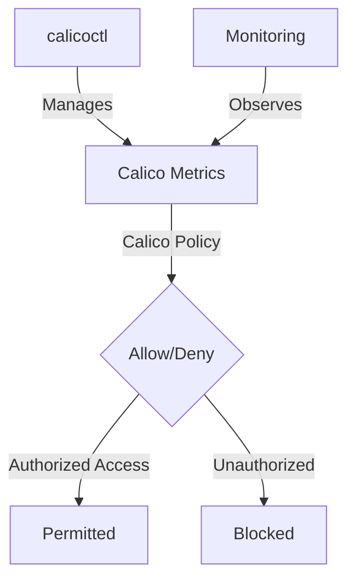

# How to Log and Audit Calico Metrics Endpoint Access

Author: [nawazdhandala](https://github.com/nawazdhandala)

Tags: Calico, Kubernetes, Metric, Security, Prometheus

Description: Log Audit security for Calico metrics endpoints to restrict access to authorized monitoring systems only.

---

## Introduction

Securing Calico Metrics Endpoints is an important security consideration for production Calico deployments. The `projectcalico.org/v3` API provides the tools needed to log audit Calico Metrics effectively, combining Calico's network policy with proper access controls and monitoring.

This guide covers log audit Calico Metrics in Calico with practical configurations and operational best practices.

## Prerequisites

- Kubernetes cluster with Calico v3.30+ if you want Calico Open Source flow logs through Whisker
- `calicoctl` and `kubectl` installed
- Automatic HostEndpoints enabled, with a node label such as `kubernetes-host` synced to the HostEndpoints
- Understanding of Calico's monitoring and security architecture

## Core Configuration

```yaml
# Restrict access to Calico Felix metrics (port 9091)

apiVersion: projectcalico.org/v3
kind: GlobalNetworkPolicy
metadata:
  name: secure-calico-metrics
spec:
  order: 100
  selector: has(kubernetes-host)
  ingress:
    - action: Allow
      protocol: TCP
      source:
        namespaceSelector: team == 'observability'
      destination:
        ports: [9091]
    - action: Allow
      protocol: TCP
      source:
        selector: app == 'prometheus'
      destination:
        ports: [9091]
    - action: Deny
      protocol: TCP
      destination:
        ports: [9091, 9092, 9093]
  types:
    - Ingress
```

## Implementation Steps

```bash
# Apply metrics security policy
calicoctl patch kubecontrollersconfiguration default --patch='{"spec": {"controllers": {"node": {"hostEndpoint": {"autoCreate": "Enabled"}}}}}'
kubectl label nodes --all kubernetes-host=
calicoctl apply -f secure-calico-metrics.yaml

# Verify only authorized access works
kubectl exec -n monitoring prometheus-pod -- curl -s http://<node-ip>:9091/metrics | head -5
echo "Prometheus access (should work): $?"

# Verify unauthorized access is blocked
kubectl exec -n default test-pod -- curl -s --max-time 5 http://<node-ip>:9091/metrics
echo "Unauthorized access (should timeout): $?"
```

## Verify Metrics Security

```bash
# View flow logs and filter for destination port 9091 in the Whisker UI
kubectl port-forward -n calico-system service/whisker 8081:8081

# Check active global policy for HostEndpoints
calicoctl get globalnetworkpolicies | grep secure-calico-metrics
```

## Architecture



## Conclusion

Log Audit Calico Metrics in Calico requires a combination of proper policy configuration, regular monitoring, and proactive testing. Use the patterns in this guide as a foundation and adapt them to your specific security requirements. Always validate changes in staging before production and maintain comprehensive logging for security visibility.
