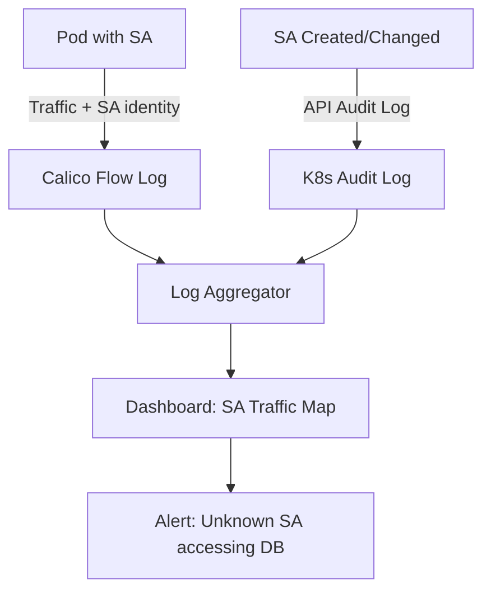

# How to Log and Audit Calico Service Account-Based Policies

Author: [nawazdhandala](https://github.com/nawazdhandala)

Tags: Calico, Kubernetes, Network Policy, Service Accounts, Logging, Audit

Description: Configure logging and auditing for Calico service account-based network policies to track identity-driven traffic decisions and service account changes.

---

## Introduction

Auditing service account-based policies gives you an identity-annotated traffic log: every allowed or denied connection includes the service account of the source workload. This is invaluable for security investigations, compliance reporting, and detecting unauthorized access attempts.

Combined with Kubernetes RBAC audit logs that capture service account creation, deletion, and assignment changes, you have a complete audit trail from identity to traffic decision.

## Prerequisites

- Kubernetes cluster with Calico v3.26+
- Calico flow logging enabled
- A log aggregation system
- `calicoctl` and `kubectl` installed

## Step 1: Enable Flow Logging with SA Identity

```bash
kubectl patch felixconfiguration default --type=merge -p '{
  "spec": {
    "flowLogsEnabled": true,
    "flowLogsCollectProcessInfo": true
  }
}'
```

## Step 2: Add Log Actions to SA Policies

```yaml
apiVersion: projectcalico.org/v3
kind: NetworkPolicy
metadata:
  name: log-sa-denials
  namespace: production
spec:
  order: 999
  selector: app == 'db'
  ingress:
    - action: Log
      source:
        serviceAccountSelector: name != 'backend-sa'
    - action: Deny
      source:
        serviceAccountSelector: name != 'backend-sa'
  types:
    - Ingress
```

## Step 3: Audit Service Account Changes

```yaml
# audit-policy.yaml - capture SA-related events
apiVersion: audit.k8s.io/v1
kind: Policy
rules:
  - level: RequestResponse
    verbs: ["create", "delete", "patch"]
    resources:
      - group: ""
        resources: ["serviceaccounts"]
  - level: RequestResponse
    verbs: ["patch", "update"]
    resources:
      - group: "apps"
        resources: ["deployments"]
    omitStages: ["RequestReceived"]
```

## Step 4: Correlate SA Identity with Traffic

```bash
# Find traffic from unexpected service accounts
grep "CALICO.*DENY" /var/log/calico/flow-logs/*.log | grep "src_service_account" | \
  awk '{print $NF}' | sort | uniq -c | sort -rn | head -10
```

## Logging Architecture



## Conclusion

Logging service account-based Calico policies creates an identity-enriched traffic audit trail. Combine policy `Log` actions with Kubernetes API audit logs for service account changes to build a complete picture: who was granted which service account, when the service account was assigned to a workload, and what traffic that workload attempted. This combination is particularly valuable for security investigations and zero-trust compliance audits.
