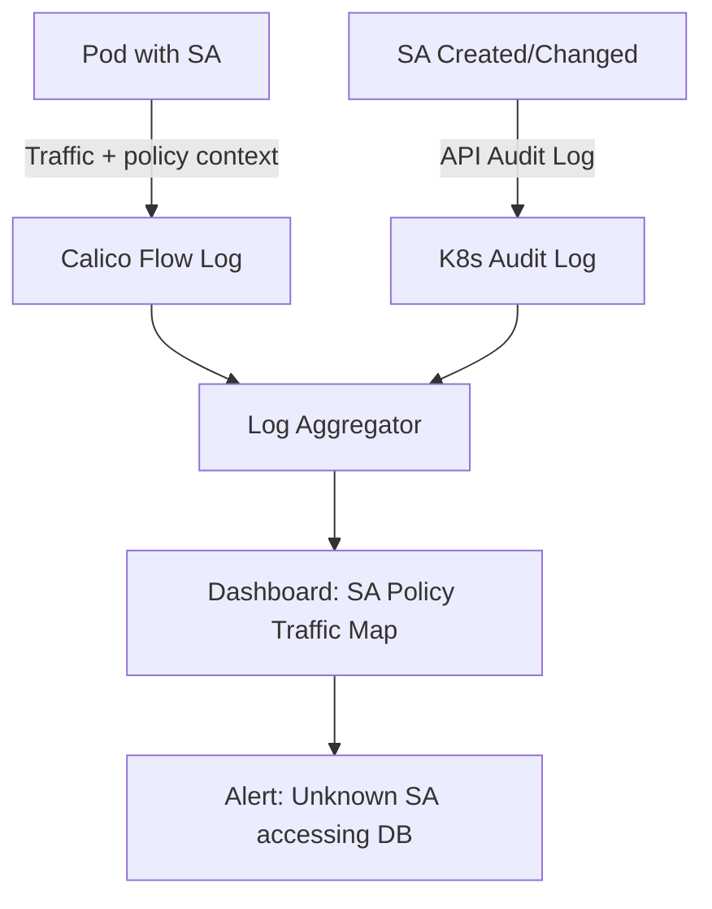

# How to Log and Audit Calico Service Account-Based Policies

Author: [nawazdhandala](https://github.com/nawazdhandala)

Tags: Calico, Kubernetes, Network Policy, Service Account, Logging, Audit

Description: Configure logging and auditing for Calico service account-based network policies to track identity-driven traffic decisions and service account changes.

---

## Introduction

Auditing service account-based policies gives you an identity-aware traffic trail: allowed or denied connections can be tied back to the source workload and the service account-based policy that matched it. This is invaluable for security investigations, compliance reporting, and detecting unauthorized access attempts.

Combined with Kubernetes API audit logs that capture service account creation, deletion, and workload assignment changes, you have a complete audit trail from identity to traffic decision.

## Prerequisites

- Kubernetes cluster with Calico service account policy support
- Calico Cloud or Calico Enterprise file-based flow logging enabled, or a Calico Open Source flow log pipeline using Goldmane/Whisker
- A log aggregation system
- `calicoctl` and `kubectl` installed

## Step 1: Enable Flow Logging with Policy Context

```bash
kubectl patch felixconfiguration default --type=merge -p '{
  "spec": {
    "flowLogsFileEnabled": true,
    "flowLogsFileIncludeLabels": true,
    "flowLogsFileIncludePolicies": true,
    "flowLogsCollectProcessInfo": true
  }
}'
```

## Step 2: Add Log Actions to SA Policies

```yaml
apiVersion: projectcalico.org/v3
kind: NetworkPolicy
metadata:
  name: log-sa-denials
  namespace: production
spec:
  order: 999
  selector: app == 'db'
  ingress:
    - action: Log
      source:
        serviceAccounts:
          selector: projectcalico.org/name != 'backend-sa'
    - action: Deny
      source:
        serviceAccounts:
          selector: projectcalico.org/name != 'backend-sa'
  types:
    - Ingress
```

## Step 3: Audit Service Account Changes

```yaml
# audit-policy.yaml - capture SA-related events

apiVersion: audit.k8s.io/v1
kind: Policy
rules:
  - level: RequestResponse
    verbs: ["create", "delete", "patch", "update"]
    resources:
      - group: ""
        resources: ["serviceaccounts"]
  - level: RequestResponse
    verbs: ["patch", "update"]
    resources:
      - group: ""
        resources: ["pods"]
      - group: "apps"
        resources: ["deployments", "daemonsets", "statefulsets", "replicasets"]
      - group: "batch"
        resources: ["jobs", "cronjobs"]
    omitStages: ["RequestReceived"]
```

## Step 4: Correlate SA Identity with Traffic

```bash
# Find denied Calico file-flow-log entries by source workload
awk '$NF == "deny" {print $4 "/" $5}' /var/log/calico/flowlogs/*.log | \
  sort | uniq -c | sort -rn | head -10
```

## Logging Architecture


```mermaid
flowchart TD
    A[Pod with SA] -->|Traffic + policy context| B[Calico Flow Log]
    C[SA Created/Changed] -->|API Audit Log| D[K8s Audit Log]
    B --> E[Log Aggregator]
    D --> E
    E --> F[Dashboard: SA Policy Traffic Map]
    F --> G[Alert: Unknown SA accessing DB]
```

## Conclusion

Logging service account-based Calico policies creates an identity-aware traffic audit trail. Combine policy `Log` actions with Kubernetes API audit logs for service account changes to build a complete picture: which service accounts changed, when a service account was assigned to a workload, and what traffic that workload attempted. This combination is particularly valuable for security investigations and zero-trust compliance audits.
