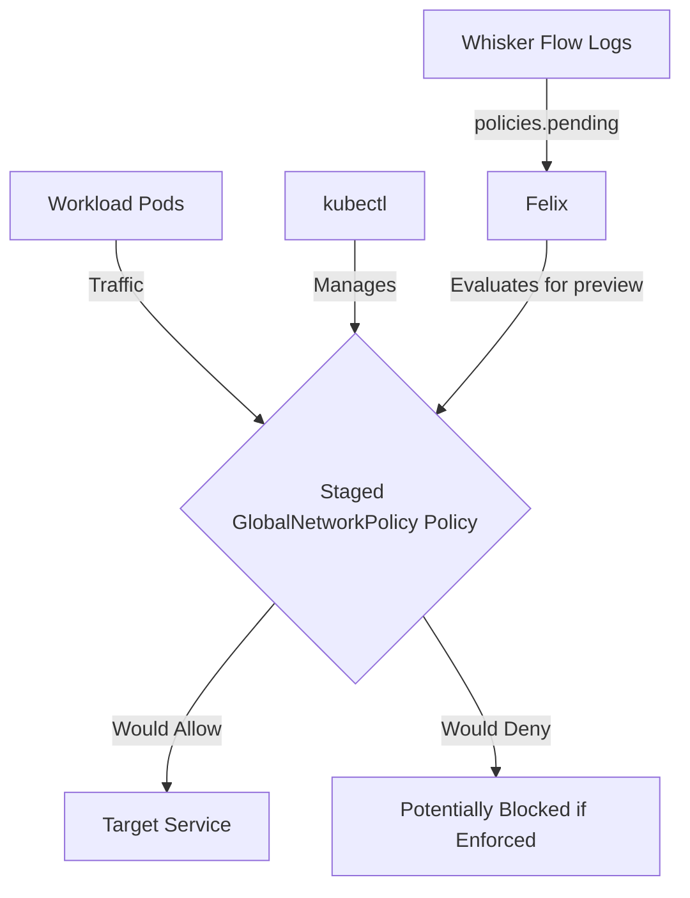

# How to Log and Audit Staged GlobalNetworkPolicy in Calico

Author: [nawazdhandala](https://github.com/nawazdhandala)

Tags: Calico, Kubernetes, Network Policy, Staged Policies, Global Policy

Description: Configure comprehensive logging and auditing for Staged GlobalNetworkPolicy in Calico.

---

## Introduction

Staged GlobalNetworkPolicy is an advanced Calico feature that lets you preview fine-grained network security controls using the `projectcalico.org/v3` API before enforcing them. This guide covers how to audit Staged GlobalNetworkPolicy effectively in your Kubernetes cluster.

Calico's `projectcalico.org/v3` API provides rich support for staged policy resources through `StagedGlobalNetworkPolicy`, `StagedNetworkPolicy`, `StagedKubernetesNetworkPolicy`, and related resources. Proper configuration of Staged GlobalNetworkPolicy is essential for maintaining a secure, well-controlled network fabric.

This guide provides validated patterns for auditing Staged GlobalNetworkPolicy, including YAML examples, CLI commands, and troubleshooting techniques.

## Prerequisites

- Kubernetes cluster with Calico v3.30+
- `kubectl` installed  
- Basic understanding of Calico network policy concepts
- Calico v3.30+ for Staged GlobalNetworkPolicy support in Calico Open Source

## Core Configuration

The following YAML demonstrates the key pattern for Staged GlobalNetworkPolicy:

```yaml
apiVersion: projectcalico.org/v3
kind: StagedGlobalNetworkPolicy
metadata:
  name: log-audit-staged-globalnetworkpolicy
spec:
  tier: default
  order: 100
  namespaceSelector: projectcalico.org/name == 'production'
  selector: all()
  ingress:
    - action: Allow
      protocol: TCP
      source:
        selector: app == 'authorized-source'
        namespaceSelector: projectcalico.org/name == 'production'
      destination:
        ports: [8080, 443]
  egress:
    - action: Allow
      protocol: UDP
      destination:
        ports: [53]
    - action: Allow
      destination:
        selector: app == 'authorized-destination'
  types:
    - Ingress
    - Egress
```

## Implementation Steps

```bash
# 1. Apply the policy

kubectl apply -f log-audit-staged-globalnetworkpolicy.yaml

# 2. Verify the staged policy exists
kubectl get stagedglobalnetworkpolicies.projectcalico.org -o wide

# 3. Test connectivity
kubectl exec -n production test-pod -- curl -s --max-time 5 http://target:8080
echo "Exit code: $?"

# 4. Check staged policy impact in Calico Whisker flow logs
# Review the policies.pending field for matching flows.
```

## Operational Commands

```bash
# List all relevant policies
kubectl get stagednetworkpolicies.projectcalico.org --all-namespaces
kubectl get stagedglobalnetworkpolicies.projectcalico.org
kubectl get globalnetworkpolicies.projectcalico.org

# View policy details
kubectl get stagedglobalnetworkpolicy.projectcalico.org log-audit-staged-globalnetworkpolicy -o yaml

# Delete a policy if needed
kubectl delete stagedglobalnetworkpolicy.projectcalico.org log-audit-staged-globalnetworkpolicy
```

## Architecture



## Common Issues

1. **Policy not applying**: Verify API version is `projectcalico.org/v3` and run `kubectl apply --dry-run=server -f log-audit-staged-globalnetworkpolicy.yaml` first
2. **Selector not matching**: Use `kubectl get pods -l your-selector` to verify label matches
3. **Order conflicts**: Run `kubectl get stagedglobalnetworkpolicies.projectcalico.org -o wide` and sort by order field
4. **DNS failures**: Always ensure egress to port 53 is allowed when restricting egress

## Conclusion

Auditing Staged GlobalNetworkPolicy in Calico requires careful attention to policy ordering, selector syntax, and bidirectional traffic rules. Use the patterns in this guide as a starting point, adapt them to your specific requirements, and always validate staged policy impact before enforcing it in production. Consistent flow-log review and monitoring will help you detect and resolve issues quickly when they occur.
