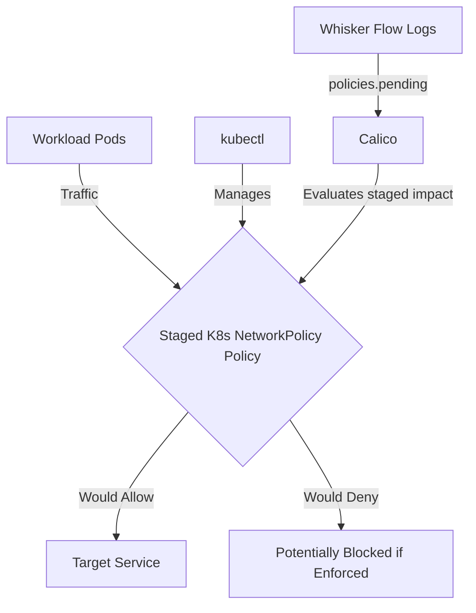

# How to Log and Audit Staged Kubernetes NetworkPolicy in Calico

Author: [nawazdhandala](https://github.com/nawazdhandala)

Tags: Calico, Kubernetes, Network Policy, Staged Policies

Description: Configure comprehensive logging and auditing for Staged Kubernetes NetworkPolicy in Calico.

---

## Introduction

Staged Kubernetes NetworkPolicy is an advanced Calico feature that lets you preview Kubernetes NetworkPolicy behavior using the `projectcalico.org/v3` API before enforcing it. This guide covers how to log audit Staged K8s NetworkPolicy effectively in your Kubernetes cluster.

Calico's `projectcalico.org/v3` API provides support for staged policy through `StagedKubernetesNetworkPolicy`, `StagedNetworkPolicy`, `StagedGlobalNetworkPolicy`, and related resources. Proper configuration of Staged K8s NetworkPolicy is essential for maintaining a secure, well-controlled network fabric.

This guide provides production-tested patterns for log audit Staged K8s NetworkPolicy, including YAML examples, CLI commands, and troubleshooting techniques.

## Prerequisites

- Kubernetes cluster with Calico staged policy resources and Whisker flow logs enabled
- `kubectl` installed
- Basic understanding of Calico network policy concepts

## Core Configuration

The following YAML demonstrates the key pattern for Staged K8s NetworkPolicy:

```yaml
apiVersion: projectcalico.org/v3
kind: StagedKubernetesNetworkPolicy
metadata:
  name: log-audit-staged-k8s-networkpolicy
  namespace: production
spec:
  podSelector: {}
  policyTypes:
    - Ingress
    - Egress
  ingress:
    - from:
        - podSelector:
            matchLabels:
              app: authorized-source
      ports:
        - protocol: TCP
          port: 8080
        - protocol: TCP
          port: 443
  egress:
    - ports:
        - protocol: UDP
          port: 53
        - protocol: TCP
          port: 53
    - to:
        - podSelector:
            matchLabels:
              app: authorized-destination
```

## Implementation Steps

```bash
# 1. Apply the policy

kubectl apply -f log-audit-staged-k8s-networkpolicy.yaml

# 2. Verify the staged policy exists
kubectl get stagedkubernetesnetworkpolicies.projectcalico.org -n production

# 3. Test connectivity
kubectl exec -n production test-pod -- curl -s --max-time 5 http://target:8080
echo "Exit code: $?"

# 4. Review staged policy impact in Calico Whisker flow logs
# Check the policies.pending field for flows that the staged policy would affect.
```

## Operational Commands

```bash
# List all relevant policies
kubectl get stagedkubernetesnetworkpolicies.projectcalico.org --all-namespaces
kubectl get stagednetworkpolicies.projectcalico.org --all-namespaces
kubectl get stagedglobalnetworkpolicies.projectcalico.org

# View policy details
kubectl get stagedkubernetesnetworkpolicy.projectcalico.org log-audit-staged-k8s-networkpolicy -n production -o yaml

# Delete a policy if needed
kubectl delete stagedkubernetesnetworkpolicy.projectcalico.org log-audit-staged-k8s-networkpolicy -n production
```

## Architecture



## Common Issues

1. **Policy not applying**: Verify API version is `projectcalico.org/v3`, kind is `StagedKubernetesNetworkPolicy`, and run `kubectl apply --dry-run=server -f log-audit-staged-k8s-networkpolicy.yaml` first
2. **Selector not matching**: Use `kubectl get pods -l your-selector -n production` to verify label matches
3. **Unexpected preview results**: Run `kubectl get stagedkubernetesnetworkpolicies.projectcalico.org -n production -o yaml` and compare the policy with the enforced Kubernetes NetworkPolicy you plan to create
4. **DNS failures**: Always ensure egress to UDP and TCP port 53 is allowed when restricting egress

## Conclusion

Log Audit Staged K8s NetworkPolicy in Calico requires careful attention to Kubernetes NetworkPolicy selectors, ingress and egress rule structure, and flow log review. Use the patterns in this guide as a starting point, adapt them to your specific requirements, and always validate changes in a staging environment before applying to production. Consistent logging and monitoring will help you detect and resolve issues quickly when they occur.
