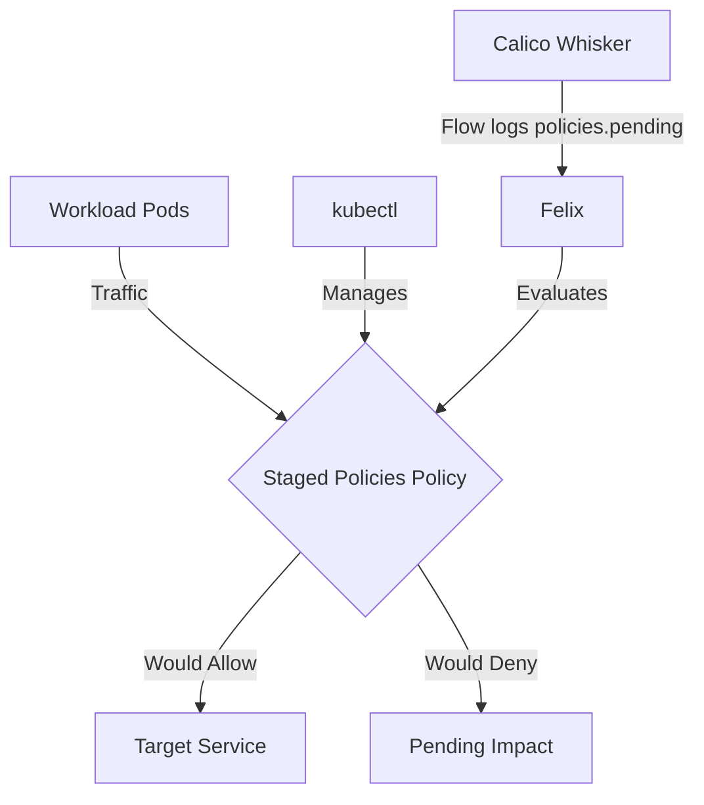

# How to Log and Audit Staged Network Policies in Calico

Author: [nawazdhandala](https://github.com/nawazdhandala)

Tags: Calico, Kubernetes, Network Policy, Staged Policies, Security

Description: Configure comprehensive logging and auditing for Staged Network Policies in Calico.

---

## Introduction

Staged Network Policies is an advanced Calico feature that lets you preview fine-grained network security controls using the `projectcalico.org/v3` API without enforcing them. This guide covers how to log and audit Staged Policies effectively in your Kubernetes cluster.

Calico's `projectcalico.org/v3` API provides rich support for Staged Policies through its `StagedGlobalNetworkPolicy`, `StagedNetworkPolicy`, `StagedKubernetesNetworkPolicy`, and related resources. Proper configuration of Staged Policies is essential for safely previewing policy changes before enforcement.

This guide provides production-tested patterns for log audit Staged Policies, including YAML examples, CLI commands, and troubleshooting techniques.

## Prerequisites

- Kubernetes cluster with Calico v3.26+
- `kubectl` installed and configured
- Basic understanding of Calico network policy concepts
- Calico v3.26+ for full Staged Policies feature support

## Core Configuration

The following YAML demonstrates the key pattern for Staged Policies:

```yaml
apiVersion: projectcalico.org/v3
kind: StagedNetworkPolicy
metadata:
  name: log-audit-staged-policies
  namespace: production
spec:
  order: 100
  selector: all()
  ingress:
    - action: Allow
      source:
        selector: app == 'authorized-source'
      destination:
        ports: [8080, 443]
  egress:
    - action: Allow
      protocol: UDP
      destination:
        ports: [53]
    - action: Allow
      destination:
        selector: app == 'authorized-destination'
  types:
    - Ingress
    - Egress
```

## Implementation Steps

```bash
# 1. Apply the staged policy

kubectl apply -f log-audit-staged-policies.yaml

# 2. Verify it's created
kubectl get stagednetworkpolicies.projectcalico.org -n production

# 3. Generate traffic to evaluate against the staged policy
kubectl exec -n production test-pod -- curl -s --max-time 5 http://target:8080
echo "Exit code: $?"

# 4. Review Calico flow logs for the policies.pending field in Calico Whisker
```

## Operational Commands

```bash
# List all relevant policies
kubectl get stagednetworkpolicies.projectcalico.org --all-namespaces
kubectl get stagedglobalnetworkpolicies.projectcalico.org

# View policy details
kubectl get stagednetworkpolicy.projectcalico.org log-audit-staged-policies -n production -o yaml

# Delete a policy if needed
kubectl delete stagednetworkpolicy.projectcalico.org log-audit-staged-policies -n production
```

## Architecture



## Common Issues

1. **Policy not applying**: Verify API version is `projectcalico.org/v3`, kind is `StagedNetworkPolicy`, and run `kubectl apply --dry-run=server -f log-audit-staged-policies.yaml` first
2. **Selector not matching**: Use Kubernetes label selectors such as `kubectl get pods -n production -l app=authorized-source` to verify labels used by the Calico selector
3. **Order conflicts**: Run `kubectl get stagedglobalnetworkpolicies.projectcalico.org -o yaml` and review the `spec.order` and `spec.tier` fields
4. **DNS failures**: Always ensure egress to port 53 is allowed when restricting egress

## Conclusion

Log Audit Staged Policies in Calico requires careful attention to policy ordering, selector syntax, and bidirectional traffic rules. Use the patterns in this guide as a starting point, adapt them to your specific requirements, and always validate staged policy impact before creating the equivalent enforced policy in production. Consistent logging and monitoring will help you detect and resolve issues quickly when they occur.
