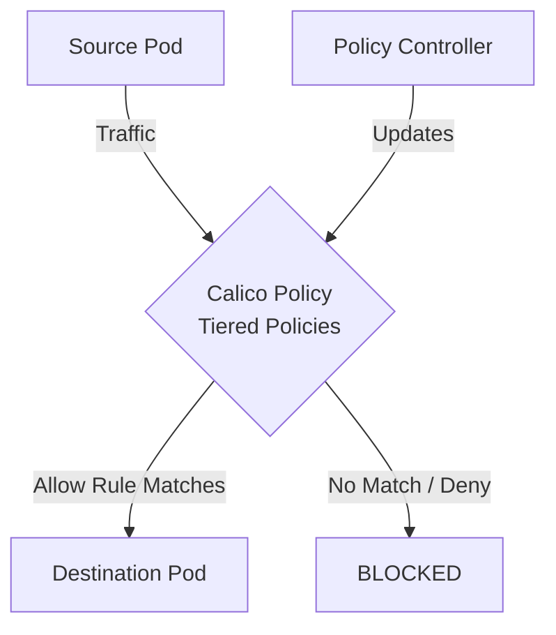

# How to Log and Audit Calico Tiered Policies in Calico

Author: [nawazdhandala](https://github.com/nawazdhandala)

Tags: Calico, Kubernetes, Network Policy, Policy Tiers, Security

Description: Configure logging and auditing for Calico Tiered Policies in Calico for security visibility.

---

## Introduction

Calico Tiered Policies in Calico provides fine-grained network security controls using the `projectcalico.org/v3` API. This guide covers how to log audit Tiered Policies effectively.

Calico's extensible policy model supports Tiered Policies through its `GlobalNetworkPolicy` and `NetworkPolicy` resources, giving you cluster-wide and namespace-scoped control over traffic that matches your Tiered Policies criteria.

This guide provides practical techniques for log audit Tiered Policies in your Kubernetes cluster, following security best practices and production-tested patterns.

## Prerequisites

- Kubernetes cluster with Calico v3.26+
- `calicoctl` and `kubectl` installed
- Basic understanding of Calico network policy concepts

## Step 1: Configure Policy Log Output

```bash
kubectl patch felixconfiguration default --type=merge -p '{"spec":{"logPrefix":"calico-packet %t %p "}}'
```

## Step 2: Add Log Actions to Policy

```yaml
apiVersion: projectcalico.org/v3
kind: NetworkPolicy
metadata:
  name: log-tiered-policies
  namespace: production
spec:
  order: 100
  selector: all()
  ingress:
    - action: Log
    - action: Allow
      source:
        selector: app == 'authorized'
    - action: Log
    - action: Deny
  types:
    - Ingress
```

## Step 3: View Kernel Log Output

```bash
journalctl -k -g "calico-packet"
```

## Step 4: Query and Alert

```bash
grep "calico-packet" /var/log/syslog /var/log/kern.log | tail -20
```

## Architecture



## Conclusion

Log Audit Tiered Policies policies in Calico requires attention to policy ordering, selector accuracy, and bidirectional rule coverage. Follow the patterns in this guide to ensure your Tiered Policies policies are correctly configured, tested, and monitored. Always validate in staging before applying to production, and maintain comprehensive logging for visibility into policy decisions.
