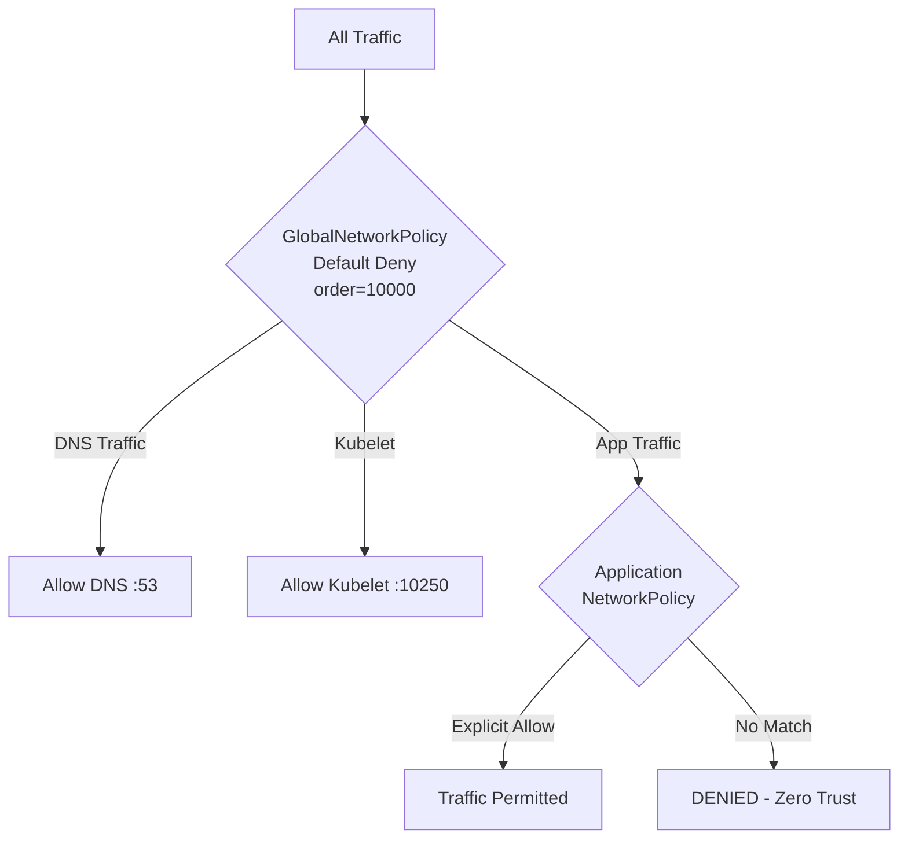

# How to Log and Audit Zero Trust Network Policy in Calico

Author: [nawazdhandala](https://github.com/nawazdhandala)

Tags: Calico, Kubernetes, Network Policy, Zero Trust, Security, Microsegmentation

Description: Log Audit zero trust network policies in Calico to enforce the principle of never trust, always verify across your Kubernetes cluster.

---

## Introduction

Zero Trust Network Policy in Calico implements the principle of never trust, always verify at the Kubernetes network layer. Every connection is evaluated against explicit policy rules, and nothing is permitted by default. This eliminates implicit trust that allows compromised workloads to move laterally through the cluster.

Calico's `projectcalico.org/v3` GlobalNetworkPolicy and NetworkPolicy resources provide the building blocks for zero trust: default deny at the cluster level, explicit allow rules for each required communication path, and comprehensive logging of every traffic decision.

This guide covers log audit zero trust network policies in Calico, including the full policy stack from global defaults to workload-specific microsegmentation.

## Prerequisites

- Kubernetes cluster with Calico v3.26+
- `calicoctl` and `kubectl` installed
- Complete traffic map of all required communication paths
- Monitoring and alerting configured

## Core Zero Trust Policy Stack

```yaml
# Layer 1: Global default deny
apiVersion: projectcalico.org/v3
kind: GlobalNetworkPolicy
metadata:
  name: zt-global-default-deny
spec:
  order: 10000
  selector: all()
  types:
    - Ingress
    - Egress
---
# Layer 2: Required system traffic
apiVersion: projectcalico.org/v3
kind: GlobalNetworkPolicy
metadata:
  name: zt-allow-system-traffic
spec:
  order: 1
  selector: all()
  egress:
    - action: Allow
      protocol: UDP
      destination:
        ports: [53]
    - action: Allow
      protocol: TCP
      destination:
        ports: [53]
  ingress:
    - action: Allow
      source:
        nets: ["10.0.0.0/8"]
      destination:
        ports: [10250]
  types:
    - Ingress
    - Egress
---
# Layer 3: Application-specific allow rules
apiVersion: projectcalico.org/v3
kind: NetworkPolicy
metadata:
  name: zt-allow-frontend-to-api
  namespace: production
spec:
  order: 100
  selector: tier == 'api'
  ingress:
    - action: Allow
      source:
        selector: tier == 'frontend'
      destination:
        ports: [8080]
  types:
    - Ingress
```

## Zero Trust Verification

```bash
# Verify default deny is active
kubectl exec -n production test-pod -- curl -s --max-time 5 http://random-ip:8080
echo "Should timeout (default deny): $?"

# Verify explicit allows work
kubectl exec -n production frontend-pod -- curl -s --max-time 5 http://backend-api:8080
echo "Should succeed (explicit allow): $?"

# Verify lateral movement is blocked
kubectl exec -n production frontend-pod -- curl -s --max-time 5 http://database:5432
echo "Should timeout (no frontend->DB allow): $?"
```

## Zero Trust Policy Architecture



## Conclusion

Zero trust network policies in Calico require a layered approach: start with global default deny, add required system traffic, then incrementally add application-specific allow rules. The zero trust model is a journey — begin with monitoring mode to discover your traffic patterns, then progressively restrict traffic as you build your allow rule library. Comprehensive logging and monitoring are essential to detect gaps and anomalies in your zero trust posture.
