# How to Migrate to BGP Peering in Calico Safely

Author: [nawazdhandala](https://github.com/nawazdhandala)

Tags: Calico, Kubernetes, BGP, Networking, Migration

Description: Safely migrate a Calico cluster from VXLAN or IP-in-IP encapsulation to native BGP routing using a phased approach that minimizes downtime and traffic disruption.

---

## Introduction

Many Calico deployments start with VXLAN or IP-in-IP encapsulation because it requires no special network configuration — it works on any IP network without BGP support in the underlying infrastructure. As clusters mature and performance requirements increase, teams often want to migrate to native BGP routing to eliminate encapsulation overhead and gain better network visibility.

This migration carries real risk: changing the data plane while live workloads are running can cause traffic disruption if not handled carefully. The key to a safe migration is enabling BGP alongside the existing encapsulation mode, verifying routes are being distributed correctly, then gradually shifting traffic to native routing paths before removing the encapsulation fallback.

This guide provides a step-by-step migration path from VXLAN/IP-in-IP to native BGP peering with full traffic verification at each stage.

## Prerequisites

- Existing Calico cluster running VXLAN or IP-in-IP mode
- Underlying network infrastructure that supports BGP peering (physical or virtual routers)
- A maintenance window or the ability to tolerate brief per-node disruptions
- `calicoctl` and `kubectl` access

## Phase 1: Audit Current Configuration

Before changing anything, capture the current state:

```bash
calicoctl get ippools -o yaml > ippool-backup.yaml
calicoctl get bgpconfiguration -o yaml > bgp-config-backup.yaml
kubectl get nodes -o wide > nodes-backup.txt
calicoctl get nodes -o yaml > calico-nodes-backup.yaml
```

Check the current encapsulation mode:

```bash
calicoctl get ippools -o yaml | grep -A2 ipipMode
calicoctl get ippools -o yaml | grep -A2 vxlanMode
```

## Phase 2: Enable BGP Without Disabling Encapsulation

Enable BGP peering while keeping existing encapsulation as a fallback:

```bash
# Enable BGP (if not already enabled)
calicoctl patch bgpconfiguration default --type merge \
  --patch '{"spec":{"nodeToNodeMeshEnabled":true,"asNumber":64512}}'
```

Configure external peers if needed:

```yaml
apiVersion: projectcalico.org/v3
kind: BGPPeer
metadata:
  name: tor-router
spec:
  peerIP: 192.168.0.1
  asNumber: 64513
```

```bash
calicoctl apply -f bgp-peer-tor.yaml
```

## Phase 3: Verify BGP Sessions and Routes

Confirm all nodes have established BGP sessions before proceeding:

```bash
calicoctl node status
for node in $(kubectl get nodes -o name | cut -d/ -f2); do
  echo "=== $node ==="
  kubectl exec -n calico-system \
    $(kubectl get pod -n calico-system -l k8s-app=calico-node \
      --field-selector spec.nodeName=${node} -o name | head -1) \
    -- birdcl show protocols
done
```

## Phase 4: Gradually Transition IP Pools

Change encapsulation mode to `CrossSubnet` first (uses BGP within subnet, encapsulation across subnets):

```yaml
apiVersion: projectcalico.org/v3
kind: IPPool
metadata:
  name: default-ipv4-ippool
spec:
  cidr: 10.244.0.0/16
  ipipMode: CrossSubnet
  vxlanMode: Never
  natOutgoing: true
```

```bash
calicoctl apply -f ippool-crosssubnet.yaml
```

Then, after verifying connectivity, disable encapsulation entirely:

```bash
calicoctl patch ippool default-ipv4-ippool --type merge \
  --patch '{"spec":{"ipipMode":"Never","vxlanMode":"Never"}}'
```

## Migration Phases

```mermaid
gantt
    title BGP Migration Timeline
    dateFormat  HH:mm
    section Phase 1
    Audit current config       :a1, 00:00, 30m
    section Phase 2
    Enable BGP with encap      :a2, 00:30, 1h
    section Phase 3
    Verify BGP sessions        :a3, 01:30, 30m
    section Phase 4
    Switch to CrossSubnet      :a4, 02:00, 1h
    Verify connectivity        :a5, 03:00, 30m
    Disable encapsulation      :a6, 03:30, 30m
```



## Conclusion

Migrating to BGP peering in Calico is safe when done incrementally: enable BGP alongside existing encapsulation, verify sessions and routes, then gradually remove the encapsulation fallback. The CrossSubnet mode provides a useful intermediate step that uses native routing within subnets while maintaining encapsulation for cross-subnet traffic. Always back up your IP pool configuration and have a rollback plan before executing each phase.
