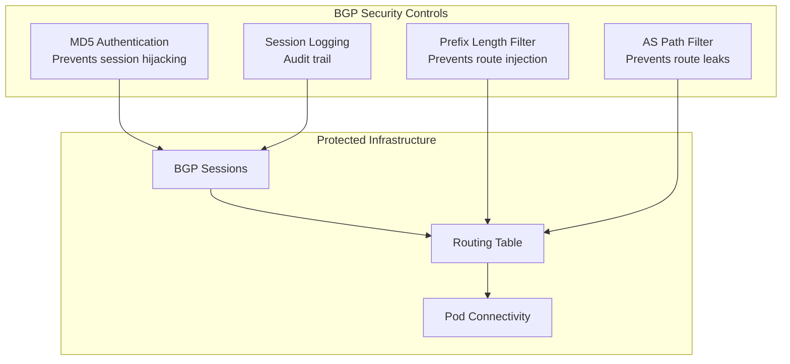

# How to Migrate to BGP Security Designs in Calico Safely

Author: [nawazdhandala](https://github.com/nawazdhandala)

Tags: Calico, Kubernetes, BGP, Security, Networking

Description: Safely add BGP security controls to an existing Calico deployment without disrupting current BGP sessions.

---

## Introduction

BGP security in Calico extends beyond basic session authentication to encompass a comprehensive security architecture for the routing control plane. BGP route injection attacks, where a compromised or misconfigured peer advertises incorrect routes, can cause widespread traffic misdirection or network blackholes. Implementing defense-in-depth for BGP security protects the entire cluster's network connectivity.

Key BGP security controls include: MD5 session authentication, prefix length limits (rejecting unusually short or long prefixes), AS path filtering (rejecting routes with unexpected AS paths), and RPKI (Resource Public Key Infrastructure) validation for public internet routing. For internal Kubernetes clusters, the first two are most relevant.

## Prerequisites

- Calico with BGP mode
- calicoctl v3.26+
- BGP peer routers supporting authentication

## Configure BGP MD5 Authentication

```yaml
apiVersion: projectcalico.org/v3
kind: BGPPeer
metadata:
  name: secure-peer
spec:
  peerIP: 192.168.1.1
  asNumber: 64513
  password:
    secretKeyRef:
      name: bgp-secrets
      key: peer-password
```

```bash
kubectl create secret generic bgp-secrets \
  --from-literal=peer-password='StrongBGPauth$ecret2024' \
  -n calico-system
```

## Configure Prefix Length Filters

```yaml
apiVersion: projectcalico.org/v3
kind: BGPFilter
metadata:
  name: secure-prefix-filter
spec:
  importV4:
  - action: Reject
    cidr: 0.0.0.0/0
    prefixLength:
      min: 0
      max: 7  # Reject excessively broad routes
  - action: Reject
    cidr: 0.0.0.0/0
    prefixLength:
      min: 25
      max: 32  # Reject overly specific routes
  - action: Accept
```

## Apply Security Controls to Peers

```yaml
apiVersion: projectcalico.org/v3
kind: BGPPeer
metadata:
  name: secured-tor-peer
spec:
  peerIP: 192.168.1.1
  asNumber: 64513
  password:
    secretKeyRef:
      name: bgp-secrets
      key: peer-password
  filters:
  - secure-prefix-filter
```

## BGP Security Layers



## Conclusion

BGP security in Calico requires multiple defensive layers: MD5 authentication prevents unauthorized session establishment, prefix filters prevent route injection, and session monitoring provides audit trails for security incidents. Implement these controls before connecting Calico to external BGP infrastructure to maintain routing integrity.
