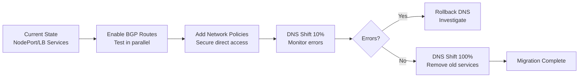

# How to Migrate to BGP to Workload Connectivity in Calico Safely

Author: [nawazdhandala](https://github.com/nawazdhandala)

Tags: Calico, Kubernetes, BGP, Networking, Migration

Description: Safely migrate Kubernetes workloads to direct BGP connectivity by transitioning from NodePort or LoadBalancer services to direct pod IP routing with minimal downtime.

---

## Introduction

Migrating from NodePort or cloud load balancer-based external access to direct BGP-to-workload connectivity is a significant architectural change. Applications that previously relied on service-level load balancing and NAT must be adapted to work with direct pod IP routing. This migration can improve latency and simplify the network path, but requires careful planning.

The safe migration approach involves running both connectivity methods in parallel, gradually shifting traffic from the old method to the new, and validating behavior at each step before cutting over completely. DNS or traffic management systems can be used to control the gradual shift.

## Prerequisites

- Calico BGP mode configured with route advertisements
- External BGP peers established and routing pod CIDRs
- Existing applications served via NodePort or LoadBalancer services

## Phase 1: Enable BGP Pod Advertisement Without Removing Services

First, verify that pod IPs are being advertised via BGP and reachable externally without changing any application configuration:

```bash
# Check BGP is advertising pod routes
calicoctl node status
kubectl exec -n calico-system ${NODE_POD} -- birdcl show route
```

From an external host, test direct pod IP connectivity alongside existing service access:

```bash
# Test existing service path (no change to this)
curl http://service-loadbalancer-ip:80/

# Test new direct pod path
curl http://10.48.1.5:80/
```

## Phase 2: Update DNS for Gradual Traffic Shift

Update DNS to include pod IPs alongside service IPs, with initial weight on service path:

```bash
# In your DNS system, add pod IP as secondary record with lower weight
# Example with Route53 weighted routing policy
aws route53 change-resource-record-sets --hosted-zone-id Z123 \
  --change-batch '{
    "Changes": [{
      "Action": "CREATE",
      "ResourceRecordSet": {
        "Name": "api.example.com",
        "Type": "A",
        "SetIdentifier": "pod-direct",
        "Weight": 10,
        "TTL": 30,
        "ResourceRecords": [{"Value": "10.48.1.5"}]
      }
    }]
  }'
```

## Phase 3: Enable Network Policies for Direct Access

Before shifting traffic, ensure network policies are in place to secure direct pod access:

```yaml
apiVersion: projectcalico.org/v3
kind: NetworkPolicy
metadata:
  name: allow-direct-bgp-access
  namespace: production
spec:
  selector: app == 'api'
  types:
  - Ingress
  ingress:
  - action: Allow
    protocol: TCP
    source:
      nets:
      - 192.168.0.0/16
    destination:
      ports:
      - 80
      - 443
```

## Phase 4: Cut Over and Verify

After validating direct connectivity with a small traffic percentage, shift remaining traffic:

```bash
# Update IP pool to disable NAT
calicoctl patch ippool default-ipv4-ippool --type merge \
  --patch '{"spec":{"natOutgoing":false}}'

# Update DNS to point fully to pod IPs or a new BGP-aware load balancer
```

## Migration Flowchart



## Conclusion

Migrating to BGP-to-workload connectivity requires a phased approach: validate connectivity in parallel before making any changes, gradually shift traffic using DNS or load balancer weights, and have a clear rollback path at each stage. The key risk to manage is the change in NAT behavior when `natOutgoing` is disabled, which affects applications that log or rate-limit based on client IP.
