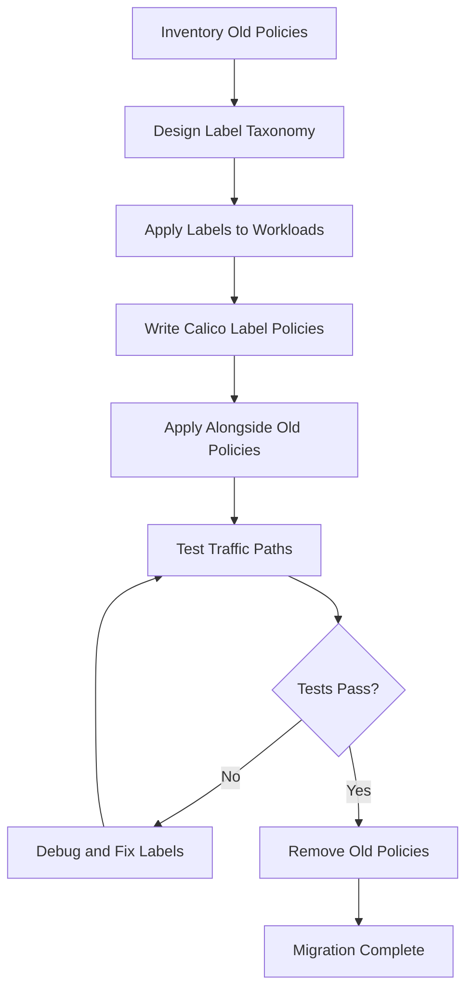

# How to Migrate Existing Rules to Calico Label-Based Network Policies

Author: [nawazdhandala](https://github.com/nawazdhandala)

Tags: Calico, Kubernetes, Network Policy, Labels, Migration

Description: Migrate IP-based or namespace-scoped network policies to Calico label-based policies for more flexible, maintainable cluster security.

---

## Introduction

Many organizations start with Kubernetes NetworkPolicy objects that use IP address ranges, namespace selectors, or pod selectors with insufficient granularity. Migrating to Calico label-based policies under the `projectcalico.org/v3` API enables more precise, maintainable, and scalable network controls.

The migration challenge is that you must introduce a new label taxonomy without disrupting existing policies. This means running both old and new policies simultaneously during the transition period, and only removing old policies after labels are fully applied and new policies are verified.

This guide provides a systematic migration from CIDR-based and coarse namespace policies to fine-grained Calico label-based policies.

## Prerequisites

- Kubernetes cluster with Calico v3.26+
- Existing network policies to migrate
- `calicoctl` and `kubectl` installed
- Ability to update deployment templates across the cluster

## Step 1: Categorize Existing Policies

```bash
# Inventory existing policies by type
kubectl get networkpolicies --all-namespaces -o json | jq '.items[] | {
  name: .metadata.name,
  namespace: .metadata.namespace,
  uses_pod_selector: (.spec.podSelector != null),
  uses_namespace_selector: (.spec.ingress[]?.from[]?.namespaceSelector != null),
  uses_ip_block: (.spec.ingress[]?.from[]?.ipBlock != null)
}'
```

## Step 2: Design Label Taxonomy for Migration

```yaml
# Current policy (namespace-based)
apiVersion: networking.k8s.io/v1
kind: NetworkPolicy
metadata:
  name: allow-monitoring-namespace
spec:
  ingress:
    - from:
        - namespaceSelector:
            matchLabels:
              name: monitoring

# Target policy (label-based)
# After labeling all monitoring pods with: team=monitoring, app=prometheus
```

## Step 3: Apply Labels to All Workloads

```bash
# Script to label all pods in the monitoring namespace
kubectl get deployments -n monitoring -o name | while read deploy; do
  kubectl patch "$deploy" -n monitoring --type=merge -p '{
    "spec": {
      "template": {
        "metadata": {
          "labels": {
            "team": "monitoring",
            "tier": "observability"
          }
        }
      }
    }
  }'
done
```

## Step 4: Create Calico Label-Based Replacement Policies

```yaml
apiVersion: projectcalico.org/v3
kind: NetworkPolicy
metadata:
  name: allow-monitoring-by-label
  namespace: production
spec:
  order: 100
  selector: all()
  ingress:
    - action: Allow
      source:
        selector: team == 'monitoring'
      destination:
        ports: [9090, 9091, 8080]
  types:
    - Ingress
```

## Step 5: Verify and Remove Old Policies

```bash
# Apply new label-based policy
calicoctl apply -f allow-monitoring-by-label.yaml

# Run traffic verification
kubectl exec -n monitoring prometheus -- curl -s http://production-app:9090/metrics

# If successful, remove old namespace-based policy
kubectl delete networkpolicy allow-monitoring-namespace -n production

echo "Migration complete for monitoring policies"
```

## Migration Flow



## Conclusion

Migrating to Calico label-based policies is an investment that pays off through improved clarity, flexibility, and maintainability. The key is applying labels to workloads before removing old policies, running both in parallel during the transition, and only retiring the old approach after thorough verification. A good label taxonomy will serve as the foundation for all future network policies in your cluster.
