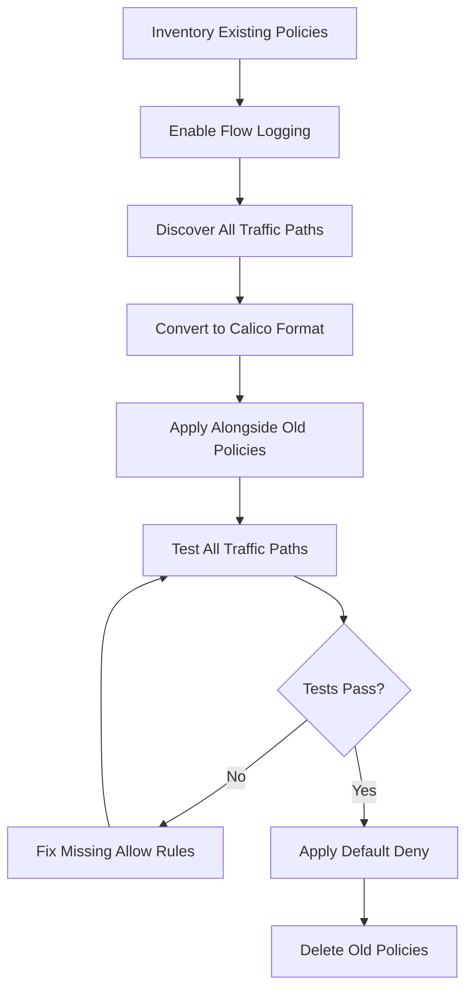

# How to Migrate Existing Rules to Calico Default Deny Policies

Author: [nawazdhandala](https://github.com/nawazdhandala)

Tags: Calico, Kubernetes, Network Policy, Migration, Security

Description: A structured migration guide for converting existing Kubernetes NetworkPolicy rules to Calico default deny policies without disrupting running workloads.

---

## Introduction

Most Kubernetes clusters start with no network policies and gradually accumulate individual allow rules as teams add them. Migrating to a default deny model means inverting this approach: instead of allowing everything and adding restrictions, you deny everything and add explicit permissions. This migration is challenging because you must ensure every legitimate traffic path is captured before the deny rule goes live.

Calico supports both standard Kubernetes `NetworkPolicy` and its own `projectcalico.org/v3` resources, making it possible to migrate incrementally. You can run Kubernetes NetworkPolicy objects alongside Calico `GlobalNetworkPolicy` objects during the transition, then gradually consolidate.

This guide provides a structured migration process from an open-by-default cluster to a Calico default deny model, with rollback procedures at each stage.

## Prerequisites

- Kubernetes cluster with Calico v3.26+
- Existing Kubernetes NetworkPolicy objects to migrate
- `calicoctl` and `kubectl` installed
- Flow logging enabled for traffic discovery

## Step 1: Inventory Existing Policies

```bash
# List all existing Kubernetes NetworkPolicies
kubectl get networkpolicies --all-namespaces -o json | jq '.items[] | {name: .metadata.name, namespace: .metadata.namespace}'

# List all Calico policies
calicoctl get networkpolicies --all-namespaces
calicoctl get globalnetworkpolicies
```

## Step 2: Enable Traffic Discovery

Use flow logs to discover unlocked traffic paths before migrating:

```bash
kubectl patch felixconfiguration default --type=merge -p '{"spec":{"flowLogsEnabled":true}}'
# Run for 48-72 hours to capture all traffic patterns
```

## Step 3: Convert Kubernetes NetworkPolicy to Calico Format

Existing Kubernetes NetworkPolicy:

```yaml
# Before migration - Kubernetes NetworkPolicy
apiVersion: networking.k8s.io/v1
kind: NetworkPolicy
metadata:
  name: allow-frontend
  namespace: production
spec:
  podSelector:
    matchLabels:
      app: backend
  ingress:
    - from:
        - podSelector:
            matchLabels:
              app: frontend
      ports:
        - port: 8080
```

Equivalent Calico NetworkPolicy:

```yaml
# After migration - Calico NetworkPolicy
apiVersion: projectcalico.org/v3
kind: NetworkPolicy
metadata:
  name: allow-frontend-to-backend
  namespace: production
spec:
  order: 100
  selector: app == 'backend'
  ingress:
    - action: Allow
      source:
        selector: app == 'frontend'
      destination:
        ports: [8080]
  types:
    - Ingress
```

## Step 4: Apply Calico Versions Alongside Existing Policies

```bash
# Apply converted Calico policies
calicoctl apply -f calico-allow-rules/

# Verify they are active (both Kubernetes and Calico policies coexist)
calicoctl get networkpolicies -n production
kubectl get networkpolicies -n production
```

## Step 5: Apply Default Deny and Remove Old Policies

```bash
# Apply global deny
calicoctl apply -f global-default-deny.yaml

# Test all traffic paths (see testing guide)
./run-traffic-tests.sh

# Only if tests pass, remove old Kubernetes NetworkPolicies
kubectl delete networkpolicies --all --all-namespaces
```

## Migration Flow



## Conclusion

Migrating to Calico default deny policies is a systematic process that requires traffic discovery, policy conversion, parallel operation, and careful testing. Never delete existing policies until you have verified that your Calico allow rules cover every legitimate traffic path. With patience and good tooling, you can complete this migration with zero downtime and emerge with a significantly stronger security posture.
