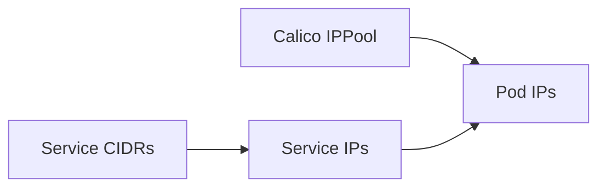

# How to Migrate to Dual-Stack IPv6 with Calico Safely

Author: [nawazdhandala](https://github.com/nawazdhandala)

Tags: Calico, Kubernetes, IPv6, Dual-Stack, Networking

Description: Safely migrate a Calico cluster from IPv4-only to dual-stack by adding IPv6 pools without disrupting existing pods.

---

## Introduction

Dual-Stack IPv6 with Calico enables important networking capabilities in Calico Kubernetes clusters. Proper configuration ensures reliable service connectivity and IP address management.

## Prerequisites

- Calico IPAM enabled
- Kubernetes control plane configured for IPv4/IPv6 dual-stack pod and service CIDRs
- IPv6 forwarding enabled on each node (`net.ipv6.conf.all.forwarding=1`)
- kubectl and calicoctl access
- Cluster-admin access

## Configuration

```bash
calicoctl get ippools -o yaml
calicoctl get bgpconfiguration -o yaml
kubectl get nodes -o wide
```

## Example Configuration

```yaml
apiVersion: projectcalico.org/v3
kind: IPPool
metadata:
  name: default-ipv6-ippool
spec:
  cidr: fd00:10:244::/64
  natOutgoing: true
  disabled: false
  nodeSelector: all()
```

For manifest-based installations, enable IPv6 allocation in the Calico CNI configuration and set IPv6 support on `calico-node`:

```json
"ipam": {
  "type": "calico-ipam",
  "assign_ipv4": "true",
  "assign_ipv6": "true"
}
```

```yaml
- name: IP6
  value: autodetect
- name: FELIX_IPV6SUPPORT
  value: "true"
```

New pods receive both IPv4 and IPv6 addresses after the CNI configuration and IPv6 pool are in place. Existing pods keep their current addresses until they are recreated.

## Verify

```bash
kubectl get pods -A -o wide
kubectl get svc -A -o wide
calicoctl ipam check
```

## Architecture



## Conclusion

How to Migrate to Dual-Stack IPv6 with Calico Safely in Calico provides reliable IP addressing for Kubernetes workloads while Kubernetes allocates dual-stack Service IPs from the configured service CIDRs. Follow the configuration and verification steps to ensure correct behavior.
