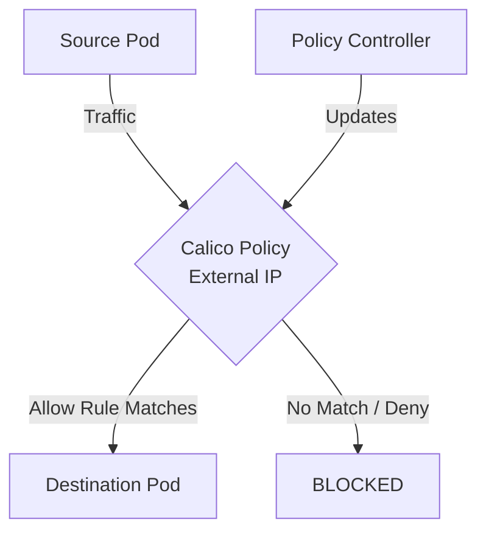

# How to Migrate Existing Rules to External IP Policies in Calico

Author: [nawazdhandala](https://github.com/nawazdhandala)

Tags: Calico, Kubernetes, Network Policy, External IP, Security

Description: Migrate existing network policies to External IP Policies in Calico without disruption.

---

## Introduction

External IP Policies in Calico provides fine-grained network security controls using the `projectcalico.org/v3` API. This guide covers how to migrate External IP effectively.

Calico's extensible policy model supports External IP through its `GlobalNetworkPolicy` and `NetworkPolicy` resources, giving you cluster-wide and namespace-scoped control over traffic that matches your External IP criteria.

This guide provides practical techniques for migrate External IP in your Kubernetes cluster, following security best practices and production-tested patterns.

## Prerequisites

- Kubernetes cluster with Calico v3.26+
- `calicoctl` and `kubectl` installed
- Basic understanding of Calico network policy concepts

## Step 1: Inventory Existing Policies

```bash
kubectl get networkpolicies --all-namespaces -o yaml > current-policies-backup.yaml
calicoctl get networkpolicies --all-namespaces -o yaml >> current-policies-backup.yaml
```

## Step 2: Write Calico Replacement Policies

```yaml
apiVersion: projectcalico.org/v3
kind: NetworkPolicy
metadata:
  name: migrated-external-ip
  namespace: production
spec:
  order: 100
  selector: all()
  ingress:
    - action: Allow
      source:
        selector: app == 'authorized'
  types:
    - Ingress
```

## Step 3: Apply Alongside Old Policies

```bash
calicoctl apply -f migrated-policies/
# Test traffic thoroughly
./run-traffic-tests.sh
```

## Step 4: Remove Old Policies After Verification

```bash
# Only after all tests pass
kubectl delete networkpolicies --all -n production
echo "Migration complete"
```

## Architecture



## Conclusion

Migrate External IP policies in Calico requires attention to policy ordering, selector accuracy, and bidirectional rule coverage. Follow the patterns in this guide to ensure your External IP policies are correctly configured, tested, and monitored. Always validate in staging before applying to production, and maintain comprehensive logging for visibility into policy decisions.
