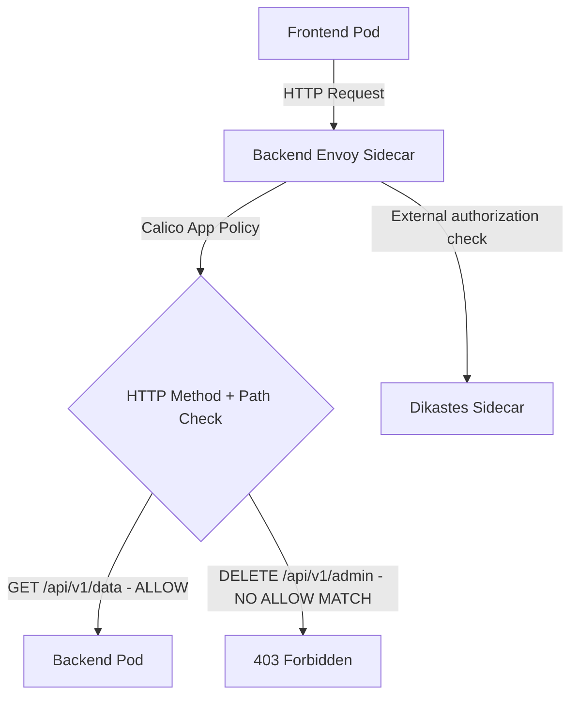

# How to Migrate to HTTP Method Policies with Calico and Istio

Author: [nawazdhandala](https://github.com/nawazdhandala)

Tags: Calico, Kubernetes, Network Policy, Istio, HTTP Methods, Security

Description: Migrate Calico HTTP method-based network policies using Istio to control access by HTTP verb (GET, POST, DELETE, etc.).

---

## Introduction

HTTP Method Policies with Calico and Istio combines Calico's network-layer enforcement with Istio's application-layer visibility. This powerful combination lets you write policies that reference HTTP attributes - methods and paths - in addition to network-level properties like IP addresses and ports.

Calico's `projectcalico.org/v3` NetworkPolicy and GlobalNetworkPolicy resources (with application layer policy enabled for Istio integration) allow you to write ingress rules that are evaluated by Istio's Envoy sidecar proxies rather than only at the network layer. This enables fine-grained control like "allow GET requests to /api/health but leave POST requests to /api/admin denied by default."

This guide covers migrate HTTP Method Policies using Calico and Istio together.

## Prerequisites

- Kubernetes v1.29+ cluster with Calico CNI and Istio v1.22+ installed
- Calico application layer policy enabled
- Calico-Istio integration configured (Dikastes sidecar)
- `calicoctl` and `kubectl` installed
- Workloads with Istio sidecar injection and Dikastes template injection enabled

## Core Configuration

```yaml
apiVersion: projectcalico.org/v3
kind: NetworkPolicy
metadata:
  name: migrate-http-method-policies
  namespace: production
spec:
  order: 100
  selector: app == 'backend-api'
  ingress:
    - action: Allow
      source:
        selector: app == 'frontend'
      http:
        methods:
          - GET
          - POST
        paths:
          - exact: /api/v1/data
          - prefix: /api/v1/public
  types:
    - Ingress
```

Calico application-layer match criteria are supported only on ingress `Allow` rules. Requests that do not match an explicit allow policy are denied by Dikastes, so `DELETE` or `PUT` requests to `/api/v1/admin` are not added as HTTP `Deny` rules.

## Istio + Calico Setup

```bash
# Verify Calico-Istio integration

kubectl get felixconfiguration default -o yaml | grep policySyncPathPrefix
kubectl get pods -n calico-system -l k8s-app=csi-node-driver

# Enable Istio sidecar injection for namespace
kubectl label namespace production istio-injection=enabled --overwrite

# Verify Dikastes is injected into application pods
kubectl get pod -n production -l app=backend-api -o jsonpath='{.items[0].spec.containers[*].name}'
```

## Test Application-Layer Policy

```bash
# Test allowed method
kubectl exec -n production frontend-pod -- curl -fsS -X GET http://backend-api:8080/api/v1/data
echo "GET /api/v1/data (should pass): $?"

# Test denied method/path
kubectl exec -n production frontend-pod -- curl -fsS -X DELETE http://backend-api:8080/api/v1/admin
echo "DELETE /api/v1/admin (should be denied): $?"
```

## Architecture



## Conclusion

HTTP Method Policies with Calico and Istio provides fine-grained Kubernetes network security by combining network-layer enforcement with application-layer policy evaluation. By filtering on HTTP methods and paths, you can implement access controls that are impossible with pure network-layer policies. Ensure your Calico-Istio integration is properly configured and test both allowed and denied request patterns to verify your application-layer policies are working correctly.
