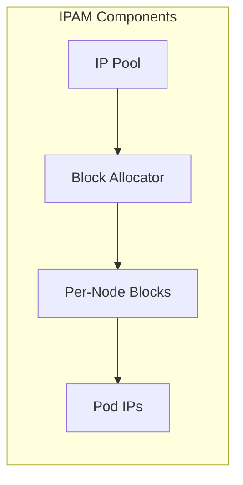

# How to Migrate to IP Address Allocation by Topology in Calico Safely

Author: [nawazdhandala](https://github.com/nawazdhandala)

Tags: Calico, Kubernetes, IPAM, Topology, Networking

Description: Safely add topology-aware IP allocation to an existing Calico cluster without re-addressing running pods.

---

## Introduction

IP Address Allocation by Topology is an important aspect of Calico IP address management in Kubernetes. Getting this right ensures efficient IP utilization, predictable pod addressing, and smooth cluster operations.

This guide provides practical steps to manage IP Address Allocation by Topology in your Calico deployment with focus on production-grade configurations and best practices.

## Prerequisites

- Calico v3.20+ with IPAM configured
- kubectl and calicoctl access
- IP pools configured in the cluster

## Configuration Steps

```bash
# Check current IPAM state
calicoctl ipam show --show-blocks

# View IP pool configuration
calicoctl get ippools -o yaml

# Check IPAM allocations
calicoctl ipam check
```

## Example Configuration

```yaml
apiVersion: projectcalico.org/v3
kind: IPPool
metadata:
  name: pool-example
spec:
  cidr: 10.48.0.0/16
  blockSize: 26
  ipipMode: Never
  vxlanMode: VXLAN
  natOutgoing: true
  nodeSelector: all()
```

## Verification

```bash
# Verify allocations
kubectl get pods -A -o wide | awk '{print $8}' | sort -u | head -20

# Check pool utilization
calicoctl ipam show --summary

# Validate consistency
calicoctl ipam check --output=report
```

## Architecture



## Conclusion

Properly managing IP Address Allocation by Topology in Calico ensures reliable pod networking and prevents IP exhaustion issues. Regular monitoring of pool utilization and IPAM consistency checks help maintain a healthy IP addressing infrastructure.
